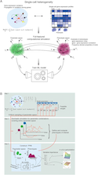

## Results

### Comparing bioRxiv to other corpora

#### bioRxiv Metadata Statistics

The preprint landscape is rapidly changing, and the number of bioRxiv preprints in our data download (71,118) was nearly double that of a recent study that reported on a snapshot with 37,648 preprints [@doi:10.7554/eLife.45133].
Because the rate of change is rapid, we first analyzed category data and compared our results with previous findings.
As in previous reports [@doi:10.7554/eLife.45133], neuroscience remains the most common category of preprint followed by bioinformatics (Supplemental Figure {@fig:biorxiv_categories}).
Microbiology, which was fifth in the most recent report [@doi:10.7554/eLife.45133], has now surpassed evolutionary biology and genomics to move into third.
When authors upload their preprints, they select from three result category types: new results, confirmatory results or contradictory results.
We found that nearly all preprints (97.5%) were categorized as new results, which is consistent with reports on a smaller set [@doi:10.1001/jama.2017.21168].
Taken together, the results suggest that while bioRxiv has experienced dramatic growth, the way in which it is being used appears to have remained consistent in recent years.

#### Global analysis reveals similarities and differences between bioRxiv and PMC

| Metric                | bioRxiv     | PMC           | NYTAC         |
|-----------------------|-------------|---------------|---------------|
| document count             | 71,118      | 1,977,647     | 1,855,658     |
| sentence count             | 22,195,739  | 480,489,811   | 72,171,037    |
| token count                | 420,969,930 | 8,597,101,167 | 1,218,673,384 |
| stopword count            | 158,429,441 | 3,153,077,263 | 559,391,073   |
| avg. document length        | 312.10      | 242.96        | 38.89         |
| avg. sentence length        | 22.71       | 21.46         | 19.89         |
| negatives                  | 1,148,382   | 24,928,801    | 7,272,401     |
| coordinating conjunctions  | 14,295,736  | 307,082,313   | 38,730,053    |
| coordinating conjunctions% | 3.40%       | 3.57%         | 3.18%         |
| pronouns                   | 4,604,432   | 74,994,125    | 46,712,553    |
| pronouns%                  | 1.09%        | 0.87%         | 3.83%         |
| passives                   | 15,012,441  | 342,407,363   | 19,472,053    |
| passive%                   | 3.57%       | 3.98%         | 1.60%         |

Table: Summary statistics for the bioRxiv, PMC, and NYTAC corpora. {#tbl:corpora_stats}

![
A. The Kullback–Leibler divergence measures the extent to which the distributions, not specific tokens, differ from each other.
The token distribution of bioRxiv and PMC corpora is more similar than these biomedical corpora are to the NYTAC one.
B. The major differences in token frequencies for the corpora appear to be driven by the fields that have had the highest uptake of bioRxiv, as terms from neuroscience and genomics are relatively more abundant in bioRxiv.
Points indicate the log_2(OR) for each token and error bars indicate the 95% confidence intervals.
C. Of the terms that differ between bioRxiv and PMC, the most abundant in bioRxiv are "et" and "al" while the most abundant in PMC is "study."
D. The major differences in token frequencies for preprints and their corresponding published version often appear to be associated with typesetting and supplementary or additional materials.
Points indicate the log_2(OR) for each token and error bars indicate the 95% confidence intervals.
E. The tokens with the largest absolute differences in abundance appear to be stylistic.
](https://raw.githubusercontent.com/danich1/annorxiver/e61dff8efe2216852a6b2a9ff0ec921a54356ad7/figure_generation/output/figure_one_panels.svg){#fig:corpora_comparison_panels width="100%"}

We first compared the overall text of bioRxiv with PMC, adding a corpus of professionally written but non-biomedical text (NYTAC) as a control.
Documents on bioRxiv were slightly longer than those on PMC, but both were much longer than those from NYTAC (Table {@tbl:corpora_stats}).
Other than length, both corpora were otherwise quite similar.
The average sentence length, fraction of pronouns, and the use of the passive voice were all more similar between bioRxiv and PMC than they were to NYTAC (Table {@tbl:corpora_stats}).
The Kullback–Leibler divergence measures the extent to which two distributions, but not the specific entities that comprise those distributions, differ.
The distribution of term frequencies in bioRxiv and PMC were low, especially among the top few hundred tokens (Figure {@fig:corpora_comparison_panels}A).
Differences began to emerge over more terms, but remained much lower than when the biomedical corpora are compared with NYTAC.

Examining the frequencies of individual terms revealed differences between the biomedical corpora.
Previous work examining author-selected categories has reported that fields appear to have preprinted unevenly, with certain life sciences research fields having more uptake than others [@doi:10.7554/eLife.45133].
However, it was possible that authors simply selected certain fields preferentially but that the content was similar to the broader corpus of life sciences text.
We directly examined this by comparing term frequencies between bioRxiv and PMC.
We found that among the terms that differed the most many were associated with certain life sciences research fields.
Terms like "neurons" "genome" and "genetic", which are common in genomics and neuroscience, were more common in bioRxiv than PMC while others associated with clinical research, such as "clinical" "patients" and "treatment" were more common in PMC (Figure {@fig:corpora_comparison_panels}B and {@fig:corpora_comparison_panels}C).

We next controlled for differences in the body of documents to identify term-level changes associated with the publication process itself by examining only pairs of preprints and their corresponding publication (Figure {@fig:corpora_comparison_panels}D and {@fig:corpora_comparison_panels}E).
The tokens that differed included "et" "al", "$\pm$", "–" and others that appeared to be typesetting related.
Certain changes appeared to be related to journal styles: "figure" was more common in bioRxiv while "fig" was relatively more common in PMC.
Other changes appeared to be associated with an increasing reference to content external to the manuscript itself: the tokens "supplementary", "additional" and "file" were all more common in PMC than bioRxiv suggesting that journals are not simply replacing one token with another but that there are more mentions of such content after peer review.

Taken together these results suggested that the structure of the text in documents on bioRxiv was similar to that on PMC.
The differences in uptake across fields is supported not only by differences in authors' categorization of their articles but also in the text of the articles themselves.
At the level of individual manuscripts, the terms that change the most appear to be associated with typesetting, journal style, and an increasing reliance on additional materials after peer review.

### Document embeddings derived from bioRxiv reveal fields and subfields

![
A. Principal components (PC) analysis of bioRxiv word2vec embeddings groups documents by author-selected categories.
We visualized documents from key categories on a scatterplot for the first two PCs.
The first PC separated cell biology from informatics-related fields.
The second PC separated bioinformatics from neuroscience.
Certain neuroscience papers appeared to be more associated with the cellular biology direction of PC1, while others appeared to be more associated with the informatics-related direction, which suggested that the concepts captured by PCs were not exclusively related to field.
B. A word cloud visualization of PC1, which separated informatics disciplines (positive direction) from cell biology (negative direction) showed that tokens "empirical" "estimates" and "statistics" characterized the positive direction while "cultured" and "overexpressing" characterized the negative one.
Each word cloud depicts the cosine similarity score between tokens and the second PC.
Tokens in orange were most similar to the PC's positive direction while tokens in blue were most similar to the PC's negative direction.
The size of each token indicates the magnitude of the similarity.
C. A word cloud visualization of PC2, which separated bioinformatics from neuroscience, showed that tokens "genomic" "genome" and "genomes" characterized the positive direction while "evoked" "stimulus" and "stimulation" characterized the negative one.
D. Examining PC1 values for each article by category created a continuum from informatics-related fields on the top through cell biology on the bottom.
Certain article categories (neuroscience, genetics) were spread throughout PC1 values.
E. Examining PC2 values for each article by category revealed fields like genomics, bioinformatics, and genetics on the top and neuroscience and behavior on the bottom.
](https://raw.githubusercontent.com/danich1/annorxiver/e61dff8efe2216852a6b2a9ff0ec921a54356ad7/figure_generation/output/figure_two_panels.svg){#fig:topic_analysis_panels width="100%"}

Document embeddings provide a means to categorize the language of documents in a way that takes into account the similarities between terms [@arxiv:1405.4053;@arxiv:1707.02377;@arxiv:2001.05727].
We first trained word embeddings using a 300-dimensional word2vec continuous bag of words model.
We combined word embeddings to produce an embedding for each bioRxiv or PMC document by calculating the average of all words present in each respective document.
This placed each document in a 300-dimensional space where each individual dimension is arbitrary.
To provide more structure to the dataset, we examined the predominant patterns in these embeddings by performing principal components analysis of bioRxiv.
The principal components (PCs) are ordered by the proportion of the variance explained.
We found that the first two PCs separated articles from different author-selected categories (Figure {@fig:topic_analysis_panels}A).

We sought to understand the token patterns that drove these overall differences between documents.
We identified the tokens most similar to a PC by calculating the cosine similarity score between tokens' embeddings in the word2vec space and each PC.
Visualizing token-PC similarity revealed tokens associated with certain research approaches (Figures {@fig:topic_analysis_panels}B and {@fig:topic_analysis_panels}C).
Examining the value for PC1 across all author-selected categories revealed an ordering of fields from cell biology to informatics-related disciplines (Figure {@fig:topic_analysis_panels}D).

While the PC1 value range for each author-selected category was high, these results suggested that a primary driver in the variability of language use on bioRxiv could be the divide between data science approaches and cell biology ones.
A similar analysis for PC2 suggested that neuroscience and genomics present a similar language continuum (Figure {@fig:topic_analysis_panels}E).
For both of the top two PCs, the submitter-selected category of systems biology preprints was near the middle of the distribution and had a relatively large interquartile range when compared with other categories (Figure {@fig:topic_analysis_panels}D and {@fig:topic_analysis_panels}E).

We examined the preprints that had the highest and lowest values for PC1 within systems biology (Table {#tbl:five_pc1_table}).
The preprints with the highest five PC values [@doi:10.1101/197400;@doi:10.1101/825943;@doi:10.1101/769299;@doi:10.1101/107250] included software packages, machine learning analyses, and other computational biology manuscripts.
The preprints with the lowest five PC values [@doi:10.1101/455048;@doi:10.1101/371922;@doi:10.1101/733162;@doi:10.1101/745943;@doi:10.1101/754572] were focused on signaling.
We provide the top 50 PCs of bioRxiv embeddings within our online repository (see Software and Data Availability).

| Title [citation]     | PC1  | License | Figure Thumbnail |
|--------------------------------|-------------------|------------|----------|
| Conditional Robust Calibration (CRC): a new computational Bayesian methodology for model parameters estimation and identifiability analysis [@doi:10.1101/197400] | 4.700554908074704 | None         |  |
| Machine learning of stochastic gene network phenotypes [@doi:10.1101/825943]                                                                                      | 4.410660604449826 | CC-BY-NC-ND  |  |
| Notions of similarity for computational biology models [@doi:10.1101/044818]                                                                                      | 4.355295926618207 | CC-BY-NC-ND  |  |
| GpABC: a Julia package for approximate Bayesian computation with Gaussian process emulation [@doi:10.1101/769299]                                                 | 4.351517618262304 | CC-BY-NC-ND  |  |
| SBpipe: a collection of pipelines for automating repetitive simulation and analysis tasks [@doi:10.1101/107250]                                                   | 4.321847854182741 |  CC-BY-NC-ND |   |
| | | | |
| Spatiotemporal proteomics uncovers cathepsin-dependent host cell death during bacterial infection [@doi:10.1101/455048]                                           | -4.263964235099807 |  CC-BY-ND   |  |
| Systems analysis by mass cytometry identifies susceptibility of latent HIV-infected T cells to targeting of p38 and mTOR pathways [@doi:10.1101/371922]           | -4.279016673409032 | CC-BY-NC-ND |  |
| NADPH consumption by L-cystine reduction creates a metabolic vulnerability upon glucose deprivation [@doi:10.1101/733162]                                         | -4.592209988884236 | None        |  |
| Inhibition of Bruton’s tyrosine kinase reduces NF-kB and NLRP3 inflammasome activity preventing insulin resistance and microvascular disease [@doi:10.1101/745943] | -4.736613689905791 | None        |   |
| AKT but not MYC promotes reactive oxygen species-mediated cell death in oxidative culture [@doi:10.1101/754572]                                                   | -4.826793742506695 | None        |   |

Table: PC1 divided the author-selected category of systems biology preprints along an axis from computational to molecular approaches. {#tbl:five_pc1_table}

### Document embedding similarities reveal unannotated preprint-publication pairs

Metaresearch into bioRxiv, including our own, relies on annotations of preprints that have been published to their corresponding peer reviewed publication.
Many journals require that authors update preprints with links to the published version of their article.
This is accomplished in two ways: bioRxiv may detect the link and automatically add it or authors may notify bioRxiv that their preprint was published.
However, bioRxiv establishes these links based on consistency in metadata (i.e., title, author names, etc).
Article titles, author lists, and other elements may change as a result of the peer review process. In these cases, if authors do not notify bioRxiv that the preprint has since been published then the scientific record remains incomplete.

Based on our finding that document embeddings captured fields and subfields, we expected that preprint-publication pairs with similar embedding values may represent the same document.
We examined the extent to which annotated preprint-publication pairs were closer in this space that preprints were to a random paper published in the same journal in which the preprint was eventually published using already annotated pairs.
We found that distances between preprints and their corresponding published versions were nearly always lower than preprints paired with a random article published in the same journal (Figure {@fig:preprint_links_panels}A).

![
A. Preprints are closer in document embedding space to their corresponding peer reviewed publication than they are to random papers published in the same journal.
B. Potential preprint-publication pairs that are unannotated but within the 50th percentile of all preprint-publication pairs in the document embedding space are likely represent true preprint-publication pairs.
We depict the fraction of true positives over the total number of pairs in each bin.
Accuracy is derived from curation of a randomized list of 200 potential pairs (50 per quantile) performed in duplicate with a third rater used in the case of disagreement.
C. Most preprints are eventually published.
We show the publication rate of preprints since bioRxiv first started.
The x-axis represents months since bioRxiv started and the y-axis represents the proportion of preprints published.
The light blue line represents the publication rate estimated by Abdill et al. [@doi:10.7554/eLife.45133].
The dark blue line represents the updated publication rate using only CrossRef-derived annotations while the dark green line includes annotations derived from similarity in the embedding space.
The horizontal lines represent the overall proportion of preprints that are were published as of the time of the annotation snapshot.
](https://raw.githubusercontent.com/danich1/annorxiver/f9d8861e3d60afa878c5d0088b7502adae15ebe3/figure_generation/output/figure_three_panels.svg){#fig:preprint_links_panels width="100%"}

Based on this finding, we analyzed preprint-publication pairs that were close in document space but not annotated as such.
We separated these pairs into four quantiles with the first three based on the distribution of preprint-publication distances and the fourth going from the 75th percentile in the preprint-publication pair space to the smallest value observed for the preprint-random set.
We then selected 50 preprint-publication pairs from each of these sets and shuffled them to create a random list of 200 possible pairs.
Two scientists then examined the pairs in these randomized lists determining if an preprint-publication pair represented the peer reviewed publication of the primary content described in the preprint.
Across the entire list we found a high inter-rater reliability of with a Cohen's Kappa [@doi:10.1177/001316446002000104] of 0.92.
In the case of disagreements, a third scientist more carefully examined the pairs and made a final determination.
Of the 200 pairs that we examined, approximately 98% of pairs with an embedding distance in the 0-25th and 25th-50th percentile bins were scored as true matches (Figure {@fig:preprint_links_panels}B).
These two bins contained 1,720 preprint-article pairs, suggesting that many preprints have been published but not previously connected with their published versions.

We overlaid these new annotations onto existing annotations to reassess the overall preprint publication rate reported by Abdill et al. [@doi:10.7554/eLife.45133].
Our filtering criteria were intentionally stringent, so the increased estimate of publication rate amounts to a few percent (Figure {@fig:preprint_links_panels}C).
We noticed that there was a particular enrichment of unannotated but published preprints in the 2017-2018 interval.
We would expect a higher proportion of such preprints before the year 2019 (many of which may not have been published yet); however, we did not expect to observe relatively few missed annotations before 2017.
It is possible that as the number of preprints grows, it has become harder to establish links.
Alternatively, authors now adopting preprinting practices may be less likely to notify the preprint server upon publication if the links are not automatically detected.
In any case, future work, especially that which aims to assess the fraction of preprints that are eventually published, should account for the possibility of missed annotations.
We supplied our set of 1720 high-confidence annotations to the bioRxiv staff.

### Preprints with more versions or more text changes took longer to publish

![
A. Preprints with more substantial text changes took longer to be published.
The x-axis shows the Euclidean distance between document representations of the first version of a preprint and it's peer reviewed form.
The y-axis shows the number of days elapsed between when the first version of a preprint posted on bioRxiv and the time a preprint is published.
The color bar on the right represents the density of each hexbin in this plot: more dense regions are shown in a brighter color.
B. Preprints with more versions were associated with a longer time to publish.
The x-axis shows the number of versions of a preprint that were posted on bioRxiv.
The y-axis shows the number of days that elapsed between when the first version of a preprint was posted on bioRxiv and the date at which the peer reviewed publication appeared.
The density of observations are depicted with the violin plot with an embedded boxplot.
C. Author-selected categories were associated with modest differences in the time to publish.
Categories are shown on the y-axis.
The x-axis shows the median time-to-publish for each category.
Error bars represent 95% confidence intervals for each preprint category's median time to publication.
](https://raw.githubusercontent.com/danich1/annorxiver/e61dff8efe2216852a6b2a9ff0ec921a54356ad7/figure_generation/output/figure_four_panels.svg){#fig:publication_delay_panels width="100%"}

The process of peer review includes a number of steps which take variable amounts of time [63] and we examined if there is a difference in publication time between author-selected categories of preprints (Figure 4A).
Of the most abundant preprint categories microbiology was the fastest to publish (140 days, (137, 145 days) [95% CI]) and genomics was the slowest (190 days, (185, 195 days) [95% CI]).
We did observe category-specific differences; however, these differences were generally modest, suggesting that the peer review process overall is agnostic to preprint categories when delaying preprint publication time. 
One exception was the Scientific Communication and Education category, which took substantially longer to be peer reviewed and published (373 days, (373, 398 days) [95% CI]). 
This hints that there is a key step or steps within the peer review process that severely halts preprints from being published within this category.

Preprint authors have the opportunity to update their preprint at any point until the peer reviewed publication appears. 
We found a positive correlation between preprints with multiple versions and time elapsed until publication (Figure 4B). 
Each new version adds additional 51 days before a preprint is published.
This time duration seems broadly compatible with the amount of time it would take to receive reviews and revise a manuscript, suggesting that many authors may be updating their preprints in response to peer reviews or other external feedback.

We quantified the association between the magnitude of change to the text between the preprint and peer reviewed publication and the time to publication.
We found that preprints further in the embedding space from their corresponding peer reviewed publication took longer to publish and each unit in the embedding space corresponds to approximately sixteen additional days (Figure 4C).
This model suggests that preprints undergoing large revisions require more time to go through the peer review process.
Overall, our findings support a notion that preprints reviewed multiple times or require larger revisions take longer to publish.

### Preprints with similar document embeddings share publication venues

We hypothesized that document embedding might capture information associated with the eventual publication venue.
We used the annotated preprint-publication pairs as a fully held out test set.
We embedded all PMC papers except those annotated to have a corresponding preprint into the bioRxiv embedding space.
For journals, we averaged the document representation of all papers in the journal to produce a journal centroid.
We used a k-nearest neighbor classifier trained on the remaining PMC documents to identify the most similar published papers and assessed performance - the extent to which the journal a paper appeared in the returned list of ten neighbors - through cross validation and the held out test set (Supplemental Figure {@fig:knn_auc}).
We found an enrichment of papers published within the same journal among the neighbors of the target paper.

We developed an online app that returns the nearest published papers and journals that are nearest to a preprint.
Users supply digital object identifiers (DOIs) from bioRxiv or medRxiv.
The application downloads the article from the preprint repository, converts the PDF to text, calculates a document embedding score, and returns the ten papers and journals with the most similar representations in the embedding space (Figure {@fig:journal_rec_workflow}).
We also sought to display the position of each preprint in the overall landscape.
We required an embedding that could be rapidly calculated for new documents, so we used the Sparse Autoencoder for Unsupervised Clustering, Imputation, and Embedding (SAUCIE) approach previously described for the analysis of single-cell gene expression data [@doi:10.1038/s41592-019-0576-7].
The user-requested preprint's location in this space is then displayed and users can select regions to identify the terms most associated with those regions.
Users can also explore the terms associated with the top 50 PCs derived from the document embeddings and those PCs vary across the document landscape.

![
The journal similarity search app workflow allows users to examine where an individual preprint falls in the overall document landscape.
A. Starting with the home screen, users can paste in a bioRxiv or medRxiv DOI, which sends a request to bioRxiv or medRxiv.
Next the app preprocesses the requested preprint and returns a listing of (B) the top ten most similar papers and (C) the ten closest journals.
D. The app also displays the location of the query preprint in PMC.
E. Users can select a square within the landscape to examine statistics associated with the square including the top journals by article count in that square and the odds ratio of tokens.
](images/journal_recommender_workflow.png){#fig:journal_rec_workflow width="100%"}
