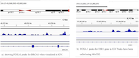

## References {.page_break_before}

<!-- Explicitly insert bibliography here -->

## Supplemental Figures

{#fig:biorxiv_categories tag="S1"}

![
Topic associated tokens are highly enriched when comparing bioRxiv to the New York Times.
The plot on the left (A) is a point range plot of the odds ratio with respect to bioRxiv.
Values greater than one indicate a high association with bioRxiv whereas values less than one indicate high association with the New York Times.
The dotted line provides a breaking point between both categories.
The plot on the right (B) is a bar chart of token frequency appearing in bioRxiv and New York Times respectively.
](https://raw.githubusercontent.com/danich1/annorxiver/e61dff8efe2216852a6b2a9ff0ec921a54356ad7/biorxiv/corpora_comparison/output/figures/biorxiv_vs_reference.png){#fig:biorxiv_v_reference tag="S2"}

![
Typesetting symbols and biologically relevant tokens are highly enriched when comparing PubMed Central (PMC) to the New York Times.
The plot on the left (A) is a point range plot of the odds ratio with respect to PMC.
Values greater than one indicate a high association with PMC whereas values less than one indicate high association with the New York Times.
The dotted line provides a breaking point between both categories.
The plot on the right (B) is a bar chart of token frequency appearing in PMC and New York Times respectively.
](https://raw.githubusercontent.com/danich1/annorxiver/a13cc22c1474071dee45602502ceb3d6fb71ab2d/biorxiv/corpora_comparison/output/figures/pmc_vs_reference.png){#fig:pmc_v_reference tag="S3"}

{#fig:knn_auc tag="S4" width="100%"}

<!-- Commenting this out for now unless we get asked for it. The first table is probably comprehensive enough to show that our approach also works within a field and then we don't have to go too deep into a second one.
## Supplemental Tables

| Title [citation]   | PC_2  | License  | Figure Thumbnail |
|--------------------------------|--------------|-------------------|----------|
| Pangenome Analysis of Enterobacteria Reveals Richness of Secondary Metabolite Gene Clusters and their Associated Gene Sets [@doi:10.1101/781328]                                                           | 3.5865702659438883 |  CC-BY-ND    |  |
| QTG-Finder: a machine-learning based algorithm to prioritize causal genes of quantitative trait loci [@doi:10.1101/484204]                                                                                 | 3.470388383023157  | None         |    |
| Identification of candidate genes underlying nodulation-specific phenotypes in Medicago truncotula through integration of genome-wide association studies and co-expression networks [@doi:10.1101/392779] | 3.3814906334073953 |  CC-BY-NC-ND |   |
| Raw sequence to target gene prediction: An integrated inference pipeline for ChIP-seq and RNA-seq datasets [@doi:10.1101/220152]                                                                           | 3.3632576028389742 | None         |   |
| The y-ome defines the thirty-four percent of Escherichia coli genes that lack experimental evidence of function [@doi:10.1101/328591]                                                                      | 3.28742786641417   | CC-BY        |  |
| | | | | |
| The effects of time-varying temperature on delays in genetic networks [@doi:10.1101/019687]                                                                                                    | -2.7047102478958056 | None          |  |
| An analog to digital converter creates nuclear localization pulses in yeast calcium signaling [@doi:10.1101/357939]                                                                            | -2.775745000260895  | None          |  |
| Nicotinic modulation of hierarchal inhibitory control over prefrontal cortex resting state dynamics: modeling of genetic modification and schizophreniarelated pathology [@doi:10.1101/301051] | -3.047342382798414  | None          |  |
| Electrical propagation of vasodilatory signals in capillary networks [@doi:10.1101/840280]                                                                                                     | -3.107715578793087  |  CC-BY-NC-ND  |  |
| Dendritic spine geometry and spine apparatus organization govern the spatiotemporal dynamics of calcium [@doi:10.1101/386367]                                                                  | -3.21533499072831   |  CC-BY-NC-ND  |  |

Table: Top and bottom five systems biology preprints projected onto the PC2 direction. These preprints contain bioinformatis and neuroscience concepts respectively. {#tbl:five_pc2_table}
-->
