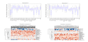
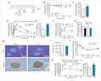

---
title: 'How things change: examining linguistic shifts between preprints and publications'
keywords:
- biorxiv
- preprints
- pubmed-central
- natural-language-processing
- descriptive-linguistics
lang: en-US
date-meta: '2021-11-03'
author-meta:
- David N. Nicholson
- Vincent Rubinetti
- Dongbo Hu
- Marvin Thielk
- Lawrence E. Hunter
- Casey S. Greene
header-includes: |-
  <!--
  Manubot generated metadata rendered from header-includes-template.html.
  Suggest improvements at https://github.com/manubot/manubot/blob/main/manubot/process/header-includes-template.html
  -->
  <meta name="dc.format" content="text/html" />
  <meta name="dc.title" content="How things change: examining linguistic shifts between preprints and publications" />
  <meta name="citation_title" content="How things change: examining linguistic shifts between preprints and publications" />
  <meta property="og:title" content="How things change: examining linguistic shifts between preprints and publications" />
  <meta property="twitter:title" content="How things change: examining linguistic shifts between preprints and publications" />
  <meta name="dc.date" content="2021-11-03" />
  <meta name="citation_publication_date" content="2021-11-03" />
  <meta name="dc.language" content="en-US" />
  <meta name="citation_language" content="en-US" />
  <meta name="dc.relation.ispartof" content="Manubot" />
  <meta name="dc.publisher" content="Manubot" />
  <meta name="citation_journal_title" content="Manubot" />
  <meta name="citation_technical_report_institution" content="Manubot" />
  <meta name="citation_author" content="David N. Nicholson" />
  <meta name="citation_author_institution" content="Department of Systems Pharmacology and Translational Therapeutics, Perelman School of Medicine University of Pennsylvania, Philadelphia PA, USA" />
  <meta name="citation_author_orcid" content="0000-0003-0002-5761" />
  <meta name="twitter:creator" content="@dnicholson329" />
  <meta name="citation_author" content="Vincent Rubinetti" />
  <meta name="citation_author_institution" content="Department of Systems Pharmacology and Translational Therapeutics, Perelman School of Medicine University of Pennsylvania, Philadelphia PA, USA" />
  <meta name="citation_author_institution" content="Center for Health AI, University of Colorado School of Medicine, Aurora, CO, USA" />
  <meta name="citation_author_orcid" content="None" />
  <meta name="twitter:creator" content="@vincerubinetti" />
  <meta name="citation_author" content="Dongbo Hu" />
  <meta name="citation_author_institution" content="Department of Systems Pharmacology and Translational Therapeutics, Perelman School of Medicine University of Pennsylvania, Philadelphia PA, USA" />
  <meta name="citation_author_orcid" content="None" />
  <meta name="twitter:creator" content="@None" />
  <meta name="citation_author" content="Marvin Thielk" />
  <meta name="citation_author_institution" content="Elsevier, Philadelphia PA, USA" />
  <meta name="citation_author_orcid" content="0000-0002-0751-3664" />
  <meta name="twitter:creator" content="@TheNeuralCoder" />
  <meta name="citation_author" content="Lawrence E. Hunter" />
  <meta name="citation_author_institution" content="Center for Computational Pharmacology, University of Colorado School of Medicine, Aurora CO, USA" />
  <meta name="citation_author_orcid" content="0000-0003-1455-3370" />
  <meta name="twitter:creator" content="@ProfLHunter" />
  <meta name="citation_author" content="Casey S. Greene" />
  <meta name="citation_author_institution" content="Department of Systems Pharmacology and Translational Therapeutics, Perelman School of Medicine University of Pennsylvania, Philadelphia PA, USA" />
  <meta name="citation_author_institution" content="Department of Biochemistry and Molecular Genetics, University of Colorado School of Medicine, Aurora CO, USA" />
  <meta name="citation_author_institution" content="Center for Health AI, University of Colorado School of Medicine, Aurora, CO, USA" />
  <meta name="citation_author_orcid" content="0000-0001-8713-9213" />
  <meta name="twitter:creator" content="@greenescientist" />
  <link rel="canonical" href="https://greenelab.github.io/annorxiver_manuscript/" />
  <meta property="og:url" content="https://greenelab.github.io/annorxiver_manuscript/" />
  <meta property="twitter:url" content="https://greenelab.github.io/annorxiver_manuscript/" />
  <meta name="citation_fulltext_html_url" content="https://greenelab.github.io/annorxiver_manuscript/" />
  <meta name="citation_pdf_url" content="https://greenelab.github.io/annorxiver_manuscript/manuscript.pdf" />
  <link rel="alternate" type="application/pdf" href="https://greenelab.github.io/annorxiver_manuscript/manuscript.pdf" />
  <link rel="alternate" type="text/html" href="https://greenelab.github.io/annorxiver_manuscript/v/70cd00ac6309d56567b58053b04468e071519f87/" />
  <meta name="manubot_html_url_versioned" content="https://greenelab.github.io/annorxiver_manuscript/v/70cd00ac6309d56567b58053b04468e071519f87/" />
  <meta name="manubot_pdf_url_versioned" content="https://greenelab.github.io/annorxiver_manuscript/v/70cd00ac6309d56567b58053b04468e071519f87/manuscript.pdf" />
  <meta property="og:type" content="article" />
  <meta property="twitter:card" content="summary_large_image" />
  <link rel="icon" type="image/png" sizes="192x192" href="https://manubot.org/favicon-192x192.png" />
  <link rel="mask-icon" href="https://manubot.org/safari-pinned-tab.svg" color="#ad1457" />
  <meta name="theme-color" content="#ad1457" />
  <!-- end Manubot generated metadata -->
bibliography:
- content/manual-references.json
manubot-output-bibliography: output/references.json
manubot-output-citekeys: output/citations.tsv
manubot-requests-cache-path: ci/cache/requests-cache
manubot-clear-requests-cache: false
...


<small><em>
This manuscript
([permalink](https://greenelab.github.io/annorxiver_manuscript/v/70cd00ac6309d56567b58053b04468e071519f87/))
was automatically generated
from [greenelab/annorxiver_manuscript@70cd00a](https://github.com/greenelab/annorxiver_manuscript/tree/70cd00ac6309d56567b58053b04468e071519f87)
on November 3, 2021.
</em></small>

## Authors


+ **David N. Nicholson**<br>
    {.inline_icon width=16 height=16}
    [0000-0003-0002-5761](https://orcid.org/0000-0003-0002-5761)
    · {.inline_icon width=16 height=16}
    [danich1](https://github.com/danich1)
    · {.inline_icon width=16 height=16}
    [dnicholson329](https://twitter.com/dnicholson329)<br>
  <small>
     Department of Systems Pharmacology and Translational Therapeutics, Perelman School of Medicine University of Pennsylvania, Philadelphia PA, USA
     · Funded by The Gordon and Betty Moore Foundation (GBMF4552); The National Institutes of Health (T32 HG000046)
  </small>

+ **Vincent Rubinetti**<br>
    · {.inline_icon width=16 height=16}
    [vincerubinetti](https://github.com/vincerubinetti)
    · {.inline_icon width=16 height=16}
    [vincerubinetti](https://twitter.com/vincerubinetti)<br>
  <small>
     Department of Systems Pharmacology and Translational Therapeutics, Perelman School of Medicine University of Pennsylvania, Philadelphia PA, USA; Center for Health AI, University of Colorado School of Medicine, Aurora, CO, USA
     · Funded by The Gordon and Betty Moore Foundation (GBMF4552); The National Institutes of Health (R01 HG010067)
  </small>

+ **Dongbo Hu**<br>
    · {.inline_icon width=16 height=16}
    [dongbohu](https://github.com/dongbohu)<br>
  <small>
     Department of Systems Pharmacology and Translational Therapeutics, Perelman School of Medicine University of Pennsylvania, Philadelphia PA, USA
     · Funded by The Gordon and Betty Moore Foundation (GBMF4552); The National Institutes of Health (R01 HG010067)
  </small>

+ **Marvin Thielk**<br>
    {.inline_icon width=16 height=16}
    [0000-0002-0751-3664](https://orcid.org/0000-0002-0751-3664)
    · {.inline_icon width=16 height=16}
    [MarvinT](https://github.com/MarvinT)
    · {.inline_icon width=16 height=16}
    [TheNeuralCoder](https://twitter.com/TheNeuralCoder)<br>
  <small>
     Elsevier, Philadelphia PA, USA
  </small>

+ **Lawrence E. Hunter**<br>
    {.inline_icon width=16 height=16}
    [0000-0003-1455-3370](https://orcid.org/0000-0003-1455-3370)
    · {.inline_icon width=16 height=16}
    [LEHunter](https://github.com/LEHunter)
    · {.inline_icon width=16 height=16}
    [ProfLHunter](https://twitter.com/ProfLHunter)<br>
  <small>
     Center for Computational Pharmacology, University of Colorado School of Medicine, Aurora CO, USA
     · Funded by The Gordon and Betty Moore Foundation (GBMF4552)
  </small>

+ **Casey S. Greene**<br>
    {.inline_icon width=16 height=16}
    [0000-0001-8713-9213](https://orcid.org/0000-0001-8713-9213)
    · {.inline_icon width=16 height=16}
    [cgreene](https://github.com/cgreene)
    · {.inline_icon width=16 height=16}
    [greenescientist](https://twitter.com/greenescientist)<br>
  <small>
     Department of Systems Pharmacology and Translational Therapeutics, Perelman School of Medicine University of Pennsylvania, Philadelphia PA, USA; Department of Biochemistry and Molecular Genetics, University of Colorado School of Medicine, Aurora CO, USA; Center for Health AI, University of Colorado School of Medicine, Aurora, CO, USA
     · Funded by The Gordon and Betty Moore Foundation (GBMF4552); The National Institutes of Health (R01 HG010067)
  </small>


## Abstract {.page_break_before}

Preprints allow researchers to make their findings available to the scientific community before they have undergone peer review.
Studies on preprints within bioRxiv have been largely focused on article metadata and how often these preprints are downloaded, cited, published, and discussed online.
A missing element that has yet to be examined is the language contained within the bioRxiv preprint repository.
We sought to compare and contrast linguistic features within bioRxiv preprints to published biomedical text as a whole as this is an excellent opportunity to examine how peer review changes these documents.
The most prevalent features that changed appear to be associated with typesetting and mentions of supplementary sections or additional files.
In addition to text comparison, we created document embeddings derived from a preprint-trained word2vec model.
We found that these embeddings are able to parse out different scientific approaches and concepts, link unannotated preprint-peer reviewed article pairs, and identify journals that publish linguistically similar papers to a given preprint.
We also used these embeddings to examine factors associated with the time elapsed between the posting of a first preprint and the appearance of a peer reviewed publication.
We found that preprints with more versions posted and more textual changes took longer to publish.
Lastly, we constructed a web application (https://greenelab.github.io/preprint-similarity-search/) that allows users to identify which journals and articles that are most linguistically similar to a bioRxiv or medRxiv preprint as well as observe where the preprint would be positioned within a published article landscape. 


## Introduction

The dissemination of research findings is key to science.
Initially, much of this communication happened orally [@doi:10.1021/ci00050a001].
During the 17th century, the predominant form of communication shifted to personal letters shared from one scientist to another [@doi:10.1021/ci00050a001].
Scientific journals didn't become a predominant mode of communication until the 19th and 20th centuries when the first journal was created [@doi:10.1021/ci00050a001; @smith2006trouble; @doi:10.1300/J123v41n01_04].
Although scientific journals became the primary method of communication, they added high maintenance costs and long publication times to scientific discourse [@smith2006trouble; @doi:10.1300/J123v41n01_04].
Some scientists' solutions to these issues have been to communicate through preprints, which are scholarly works that have yet to undergo peer review process [@doi:10.1177/0192623318767322; @doi:10.1371/journal.pbio.2003995].

Preprints are commonly hosted on online repositories, where users have open and easy access to these works.
Notable repositories include arXiv [@doi:10.1108/14666180010345564], bioRxiv [@doi:10.1101/833400] and medRxiv [@url:https://www.medrxiv.org/]; however, there are over 60 different repositories available [@url:https://scholarlykitchen.sspnet.org/2019/10/16/the-second-wave-of-preprint-servers-how-can-publishers-keep-afloat/].
The burgeoning uptake of preprints in life sciences has been examined through research focused on metadata from the bioRxiv repository.
For example, life science preprints are being posted at an increasing rate  [@doi:10.1371/journal.pbio.3000269].
Furthermore, these preprints are being rapidly shared on social media, routinely downloaded, and cited [@doi:10.1371/journal.pone.0047523].
Some preprint categories are shared on social media by both scientists and non-scientists [@doi:10.1371/journal.pbio.3000860].
About two-thirds to three-quarters of preprints are eventually published [@doi:10.7554/eLife.45133; @doi:10.1002/pra2.175] and life science articles that have a corresponding preprint version are cited and discussed more often than articles without them [@doi:10.1162/qss_a_00043; @doi:10.7554/eLife.52646; @doi:10.12688/f1000research.19619.2].
Preprints take an average of 160 days to be published in the peer-reviewed literature [@doi:10.2139/ssrn.3455146], and those with multiple versions take longer to publish[@doi:10.2139/ssrn.3455146].

The rapid uptake of preprints in the life sciences also poses challenges. 
Preprint repositories receive a growing number of submissions [@doi:10.1371/journal.pgen.1008565].
Linking preprints with their published counterparts is vital to maintaining scholarly discourse consistency, but this task is challenging to perform manually [@doi:10.1038/530265a; @doi:10.7554/eLife.52646; @doi:10.1007/s11192-021-03900-7].
Errors and omissions in linkage result in missing links and consequently erroneous metadata.
Furthermore, repositories based on standard publishing tools are not designed to show how the textual content of preprints is altered due to the peer review process [@doi:10.1371/journal.pgen.1008565].
Certain scientists have expressed concern that competitors could scoop them by making results available before publication [@doi:10.1371/journal.pgen.1008565; @doi:10.1371/journal.pbio.3000151].
Preprint repositories by definition do not perform in-depth peer review, which can result in posted preprints containing inconsistent results or conclusions [@doi:10.12688/f1000research.19619.2; @doi:10.1007/s10393-018-1352-3; @doi:10.1038/530265a; @doi:10.1016/j.bpj.2016.06.035]; however, an analysis of preprints posted at the beginning of 2020 revealed that over 50% underwent minor changes in the abstract text as they were published, but over 70% did not change or only had simple rearrangements to panels and tables [@doi:10.1101/2021.02.20.432090].
Despite a growing emphasis on using preprints to examine the publishing process within life sciences, how these findings relate to the text of all documents in bioRxiv has yet to be examined.

Textual analysis uses linguistic, statistical, and machine learning techniques to analyze and extract information from text [@doi:10.1111/1475-679X.12123; @doi:10.1101/333922]. 
For instance, scientists analyzed linguistic similarities and differences of biomedical corpora [@doi:10.1186/1471-2105-10-183;10.1186/1471-2105-9-S3-S6; @pmc:PMC442180].
Scientists have provided the community with a number of tools that aide future text mining systems [@doi:10.1093/bib/bbs084; @doi:10.1093/nar/gkz389; @doi:10.1186/s12859-017-1775-9] as well as advice on how to train and test future text processing systems [@doi:10.1186/1471-2105-11-492; @doi:10.1186/1471-2105-13-207; @doi:10.1186/s12859-019-2604-0].
Here, we use textual analysis to examine the bioRxiv repository, placing a particular emphasis on understanding the extent to which full-text research can address hypotheses derived from the study of metadata alone.

To understand how preprints relate to the traditional publishing ecosystem, we examine the linguistic similarities and differences between preprints and peer-reviewed text and observe how linguistic features change during the peer review and publishing process.
We hypothesize that preprints and biomedical text will appear to have similar characteristics, especially when controlling for the differential uptake of preprints across fields.
Furthermore, we hypothesize that document embeddings [@arxiv:1301.3781; @arxiv:1405.4053] provide a versatile way to disentangle linguistic features along with serving as a suitable medium for improving preprint repository functionality.
We test this hypothesis by producing a linguistic landscape of bioRxiv preprints, detecting preprints that change substantially during publication, and identify journals that publish manuscripts that are linguistically similar to a target preprint.
We encapsulate our findings through a web app that projects a user-selected preprint onto this landscape and suggests journals and articles that are linguistically similar.
Our work reveals how linguistically similar and dissimilar preprints are to peer-reviewed text, quantifies linguistic changes that occur during the peer review process, and highlights the feasibility of document embeddings concerning preprint repository functionality and peer review's effect on publication time.


## Materials and Methods

### Corpora Examined

Text analytics is generally comparative in nature, so we selected three relevant text corpora for analysis: the BioRxiv corpus, which is the target of the investigation; the PubMedCentral Open Access corpus, which represents the peer-reviewed biomedical literature; and the New York Times Annotated Corpus, which is used a representative of general English text.

#### BioRxiv Corpus

BioRxiv [@doi:10.1101/833400] is a repository for life sciences preprints.
We downloaded an XML snapshot of this repository on February 3rd, 2020, from bioRxiv's Amazon S3 bucket [@biorxiv-snapshot].
This snapshot contained the full text and image content of 98,023 preprints.
Preprints on bioRxiv are versioned, and in our snapshot, 26,905 out of 98,023 contained more than one version.
When preprints had multiple versions, we used the latest one unless otherwise noted.
Authors submitting preprints to bioRxiv can select one of twenty-nine different categories and tag the type of article: a new result, confirmatory finding, or contradictory finding.
A few preprints in this snapshot were later withdrawn from bioRxiv; when withdrawn, their content is replaced with the reason for withdrawal.
We encountered a total of 72 withdrawn preprints within our snapshot.
After removal, we were left with 97,951 preprints for our downstream analyses.

#### PubMed Central Open Access Corpus

PubMed Central (PMC) is a digital archive for the United States National Institute of Health's Library of Medicine (NIH/NLM) that contains full text biomedical and life science articles [@doi:10.1073/pnas.98.2.381].
Paper availability within PMC is mainly dependent on the journal's participation level [@url:https://www.ncbi.nlm.nih.gov/pmc/about/submission-methods/].
Articles appear in PMC as either accepted author manuscripts (Green Open Access) or via open access publishing at the journal (Gold Open Access [@doi:10.1007/s12471-017-1064-2]).
Individual journals have the option to fully participate in submitting articles to PMC, selectively participate sending only a few papers to PMC, only submit papers according to NIH's public access policy [@url:https://grants.nih.gov/grants/policy/nihgps/html5/section_8/8.2.2_nih_public_access_policy.htm], or not participate at all; however, individual articles published with the CC BY license may be incorporated.
As of September 2019, PMC had 5,725,819 articles available [@url:https://www.ncbi.nlm.nih.gov/pmc/about/intro/].
Out of these 5 million articles, about 3 million were open access (PMCOA) and available for text processing systems [@doi:10.1093/bioinformatics/btz070; @doi:10.1093/nar/gkz389].
PMC also contains a resource that holds author manuscripts that have already passed the peer review process [@url:https://www.ncbi.nlm.nih.gov/pmc/about/authorms/].
Since these manuscripts have already been peer-reviewed, we excluded them from our analysis as the scope of our work is focused on examining the beginning and end of a preprint's life cycle.
We downloaded a snapshot of the PMCOA corpus on January 31st, 2020.
This snapshot contained many types of articles: literature reviews, book reviews, editorials, case reports, research articles, and more.
We used only research articles, which align with the intended role of bioRxiv, and we refer to these articles as the PMCOA corpus.

#### The New York Times Annotated Corpus

The New York Times Annotated Corpus (NYTAC) is [@sandhaus2008new] is a collection of newspaper articles from the New York Times dating from January 1st, 1987, to June 19th, 2007.
This collection contains over 1.8 million articles where 1.5 million of those articles have undergone manual entity tagging by library scientists [@sandhaus2008new].
We downloaded this collection on August 3rd, 2020, from the Linguistic Data Consortium (see Software and Data Availability section) and used the entire collection as a negative control for our corpora comparison analysis.

### Mapping bioRxiv preprints to their published counterparts

We used CrossRef [@doi:10.1629/uksg.233] to identify bioRxiv preprints linked to a corresponding published article.
We accessed CrossRef on July 7th, 2020, and successfully linked 23,271 preprints to their published counterparts.
Out of those 23,271 preprint-published pairs, only 17,952 pairs had a published version present within the PMCOA corpus. 
For our analyses that involved published links, we only focused on this subset of preprints-published pairs.

### Comparing Corpora

We compared the bioRxiv, PMCOA, and NYTAC corpora to assess the similarities and differences between them.
We used the NYTAC corpus as a negative control to assess the similarity between two life sciences repositories compared with non-life sciences text.
All corpora contain multiple words that do not have any meaning (e.g. conjunctions, prepositions, etc.) or occur with a high frequency.
These words are termed stopwords and are often removed to improve text processing pipelines.
Along with stopwords, all corpora contain both words and non-word entities (e.g., numbers or symbols like $\pm$), which we refer to together as tokens to avoid confusion.
We calculated the following characteristic metrics for each corpus: the number of documents, the number of sentences, the total number of tokens, the number of stopwords, the average length of a document, the average length of a sentence, the number of negations, the number of coordinating conjunctions, the number of pronouns and the number of past tense verbs.
SpaCy is a lightweight and easy-to-use python package designed to preprocess and filter text [@spacy2].
We used spaCy's "en_core_web_sm" model [@spacy2] (version 2.2.3) to preprocess all corpora and filter out 326 stopwords using spaCy's default settings.

Following that cleaning process, we calculated the frequency of every token across all corpora.
Because many tokens were unique to one set or the other and observed at low frequency, we focused on the union of the top 0.05% (~100) most frequently occurring tokens within each corpus.
We generated a contingency table for each token in this union and calculated the odds ratio along with the 95% confidence interval [@url:https://www.ncbi.nlm.nih.gov/books/NBK431098/].
We measured corpora similarity by calculating the Kullback–Leibler (KL) divergence across all corpora along with token enrichment analysis.
KL divergence is a metric that measures the extent to which two distributions differ from each other.
A low value of KL divergence implicates that two distributions are similar and vice versa for high values.
The optimal number of tokens used to calculate the KL divergence is unknown, so we calculated this metric using a range of the 100 most frequently occurring tokens between two corpora to the 5000 most frequently occurring tokens.

### Constructing a Document Representation for Life Sciences Text

We sought to build a language model to quantify linguistic similarities of biomedical preprints and articles. 
Word2vec is a suite of neural networks designed to model linguistic features of tokens based on their appearance in the text.
These models are trained to either predict a token based on its sentence context, called a continuous bag of words (CBOW) model, or predict the context based on a given token, called a skipgram model [@arxiv:1301.3781].
Through these prediction tasks, both networks learn latent linguistic features which are helpful for downstream tasks, such as identifying similar tokens.
We used gensim [@rehurek2011gensim] (version 3.8.1) to train a CBOW  [@arxiv:1301.3781] model over all the main text within each preprint in the bioRxiv corpus.
Determining the best number of dimensions for token embeddings can be a non-trivial task; however, it has been shown that optimal performance is between 100-1000 dimensions [@arxiv:1812.04224].
We chose to train the CBOW model using 300 hidden nodes, a batch size of 10000 tokens, and for 20 epochs.
We set a fixed random seed and used gensim's default settings for all other hyperparameters.
Once trained, every token present within the CBOW model is associated with a dense vector representing latent features captured by the network.
We used these token vectors to generate a document representation for every article within the bioRxiv and PMCOA corpora.
We used spaCy to lemmatize each token for each document and then took the average of every lemmatized token present within the CBOW model and the individual document [@arxiv:1405.4053].
Any token present within the document but not in the CBOW model is ignored during this calculation process.

### Visualizing and Characterizing Preprint Representations

We sought to visualize the landscape of preprints and determine the extent to which their representation as document vectors corresponded to author-supplied document labels.
We used principal component analysis (PCA) [@doi:10.1111/1467-9868.00196] to project bioRxiv document vectors into a low-dimensional space.
We trained this model using scikit-learn's [@arXiv:1201.0490] implementation of a randomized solver [@arxiv:0909.4061] with a random seed of 100, an output of 50 principal components (PCs), and default settings for all other hyperparameters.
After training the model, every preprint within the bioRxiv corpus receives a score for each generated PC.
We sought to uncover concepts captured within generated PCs and used the cosine similarity metric to examine these concepts.
This metric takes two vectors as input and outputs a score between -1 (most dissimilar) and 1 (most similar).
We used this metric to score the similarity between all generated PCs and every token within our CBOW model for our use case.
We report the top 100 positive and negative scoring tokens as word clouds.
The size of each word corresponds to the magnitude of similarity, and color represents a positive (orange) or negative (blue) association.

### Discovering Unannotated Preprint-Publication Relationships

The bioRxiv maintainers have automated procedures to link preprints to peer-reviewed versions, and many journals require authors to update preprints with a link to the published version.
However, this automation is primarily based on the exact matching of specific preprint attributes.
If authors change the title between a preprint and published version (e.g., [@doi:10.1101/376665] and [@doi:10.1242/bio.038232]), then this change will prevent bioRxiv from automatically establishing a link.
Furthermore, if the authors do not report the publication to bioRxiv, the preprint and its corresponding published version are treated as distinct entities despite representing the same underlying research.
We hypothesize that close proximity in the document embedding space could match preprints with their corresponding published version. 
If this finding holds, we could use this embedding space to fill in links missed by existing automated processes.
We used the subset of paper-preprint pairs annotated in CrossRef as described above to calculate the distribution of available preprint to published distances.
We calculated this distribution by taking the Euclidean distance between the preprint's embedding coordinates and the coordinates of its corresponding published version.
We also calculated a background distribution, which consisted of the distance between each preprint with an annotated publication and a randomly selected article from the same journal.
We compared both distributions to determine if there was a difference between both groups as a significant difference would indicate that this embedding method can parse preprint-published pairs apart.
After comparing the two distributions, we calculated distances between preprints without a published version link with PMCOA articles that weren't matched with a corresponding preprint.
We filtered any potential links with distances greater than the minimum value of the background distribution as we considered these pairs to be true negatives.
Lastly, we binned the remaining pairs based on percentiles from the annotated pairs distribution at the [0,25th percentile), [25th percentile, 50th percentile), [50th percentile, 75th percentile), and [75th percentile, minimum background distance).
We randomly sampled 50 articles from each bin and shuffled these four sets to produce a list of 200 potential preprint-published pairs with a randomized order.
We supplied these pairs to two co-authors to manually determine if each link between a preprint and a putative matched version was correct or incorrect.
After the curation process, we encountered eight disagreements between the reviewers.
We supplied these pairs to a third scientist, who carefully reviewed each case and made a final decision.
Using this curated set, we evaluated the extent to which distance in the embedding space revealed valid but unannotated links between preprints and their published versions.

### Measuring Time Duration for Preprint Publication Process

Preprints can take varying amounts of time to be published.
We sought to measure the time required for preprints to be published in the peer-reviewed literature and compared this time measurement across author-selected preprint categories as well as individual preprints.
First, we queried bioRxiv's application programming interface (API) to obtain the date a preprint was posted onto bioRxiv as well as the date a preprint was accepted for publication.
We did not include preprint matches found by our paper matching approach (see 'Discovering Unannotated Preprint-Publication Relationships').
We measured time elapsed as the difference between the date a preprint was first posted on bioRxiv and its publication date.
Along with calculating the time elapsed, we also recorded the number of different preprint versions posted onto bioRxiv.

We used this captured data to apply the Kaplan-Meier estimator [@doi:10.4103/0974-7788.76794] via the KaplanMeierFitter function from the lifelines [@doi:10.5281/zenodo.4136578] (version 0.25.6) python package to calculate the half-life of preprints across all preprint categories within bioRxiv.
We considered survival events as preprints that have yet to be published.
We encountered 123 cases where the preprint posting date was subsequent to the publication date, resulting in a negative time difference, as previously reported [@medium].
We removed these preprints for this analysis as they were incompatible with the rules of the bioRxiv repository.

We measured the textual difference between preprints and their corresponding published version after our half-life calculation by calculating the Euclidean distance for their respective embedding representation.
This metric can be difficult to understand within the context of textual differences, so we sought to contextualize the meaning of a distance unit.
We first randomly sampled with replacement a pair of preprints from the Bioinformatics topic area as this was well represented within bioRxiv and contains a diverse set of research articles.
Next, we calculated the distance between two preprints 1000 times and reported the mean.
We repeated the above procedure using every preprint within bioRxiv as a whole.
These two means serve as normalized benchmarks to compare against as distance units are only meaningful when compared to other distances within the same space.
Following our contextualization approach, we performed linear regression to model the relationship between preprint version count with a preprint's time to publication. 
We also performed linear regression to measure the relationship between document embedding distance and a preprint's time to publication.
For this analysis, we retained preprints with negative time within our linear regression model, and we observed that these preprints had minimal impact on results.
We visualize our version count regression model as a violin plot and our document embeddings regression model as a square bin plot.

### Building Classifiers to Detect Linguistically Similar Journal Venues and Published Articles

Preprints are more likely to be published in journals that publish articles with similar content.
We assessed this claim by building classifiers based on document and journal representations.
First, we removed all journals that had fewer than 100 papers in the PMC corpus.
We held our preprint-published subset (see above section 'Mapping bioRxiv preprints to their published counterparts') and treated it as a gold standard test set.
We used the remainder of the PMCOA corpus for training and initial evaluation for our models.

Training models to identify which journal publishes similar articles is challenging as not all journals are the same. 
Some journals have a publication rate of at most hundreds of papers per year, while others publish at a rate of at least ten thousand papers per year.
Furthermore, some journals focus on publishing articles within a concentrated topic area, while others cover many dispersive topics.
Therefore, we designed two approaches to account for these characteristics.
Our first approach focuses on articles that account for a journal's variation of publication topics.
This approach allows for topically similar papers to be retrieved independently of their respective journal.
Our second approach is centered on journals to account for varying publication rates.
This approach allows more selective or less popular journals to have equal representation to their high publishing counterparts.

Our article-based approach identifies most similar manuscripts to the preprint query, and we evaluated the journals that published these identified manuscripts.
We embedded each query article into the space defined by the word2vec model (see above section 'Constructing a Document Representation for Life Sciences Text').
Once embedded, we selected manuscripts close to the query via Euclidean distance in the embedding space.
Once identified, we return articles along with journals that published these identified articles.

We constructed a journal-based approach to accompany the article-based classifier while accounting for the overrepresentation of these high publishing frequency journals.
We identified the most similar journals for this approach by constructing a journal representation in the same embedding space.
We computed this representation by taking the average embedding of all published papers within a given journal.
We then projected a query article into the same space and returned journals closest to the query using the same distance calculation described above. 

Both models were constructed using the scikit-learn k-Nearest Neighbors implementation [@arXiv:1201.0490] with the number of neighbors set to 10 as this is an appropriate number for our use case.
We consider a prediction to be a true positive if the correct journal appears within our reported list of neighbors and evaluate our performance using 10-fold cross-validation on the training set along with test set evaluation.

### Web Application for Discovering Similar Preprints and Journals

We developed a web application that places any bioRxiv or medRxiv preprint into the overall document landscape and identifies topically similar papers and journals (similar to [@doi:10.5195/jmla.2019.598]).
Our application attempts to download the full text xml version of any preprint hosted on the bioRxiv or medRxiv server and uses the lxml package (version num) to extract text.
If the xml version isn't available our application defaults to downloading the pdf version and uses PyMuPDF [@url:https://pymupdf.readthedocs.io/en/latest/intro.html] to extract text from the pdf. 
The extracted text is fed into our CBOW model to construct a document embedding representation.
We pass this representation onto our journal and article classifiers to identify journals based on the ten closest neighbors of individual papers and journal centroids.
We implemented this search using the scikit-learn implementation of k-d trees.
To run it more cost-effectively in a cloud computing environment with limited available memory, we sharded the k-d trees into four trees.

The app provides a visualization of the article's position within our training data to illustrate the local publication landscape,
We used SAUCIE [@doi:10.1101/2020.03.04.975177], an autoencoder designed to cluster single-cell RNA-seq data, to build a two-dimensional embedding space that could be applied to newly generated preprints without retraining, a limitation of other approaches that we explored for visualizing entities expected to lie on a nonlinear manifold.
We trained this model on document embeddings of PMC articles that did not contain a matching preprint version.
We used the following parameters to train the model: a hidden size of 2, a learning rate of 0.001, lambda_b of 0, lambda_c of 0.001, and lambda_d of 0.001 for 5000 iterations.
When a user requests a new document, we can then project that document onto our generated two-dimensional space; thereby, allowing the user to see where their preprint falls along the landscape.
We illustrate our recommendations as a shortlist and provide access to our network visualization at our website ([https://greenelab.github.io/preprint-similarity-search/](https://greenelab.github.io/preprint-similarity-search/)).

### Analysis of the Preprints in Motion Collection

Our manuscript describes the large-scale analysis of bioRxiv.
Concurrent with our work, another set of authors performed a detailed curation and analysis of a subset of bioRxiv [@doi:10.1101/2021.02.20.432090] that was focused on preprints posted during the initial stages of the COVID-19 pandemic.
The curated analysis was designed to examine preprints at a time of increased readership [@doi:10.1101/2020.05.22.111294] and includes certain preprints posted from January 1st, 2020 to April 30th, 2020 [@doi:10.1101/2021.02.20.432090]. 
We sought to contextualize this subset, which we term "Preprints in Motion" after the title of the preprint [@doi:10.1101/2021.02.20.432090], within our global picture of the bioRxiv preprint landscape.
We extracted all preprints from the set reported in Preprints in Motion [@doi:10.1101/2021.02.20.432090] and retained any entries in the bioRxiv repository.
We manually downloaded the XML version of these preprints and mapped them to their published counterparts as described above. 
We used Pubmed Central's DOI converter [@url:https://www.ncbi.nlm.nih.gov/pmc/pmctopmid/] to map the published article DOIs with their respective PubMed Central IDs.
We retained articles that were included in the PMCOA corpus and performed a token analysis as described to compare these preprints with their published versions.
As above, we generated document embeddings for every obtained preprint and published article.
We projected these preprint embeddings onto our publication landscape to visually observe the dispersion of this subset.
We performed a time analysis that paralleled our approach for the full set of preprint-publication pairs to examine relationships between linguistic changes and the time to publication.
The "Preprints in Motion" subset includes recent papers, and the longest time to publish in that set was 195 days; however, our bioRxiv snapshot contains both older preprint-published pairs and many with publication times longer than this timepoint.
The optimum comparison would be to consider only preprints posted on the same days as preprints with the "Preprints in Motion" collection.
However, based on our results examining publication rate over time, these preprints may not have made it entirely through the publication process.
We performed a secondary analysis to control for the time since posting, where we filtered the bioRxiv snapshot to only contain publication pairs with publication time of less than or equal to 195 days.


## Results

### Comparing bioRxiv to other corpora

#### bioRxiv Metadata Statistics

The preprint landscape is rapidly changing, and the number of bioRxiv preprints in our data download (71,118) was nearly double that of a recent study that reported on a snapshot with 37,648 preprints [@doi:10.7554/eLife.45133].
Because the rate of change is rapid, we first analyzed category data and compared our results with previous findings.
As in previous reports [@doi:10.7554/eLife.45133], neuroscience remains the most common category of preprints, followed by bioinformatics (Supplemental Figure {@fig:biorxiv_categories}).
Microbiology, which was fifth in the most recent report [@doi:10.7554/eLife.45133], has now surpassed evolutionary biology and genomics to move into third.
When authors upload their preprints, they select from three result category types: new results, confirmatory results, or contradictory results.
We found that nearly all preprints (97.5%) were categorized as new results, consistent with reports on a smaller set [@doi:10.1001/jama.2017.21168].
The results taken together suggest that while bioRxiv has experienced dramatic growth, how it is being used appears to have remained consistent in recent years.

#### Global analysis reveals similarities and differences between bioRxiv and PMC

| Metric                | bioRxiv     | PMC           | NYTAC         |
|-----------------------|-------------|---------------|---------------|
| document count             | 71,118      | 1,977,647     | 1,855,658     |
| sentence count             | 22,195,739  | 480,489,811   | 72,171,037    |
| token count                | 420,969,930 | 8,597,101,167 | 1,218,673,384 |
| stopword count            | 158,429,441 | 3,153,077,263 | 559,391,073   |
| avg. document length        | 312.10      | 242.96        | 38.89         |
| avg. sentence length        | 22.71       | 21.46         | 19.89         |
| negatives                  | 1,148,382   | 24,928,801    | 7,272,401     |
| coordinating conjunctions  | 14,295,736  | 307,082,313   | 38,730,053    |
| coordinating conjunctions% | 3.40%       | 3.57%         | 3.18%         |
| pronouns                   | 4,604,432   | 74,994,125    | 46,712,553    |
| pronouns%                  | 1.09%        | 0.87%         | 3.83%         |
| passives                   | 15,012,441  | 342,407,363   | 19,472,053    |
| passive%                   | 3.57%       | 3.98%         | 1.60%         |

Table: Summary statistics for the bioRxiv, PMC, and NYTAC corpora. {#tbl:corpora_stats}

![
**A.** The Kullback–Leibler divergence measures the extent to which the distributions, not specific tokens, differ from each other.
The token distribution of bioRxiv and PMC corpora is more similar than these biomedical corpora are to the NYTAC one.
**B.** The significant differences in token frequencies for the corpora appear to be driven by the fields with the highest uptake of bioRxiv, as terms from neuroscience and genomics are relatively more abundant in bioRxiv.
We plotted the 95% confidence interval for each reported token.
**C.** Of the tokens that differ between bioRxiv and PMC, the most abundant in bioRxiv are "et" and "al" while the most abundant in PMC is "study."
**D.** The significant differences in token frequencies for preprints and their corresponding published version often appear to be associated with typesetting and supplementary or additional materials.
We plotted the 95% confidence interval for each reported token.
**E.** The tokens with the largest absolute differences in abundance appear to be stylistic.
Data for the information depicted in this figure are available at [https://github.com/greenelab/annorxiver/blob/master/FIGURE_DATA_SOURCE.md#figure-one](https://github.com/greenelab/annorxiver/blob/master/FIGURE_DATA_SOURCE.md#figure-one).
](https://raw.githubusercontent.com/danich1/annorxiver/65ee4a556ab69f2308e5e4d9192905e8cfec3728/figure_generation/output/Figure_1.png){#fig:corpora_comparison_panels width="100%"}

Documents within bioRxiv were slightly longer than those within PMCOA, but both were much longer than those from the control (NYTAC) (Table {@tbl:corpora_stats}).
The average sentence length, the fraction of pronouns, and the use of the passive voice were all more similar between bioRxiv and PMC than they were to NYTAC(Table {@tbl:corpora_stats}).
The Kullback–Leibler (KL) divergence of term frequency distributions between bioRxiv and PMCOA were low, especially among the top few hundred tokens (Figure {@fig:corpora_comparison_panels}A).
As more tokens were incorporated, the KL divergence started to increase but remained much lower than the biomedical corpora compared against NYTAC.
We provide a listing of the top 100 most frequently occurring tokens from all three corpora in our supplement (Supplemental Table {@tbl:token_table}).
These findings support our notion that bioRxiv is linguistically similar to the PMCOA repository.

The terms "neurons", "genome", and "genetic", which are common in genomics and neuroscience, were more common in bioRxiv than PMCOA while others associated with clinical research, such as "clinical" "patients" and "treatment" were more common in PMCOA (Figure {@fig:corpora_comparison_panels}B, {@fig:corpora_comparison_panels}C and Supplementary Figure {@fig:corpora_comparison_panels_bio_v_pmid}).
When controlling for the differences in the body of documents to identify textual changes associated with the publication process, we found that tokens such as "et" "al" were enriched for bioRxiv while "$\pm$", "–" were enriched for PMCOA (Figure {@fig:corpora_comparison_panels}D, {@fig:corpora_comparison_panels}E). 
When removing special and single-character tokens, data availability and presentation related terms "fle", "supplementary", "fig"  appeared enriched for published articles, and research related terms "mice", "activity", "neurons" appeared enriched for bioRxiv (Supplementary Figure {@fig:corpora_comparison_panels_pre_v_pub}).
Furthermore, we found that specific changes appeared to be related to journal styles: "figure" was more common in bioRxiv while "fig" was relatively more common in PMCOA.
Other changes appeared to be associated with an increasing reference to content external to the manuscript itself: the tokens "supplementary", "additional" and "file" were all more common in PMCOA than bioRxiv, suggesting that journals are not simply replacing one token with another but that there are more mentions of such content after peer review.

These results suggest that the text structure within preprints on bioRxiv is similar to published articles within PMCOA.
The differences in uptake across fields are supported by the authors' categorization of their articles and the text within the articles themselves.
At the level of individual manuscripts, the most change terms appear to be associated with typesetting, journal style, and an increasing reliance on additional materials after peer review.

Following our analysis of tokens, we examined the principal components of document embeddings derived from bioRxiv.
We found that the top principal components separated methodological approaches and research fields.
Preprints from certain topic areas that spanned approaches from informatics-related to cell biology could be distinguished using these principal components (see Supplementary Results).

### Document embedding similarities reveal unannotated preprint-publication pairs

![
**A.** Preprints are closer in document embedding space to their corresponding peer-reviewed publication than they are to random papers published in the same journal.
**B.** Potential preprint-publication pairs that are unannotated but within the 50th percentile of all preprint-publication pairs in the document embedding space are likely to represent true preprint-publication pairs.
We depict the fraction of true positives over the total number of pairs in each bin.
Accuracy is derived from the curation of a randomized list of 200 potential pairs (50 per quantile) performed in duplicate with a third rater used in the case of disagreement.
**C.** Most preprints are eventually published.
We show the publication rate of preprints since bioRxiv first started.
The x-axis represents months since bioRxiv started, and the y-axis represents the proportion of preprints published given the month they were posted.
The light blue line represents the publication rate previously estimated by Abdill et al. [@doi:10.7554/eLife.45133].
The dark blue line represents the updated publication rate using only CrossRef-derived annotations, while the dark green line includes annotations derived from our embedding space approach.
The horizontal lines represent the overall proportion of preprints published as of the time of the annotated snapshot.
The dashed horizontal line represents the overall proportion published preprints for preprints posted before 2019.
Data for the information depicted in this figure are available at [https://github.com/greenelab/annorxiver/blob/master/FIGURE_DATA_SOURCE.md#figure-two](https://github.com/greenelab/annorxiver/blob/master/FIGURE_DATA_SOURCE.md#figure-two).
](https://raw.githubusercontent.com/danich1/annorxiver/65ee4a556ab69f2308e5e4d9192905e8cfec3728/figure_generation/output/Figure_2.png){#fig:preprint_links_panels width="100%"}

Distances between preprints and their corresponding published versions were nearly always lower than preprints paired with a random article published in the same journal (Figure {@fig:preprint_links_panels}A).
This suggested that embedding distances may predict the published form of preprints. 
We directly tested this by selecting low-distance but unannotated preprint-publication pairs and curating the extent to which they represented matching documents.
Approximately 98% of our 200 pairs with an embedding distance in the 0-25th and 25th-50th percentile bins were successfully matched with their published counterpart (Figure {@fig:preprint_links_panels}B).
These two bins contained 1,542 preprint-article pairs, suggesting that many preprints may have been published but not previously connected with their published versions.
There is a particular enrichment for preprints published but unlinked within the 2017-2018 interval (Figure {@fig:preprint_links_panels}C).
We expected a higher proportion of such preprints before 2019 (many of which may not have been published yet); however, observing relatively few missed annotations before 2017 was against our expectations.
There are several possible explanations for this increasing fraction of missed annotations.
As the number of preprints posted on bioRxiv grows, it may be harder for bioRxiv to establish a link between preprints and their published counterparts simply due to the scale of the challenge.
It is possible that the set of authors participating in the preprint ecosystem is changing and that new participants may be less likely to report missed publications to bioRxiv.
Finally, as familiarity with preprinting grows, it is possible that authors are posting preprints earlier in the process and that metadata fields that bioRxiv uses to establish a link may be less stable.

### Preprints with more versions or more text changes relative to their published counterpart took longer to publish

![
**A.** Author-selected categories were associated with modest differences in the median time to publish.
Author-selected preprint categories are shown on the y-axis, while the x-axis shows the median time-to-publish for each category.
Error bars represent 95% confidence intervals for each median measurement.
**B.** Preprints with more versions were associated with a longer time to publish.
The x-axis shows the number of versions of a preprint posted on bioRxiv.
The y-axis indicates the number of days that elapsed between the first version of a preprint posted on bioRxiv and the date at which the peer-reviewed publication appeared.
The density of observations is depicted in the violin plot with an embedded boxplot.
**C.** Preprints with more substantial text changes took longer to be published.
The x-axis shows the Euclidean distance between document representations of the first version of a preprint and its peer-reviewed form.
The y-axis shows the number of days elapsed between the first version of a preprint posted on bioRxiv and when a preprint is published.
The color bar on the right represents the density of each hexbin in this plot, where more dense regions are shown in a brighter color.
Data for the information depicted in this figure are available at [https://github.com/greenelab/annorxiver/blob/master/FIGURE_DATA_SOURCE.md#figure-three](https://github.com/greenelab/annorxiver/blob/master/FIGURE_DATA_SOURCE.md#figure-three).
](https://raw.githubusercontent.com/danich1/annorxiver/65ee4a556ab69f2308e5e4d9192905e8cfec3728/figure_generation/output/Figure_3.png){#fig:publication_delay_panels width="100%"}

The process of peer review includes several steps, which take variable amounts of time [@doi:10.1002/nop2.51], and we sought to measure if there is a difference in publication time between author-selected categories of preprints (Figure {@fig:publication_delay_panels}A).
Of the most abundant preprint categories microbiology was the fastest to publish (140 days, (137, 145 days) [95% CI]) and genomics was the slowest (190 days, (185, 195 days) [95% CI]) (Figure {@fig:publication_delay_panels}A).
We did observe category-specific differences; however, these differences were generally modest, suggesting that the peer review process did not differ dramatically between preprint categories. 
One exception was the Scientific Communication and Education category, which took substantially longer to be peer-reviewed and published (373 days, (373, 398 days) [95% CI]).
This hints that there may be differences in the publication or peer review process or culture that apply to preprints in this category.

Examining peer review's effect on individual preprints, we found a positive correlation between preprints with multiple versions and the time elapsed until publication (Figure {@fig:publication_delay_panels}B). 
Every additional preprint version was associated with an increase of 51 days before a preprint was published.
This time duration seems broadly compatible with the amount of time it would take to receive reviews and revise a manuscript, suggesting that many authors may be updating their preprints in response to peer reviews or other external feedback.
The embedding space allows us to compare preprint and published documents to determine if the level of change that documents undergo relates to the time it takes them to be published.
Distances in this space are arbitrary and must be compared to reference distances.
We found that the average distance of two randomly selected papers from the bioinformatics category was 4.470, while the average distance of two randomly selected papers from bioRxiv was 5.343.
Preprints with large embedding space distances from their corresponding peer-reviewed publication took longer to publish (Figure {@fig:publication_delay_panels}C): each additional unit of distance corresponded to roughly forty-three additional days.

Overall, our findings support a model where preprints are reviewed multiple times or require more extensive revisions take longer to publish.


### Preprints with similar document embeddings share publication venues

We developed an online application that returns a listing of published papers and journals closest to a query preprint in document embedding space.
This application uses two k-nearest neighbor classifiers that achieved better performance than our baseline model (Supplemental Figure {@fig:knn_auc}) to identify these entities.
Users supply our app with digital object identifiers (DOIs) from bioRxiv or medRxiv, and the corresponding preprint is downloaded from the repository.
Next, the preprint's PDF is converted to text, and this text is used to construct a document embedding representation.
This representation is supplied to our classifiers to generate a listing of the ten papers and journals with the most similar representations in the embedding space (Figures {@fig:journal_rec_workflow}A, {@fig:journal_rec_workflow}B and {@fig:journal_rec_workflow}C).
Furthermore, the user-requested preprint's location in this embedding space is then displayed on our interactive map, and users can select regions to identify the terms most associated with those regions (Figures {@fig:journal_rec_workflow}D and {@fig:journal_rec_workflow}E).
Users can also explore the terms associated with the top 50 PCs derived from the document embeddings, and those PCs vary across the document landscape.
You can access this application using the following url: [https://greenelab.github.io/preprint-similarity-search/](https://greenelab.github.io/preprint-similarity-search/)

![
The preprint-similarity-search app workflow allows users to examine where an individual preprint falls in the overall document landscape.
**A.** Starting with the home screen, users can paste in a bioRxiv or medRxiv DOI, which sends a request to bioRxiv or medRxiv.
Next, the app preprocesses the requested preprint and returns a listing of (**B**) the top ten most similar papers and (**C**) the ten closest journals.
**D.** The app also displays the location of the query preprint in PMC.
**E.** Users can select a square within the landscape to examine statistics associated with the square, including the top journals by article count in that square and the odds ratio of tokens.
](images/Figure_4.png){#fig:journal_rec_workflow width="100%"}

### Contextualizing the Preprints in Motion Collection

![
The Preprints in Motion Collection results are similar to all preprint results, except that their time to publication was independent of the number of preprint versions and amount of linguistic change.
**A.** Tokens that differed included those associated with typesetting and those related to the nomenclature of the virus that causes COVID-19.
Error bars show 95% confidence intervals for each token.
**B.** Of the tokens that differ between Preprints in Motion and their published counterparts, the most abundant were associated with the nomenclature of the virus.
**C.** The Preprints in Motion collection fall across the landscape of PMCOA with respect to linguistic properties.
This square bin plot depicts the binning of all published papers within the PMCOA corpus.
High-density regions are depicted in yellow, while low-density regions are in dark blue.
Red dots represent the Preprints in Motion Collection.
**D.** The Preprints in Motion collection were published faster than other bioRxiv preprints, and the number of versions was not associated with an increase in time to publication.
The x-axis shows the number of versions of a preprint posted on bioRxiv.
The y-axis indicates the number of days that elapsed between the first version of a preprint posted on bioRxiv and the date at which the peer-reviewed publication appeared.
The density of observations is depicted in the violin plot with an embedded boxplot.
The red dots and red regression line represent Preprints in Motion.
**E.** The Preprints in Motion collection were published faster than other bioRxiv preprints, and no dependence between the amount of linguistic change and time to publish was observed.
The x-axis shows the Euclidean distance between document representations of the first version of a preprint and its peer-reviewed form.
The y-axis shows the number of days elapsed between the first version of a preprint posted on bioRxiv and when a preprint is published.
The color bar on the right represents the density of each hexbin in this plot, where more dense regions are shown in a brighter color.
The red dots and red regression line represent Preprints in Motion.
Data for the information depicted in this figure are available at [https://github.com/greenelab/annorxiver/blob/master/FIGURE_DATA_SOURCE.md#figure-five](https://github.com/greenelab/annorxiver/blob/master/FIGURE_DATA_SOURCE.md#figure-five).
](https://raw.githubusercontent.com/danich1/annorxiver/65ee4a556ab69f2308e5e4d9192905e8cfec3728/figure_generation/output/Figure_5.png){#fig:covid_19_preprints width="100%"}

The Preprints in Motion collection included a set of preprints posted during the first four months of 2020.
We examined the extent to which preprints in this set were representative of the patterns that we identified from our analysis on all of bioRxiv.
As with all of bioRxiv, typesetting tokens changed between preprints and their paired publications.
Our token-level analysis identified certain patterns consistent with our findings across bioRxiv (Figure {@fig:covid_19_preprints}A and {@fig:covid_19_preprints}B).
However, in this set, we also observe changes likely associated with the fast-moving nature of COVID-19 research: the token "2019-ncov" became less frequently represented while "sars" and "cov-2" became more represented, likely due to a shift in nomenclature from "2019-nCoV" to "SARS-CoV-2".
The Preprints in Motion were not strongly colocalized in the linguistic landscape, suggesting that the collection covers a diverse set of research approaches (Figure {@fig:covid_19_preprints}C).
Preprints in this collection were published faster than the broader set of bioRxiv preprints (Figure {@fig:covid_19_preprints}D and {@fig:covid_19_preprints}E).
We see the same trend when filtering the broader bioRxiv set to only contain preprints published within the same timeframe as this collection (Supplemental Figures {@fig:filterd_polka_analysis}A and {@fig:filterd_polka_analysis}B).
The relationship between time to publication and the number of versions (Figure {@fig:covid_19_preprints}D and Supplemental Figure {@fig:filterd_polka_analysis}A) and the relationship between time to publication and the amount of linguistic change (Figure {@fig:covid_19_preprints}E and Supplemental Figure {@fig:filterd_polka_analysis}B) were both lost in the Preprints in Motion set.
Our findings suggest that Preprints in Motion changed during publication in ways aligned with changes in the full preprint set but that peer review was accelerated in ways that broke the time dependencies observed with the full bioRxiv set.


## Discussion and Conclusions

BioRxiv is a constantly growing repository that contains life science preprints.
Over 77% of bioRxiv preprints with a corresponding publication in our snapshot were successfully detected within Pubmed Central's Open Access Corpus (PMCOA).
This suggests that most work from groups participating in the preprint ecosystem is now available in final form for literature mining and other applications.
Most research on bioRxiv preprints has examined their metadata; we examine the text content as well.
Throughout this work, we sought to analyze the language within these preprints and understand how it changes in response to peer review.

Our global corpora analysis found that writing within bioRxiv is consistent with the biomedical literature in the PMCOA repository, suggesting that bioRxiv is linguistically similar to PMCOA.
Token-level analyses between bioRxiv and PMCOA suggested that research fields drive significant differences; e.g., more patient-related research is prevalent in PMCOA than bioRxiv.
This observation is expected as preprints focused on medicine are supported by the complementary medRxiv repository [@url:https://www.medrxiv.org/].
Token-level analyses for preprints and their corresponding published version suggest that peer review may focus on data availability and incorporating extra sections for published papers; however, future studies are needed to ascertain individual token level changes as preprints venture through the publication process.
One future avenue of research could examine the differences between only preprints and accepted author manuscripts within Pubmed Central to identify changes prior to journal publication. 

Document embeddings are a versatile way to examine language contained within preprints, understanding peer review's effect on preprints, and provide extra functionality for preprint repositories.
Our approach to generate document embeddings was focused on interpretability instead of predictive performance; however, using more advanced strategies to generate document vectors such as Doc2Vec [@arxiv:1405.4053] or BERT [@doi:10.1093/bioinformatics/btz682] should increase predictive performance.
Examining linguistic variance within document embeddings of life science preprints revealed that the largest source of variability was informatics.
This observation bisects the majority of life science research categories that have integrated preprints within their publication workflow.
This embedding space could also be used to quantify sentiment trends or other linguistic features.
Furthermore, methodologies for uncovering latent scientific knowledge [@doi:10.1038/s41586-019-1335-8] may be applicable in this embedding space.

Preprints are typically linked with their published articles via bioRxiv manually establishing links or authors self-reporting that their preprint has been published; however, gaps can occur as preprints change their appearance through multiple versions or authors do not notify bioRxiv. 
Our work suggests that document embeddings can help fill in missing links within bioRxiv.  
Furthermore, our analysis reveals that the publication rate for preprints is higher than previously estimated, even though our analysis can only account for published open access papers.
Our results raise the lower bound of the total preprint publication fraction; however, the true fraction is necessarily higher.
Future work, especially that which aims to assess the fraction of preprints that are eventually published, should account for the possibility of missed annotations.

Preprints take a variable amount of time to become published, and we examined factors that influence a preprint's time to publication.
Our half-life analysis on preprint categories revealed that preprints in most bioRxiv categories take similar amounts of time to be published.
An apparent exception is the scientific communication and education category, which contained preprints that took much longer to publish.
Regarding individual preprints, each new version adds several weeks to a preprints time to publication, which is roughly aligned with authors making changes after a round of peer review; furthermore, preprints that undergo substantial changes take longer to publish.
Overall, these results illustrate that bioRxiv is a practical resource for obtaining insight into the peer-review process.

Lastly, we found that document embeddings were associated with the eventual journal at which the work was published.
We trained two machine learning models to identify which journals publish linguistically similar papers towards a query preprint.
Our models achieved a considerably higher fold change over the baseline model, so we constructed a web application that makes our models available to the public and returns a list of the papers and journals that are linguistically similar to a bioRxiv or medRxiv preprint.


## Software and Data Availability

An online version of this manuscript is available under a Creative Commons Attribution License at [https://greenelab.github.io/annorxiver_manuscript/](https://greenelab.github.io/annorxiver_manuscript/).
Source for the research portions of this project is dual licensed under the BSD 3-Clause and Creative Commons Public Domain Dedication Licenses at [https://github.com/greenelab/annorxiver](https://github.com/greenelab/annorxiver).
All corresponding data for every figure in this manuscript is available at [https://github.com/greenelab/annorxiver/blob/master/FIGURE_DATA_SOURCE.md](https://github.com/greenelab/annorxiver/blob/master/FIGURE_DATA_SOURCE.md).
The preprint similarity search website can be found at [https://greenelab.github.io/preprint-similarity-search/](https://greenelab.github.io/preprint-similarity-search/), and code for the website is available under a BSD-2-Clause Plus Patent License at [https://github.com/greenelab/preprint-similarity-search](https://github.com/greenelab/preprint-similarity-search).
Full text access for the bioRxiv repository is available at [https://www.biorxiv.org/tdm](https://www.biorxiv.org/tdm).
Access to PubMed Central's Open Access subset is available on NCBI's FTP server at [https://www.ncbi.nlm.nih.gov/pmc/tools/ftp/](https://www.ncbi.nlm.nih.gov/pmc/tools/ftp/).
New York Times Annotated Corpus (NYTAC) can be accessed from the Linguistic Data Consortium at [https://catalog.ldc.upenn.edu/LDC2008T19](https://catalog.ldc.upenn.edu/LDC2008T19) where there may be a \$150 to \$300 fee depending on membership status.


## Acknowledgments

The authors would like to thank Ariel Hippen Anderson for evaluating potential missing preprint to published version links.
We also would like to thank Richard Sever and the bioRxiv team for their assistance with access to and support with questions about preprint full text downloaded from bioRxiv.

## Funding

This work was supported by grants from the Gordon Betty Moore Foundation (GBMF4552) and the National Institutes of Health’s National Human Genome Research Institute (NHGRI) under award R01 HG010067 to CSG and the National Institutes of Health’s NHGRI under award T32 HG00046 to DNN. 
The funders had no role in study design, data collection and analysis, decision to publish, or preparation of the manuscript.

## Competing Interests

I have read the journal's policy and the authors of this manuscript have the following competing interests: Marvin Thielk receives a salary from Elsevier Inc. where he contributes NLP expertise to health content operations. 
Elsevier did not restrict the results or interpretations that could be published in this manuscript. 
The opinions expressed here do not reflect the official policy or positions of Elsevier Inc.


## References {.page_break_before}

<!-- Explicitly insert bibliography here -->
<div id="refs"></div>

## Supplemental Section

### Document embeddings derived from bioRxiv reveal fields and subfields

![
**A.** Principal components (PC) analysis of bioRxiv word2vec embeddings groups documents based on author-selected categories.
We visualized documents from key categories on a scatterplot for the first two PCs.
The first PC separated cell biology from informatics-related fields, and the second PC separated bioinformatics from neuroscience fields.
**B.** A word cloud visualization of PC1.
Each word cloud depicts the cosine similarity score between tokens and the first PC.
Tokens in orange were most similar to the PC's positive direction, while tokens in blue were most similar to the PC's negative direction.
The size of each token indicates the magnitude of the similarity.
**C.** A word cloud visualization of PC2, which separated bioinformatics from neuroscience.
Similar to the first PC, tokens in orange were most similar to the PC's positive direction, while tokens in blue were most similar to the PC's negative direction.
The size of each token indicates the magnitude of the similarity.
**D.** Examining PC1 values for each article by category created a continuum from informatics-related fields on the top through cell biology on the bottom.
Specific article categories (neuroscience, genetics) were spread throughout PC1 values.
**E.** Examining PC2 values for each article by category revealed fields like genomics, bioinformatics, and genetics on the top and neuroscience and behavior on the bottom.
Data for the information depicted in this figure are available at [https://github.com/greenelab/annorxiver/blob/master/FIGURE_DATA_SOURCE.md#figure-s1](https://github.com/greenelab/annorxiver/blob/master/FIGURE_DATA_SOURCE.md#figure-s1).
](https://raw.githubusercontent.com/danich1/annorxiver/65ee4a556ab69f2308e5e4d9192905e8cfec3728/figure_generation/output/Figure_S1.png){#fig:topic_analysis_panels tag="S1" width="100%"}

Document embeddings provide a means to categorize the language of documents in a way that takes into account the similarities between terms [@arxiv:1405.4053; @arxiv:1707.02377; @arxiv:2001.05727].
We found that the first two PCs separated articles from different author-selected categories (Supplementary Figure {@fig:topic_analysis_panels}A).
Certain neuroscience papers appeared to be more associated with the cellular biology direction of PC1, while others seemed to be more associated with the informatics-related direction (Supplementary Figure {@fig:topic_analysis_panels}A).
This suggests that the concepts captured by PCs were not exclusively related to their field.

Visualizing token-PC similarity revealed tokens associated with certain research approaches (Supplementary Figures {@fig:topic_analysis_panels}B and {@fig:topic_analysis_panels}C).
Token association of PC1 shows the separation of cell biology and informatics-related fields through tokens: "empirical", "estimates" and "statistics" depicted in orange and "cultured" and "overexpressing" shown in blue (Supplementary Figure {@fig:topic_analysis_panels}B and Supplementary Table {@tbl:pc1_loadings_table}).
Association for PC2 shows the separation of bioinformatics and neuroscience via tokens: "genomic", "genome" and "genomes" depicted in orange and "evoked", "stimulus" and "stimulation" shown in blue (Supplementary Figure {@fig:topic_analysis_panels}C and Supplementary Table {@tbl:pc2_loadings_table}).

Examining the value for PC1 across all author-selected categories revealed an ordering of fields from cell biology to informatics-related disciplines (Supplementary Figure {@fig:topic_analysis_panels}D).
These results suggest that a primary driver of the variability within the language used in bioRxiv could be the divide between informatics and cell biology approaches.
A similar analysis for PC2 suggested that neuroscience and bioinformatics present a similar language continuum (Supplementary Figure {@fig:topic_analysis_panels}E).
This result supports the notion that bioRxiv contains an influx of neuroscience and bioinformatics-related research results. 
For both of the top two PCs, the submitter-selected category of systems biology preprints was near the middle of the distribution and had a relatively large interquartile range when compared with other categories (Supplementary Figures {@fig:topic_analysis_panels}D and {@fig:topic_analysis_panels}E), suggesting that systems biology is a broader subfield containing both informatics and cellular biology approaches. 

Examining the top five highest-scoring and bottom five lowest-scoring systems biology preprints along PC1 reinforces its dichotomous theme (Supplementary Table {@tbl:five_pc1_table}).
Preprints with the highest values [@doi:10.1101/197400;@doi:10.1101/825943;@doi:10.1101/044818;@doi:10.1101/769299;@doi:10.1101/107250] included software packages, machine learning analyses, and other computational biology manuscripts, while preprints with the lowest values [@doi:10.1101/455048;@doi:10.1101/371922;@doi:10.1101/733162;@doi:10.1101/745943;@doi:10.1101/754572] were focused on cellular signaling and protein activity.
We provide the rest of our 50 generated PCs in our online repository (see Software and Data Availability).

| Title [citation]     | PC1  | License | Figure Thumbnail |
|--------------------------------|-------------------|------------|----------|
| Conditional Robust Calibration (CRC): a new computational Bayesian methodology for model parameters estimation and identifiability analysis [@doi:10.1101/197400] | 4.522818390064091 | None         |  | 
| FPtool a software tool to obtain in silico genotype-phenotype signatures and fingerprints based on massive model simulations [@doi:10.1101/266775]                | 4.348956760251298 | CC-BY        |                | 
| GpABC: a Julia package for approximate Bayesian computation with Gaussian process emulation [@doi:10.1101/769299]                                                 | 4.259104249060651 | CC-BY-NC-ND  |  | 
| Notions of similarity for computational biology models [@doi:10.1101/044818]                                                                                      | 4.079855550647664 | CC-BY-NC-ND  |  | 
| SBpipe: a collection of pipelines for automating repetitive simulation and analysis tasks [@doi:10.1101/107250]                                                   | 4.022240241143516 | CC-BY-NC-ND  |  | 
| | | | |
| Bromodomain inhibition reveals FGF15/19 as a target of epigenetic regulation and metabolic control [@doi:10.1101/2019.12.11.872887]                                                                                                                                   | -3.4783803547922414 | None     |  | 
| Inhibition of Bruton’s tyrosine kinase reduces NF-kB and NLRP3 inflammasome activity preventing insulin resistance and microvascular disease [@doi:10.1101/745943] | -3.6926161167521476 | None     |             | 
| Spatiotemporal proteomics uncovers cathepsin-dependent host cell death during bacterial infection [@doi:10.1101/455048]                                            | -3.728443135960558  | CC-BY-ND |             | 
| NADPH consumption by L-cystine reduction creates a metabolic vulnerability upon glucose deprivation [@doi:10.1101/733162]                                          | -3.7363965062637288 | None     |             | 
| AKT but not MYC promotes reactive oxygen species-mediated cell death in oxidative culture [@doi:10.1101/754572]                                                    | -3.8769231933681176 | None     |             | 

Table: PC1 divided the author-selected category of systems biology preprints along an axis from computational to molecular approaches. {#tbl:five_pc1_table tag="S1"}

| Cosine Similarity (PC1, word)  | word           | 
|--------------------------------|----------------| 
| 0.6399154807185836             | empirical      | 
| 0.5995356000266072             | estimates      | 
| 0.5918321530159384             | choice         | 
| 0.5905550757923625             | statistics     | 
| 0.5832932491448216             | performance    | 
| 0.5803836474390357             | accuracy       | 
| 0.5757250459195589             | weighting      | 
| 0.5753027342288192             | estimation     | 
| 0.5730092178610916             | uncertainty    | 
| 0.5720493442813257             | task           |
|									   |		          | 
| -0.4484093198386865            | abrogated      | 
| -0.4490583645152233            | transfected    | 
| -0.4500847285921068            | incubating     | 
| -0.4531550791501111            | inhibited      | 
| -0.4585422153514687            | co-incubated   | 
| -0.4774721756292901            | pre-incubated  | 
| -0.4793057689825842            | overexpressing | 
| -0.4839313193713342            | purified       | 
| -0.4869885872803974            | incubated      | 
| -0.5040798110023075            | cultured       | 

Table: Top and bottom five cosine similarity scores between tokens and the PC1 axis. {#tbl:pc1_loadings_table tag="S2"}

| Cosine Similarity (PC2, word) | word          | 
|-------------------------------|---------------| 
| 0.65930201597598              | genomic       | 
| 0.6333515216782134            | genome        | 
| 0.5974018685580009            | gene          | 
| 0.5796531207938461            | genomes       | 
| 0.5353687686155728            | annotation    | 
| 0.5310140161149529            | sequencing    | 
| 0.5197350376908197            | sequencesM.   | 
| 0.5181781615670665            | genome,       | 
| 0.5168781637087506            | bioinformatic | 
| 0.513853407439108             | WGS           | 
|									  |			        |
| -0.4589201401582101           | duration      | 
| -0.4690482252758019           | stimuli       | 
| -0.4712875761979691           | amplitudes    | 
| -0.4772723570301678           | contralateral | 
| -0.4813219679071856           | stimulation:  | 
| -0.4946709932017581           | delay         | 
| -0.5111990014804086           | stimulus      | 
| -0.5251288188682695           | amplitude     | 
| -0.543586881182879            | stimulation   | 
| -0.5467022203294039           | evoked        | 

Table: Top and bottom five cosine similarity scores between tokens and the PC2 axis. {#tbl:pc2_loadings_table tag="S3"}

## Supplemental Figures and Tables


.
](https://raw.githubusercontent.com/danich1/annorxiver/65ee4a556ab69f2308e5e4d9192905e8cfec3728/figure_generation/output/Figure_S2.png){#fig:biorxiv_categories tag="S2"}

| bioRxiv Tokens  | PMCOA Tokens    | NYTAC Tokens | 
|-----------------|-----------------|--------------| 
| 'et'            | '\\\\u2009'     | 'said'       | 
| 'al'            | '\\xa0'         | 'mr.'        | 
| 'cell'          | '\\t\\t\\t\\t'  | ' '          | 
| 'cells'         | 'et'            | '--'         | 
| '1'             | '1'             | 'new'        | 
| 'different'     | 'cells'         | 'new'        | 
| '2'             | 'al'            | 'like'       | 
| 'high'          | 'cell'          | 'year'       | 
| 'genes'         | 'patients'      | 'years'      | 
| 'gene'          | 'study'         | 'united'     | 
| '3'             | '2'             | 'ms.'        | 
| 'specific'      | 'different'     | 'today'      | 
| 'figure'        | 'high'          | 'york'       | 
| 'single'        | '3'             | 'old'        | 
| 'non'           | '\\\\u2013'     | 'american'   | 
| '5'             | 'significant'   | 'yesterday'  | 
| '\\\\u201d'     | '10'            | 'time'       | 
| '\\\\u201c'     | '5'             | 'lead'       | 
| 'data'          | 'significantly' | 'people'     | 
| '10'            | 'group'         | 'dr.'        | 
| '4'             | '4'             | 'years'      | 
| 'significant'   | 'non'           | 'york'       | 
| '\\\\u2019'     | 'compared'      | 'week'       | 
| 'found'         | '\\\\u201c'     | 'officials'  | 
| 'protein'       | '\\\\u201d'     | 'ago'        | 
| 'model'         | 'found'         | 'including'  | 
| 'performed'     | 'performed'     | '10'         | 
| 'figure'        | 'specific'      | 'people'     | 
| 'analysis'      | 'respectively'  | 'high'       | 
| 'study'         | '\\\\u200a'     | 'john'       | 
| 'genetic'       | 'showed'        | 'public'     | 
| 'significantly' | 'analysis'      | 'good'       | 
| 'species'       | 'including'     | 'political'  | 
| 'low'           | 'low'           | '1'          | 
| 'human'         | 'higher'        | 'said'       | 
| 'time'          | 'clinical'      | 'president'  | 
| 'including'     | 'results'       | 'year'       | 
| 'respectively'  | 'groups'        | 'national'   | 
| 'time'          | 'shown'         | 'second'     | 
| 'compared'      | 'time'          | 'million'    | 
| 'previously'    | '\\xb0'         | 'university' | 
| 'results'       | 'total'         | 'recent'     | 
| 'shown'         | 'treatment'     | 'small'      | 
| 'fig'           | 'protein'       | 'percent'    | 
| 'multiple'      | 'additional'    | '2'          | 
| 'large'         | 'studies'       | 'long'       | 
| 'similar'       | 'genes'         | 'far'        | 
| '\\\\u2013'     | 'positive'      | 'big'        | 
| 'higher'        | 'figure'        | 'major'      | 
| 'expression'    | 'cells'         | 'later'      | 
| 'expression'    | 'gene'          | 'west'       | 
| 'samples'       | 'data'          | 'great'      | 
| 'i.e.'          | 'anti'          | '30'         | 
| 'fig'           | 'previous'      | 'little'     | 
| 'individual'    | 'data'          | 'million'    | 
| '\\xb0'         | 'addition'      | '3'          | 
| 'dna'           | 'human'         | 'mrs.'       | 
| 'average'       | 'health'        | 'states'     | 
| 'supplementary' | 'observed'      | 'says'       | 
| 'previous'      | 'according'     | 'according'  | 
| 'total'         | 'single'        | 'late'       | 
| 'showed'        | 'reported'      | 'young'      | 
| 'data'          | 'previously'    | 'away'       | 
| 'observed'      | 'mice'          | 'life'       | 
| 'functional'    | '20'            | 'american'   | 
| 'number'        | '\\\\u2003'     | 'month'      | 
| 'based'         | '6'             | 'large'      | 
| '\\\\u2018'     | 'c'             | 'company'    | 
| 'small'         | 'study'         | 'way'        | 
| 'cells'         | 'control'       | 'black'      | 
| 'positive'      | 'similar'       | 'early'      | 
| 'conditions'    | 'studies'       | 'east'       | 
| '20'            | 'expression'    | 'real'       | 
| 'data'          | 'data'          | '3'          | 
| 'regions'       | 'time'          | '11'         | 
| 'data'          | '30'            | 'state'      | 
| 'proteins'      | 'fig'           | '20'         | 
| 'new'           | '95'            | 'world'      | 
| 'mice'          | '\\\\u2019'     | 'net'        | 
| 'relative'      | 'model'         | 'j.'         | 
| 'addition'      | 'levels'        | 'street'     | 
| '6'             | 'primary'       | 'end'        | 
| 'neurons'       | 'samples'       | 'think'      | 
| 'studies'       | 'large'         | 'day'        | 
| 'c'             | 'small'         | 'long'       | 
| 'cells'         | 'lower'         | 'state'      | 
| '100'           | ' '             | 'david'      | 
| 'function'      | 'increased'     | 'best'       | 
| 'activity'      | '100'           | 'robert'     | 
| 'highly'        | 'patients'      | 'local'      | 
| 'experimental'  | 'based'         | 'city'       | 
| 'standard'      | 'figure'        | 'million'    | 
| '30'            | 'blood'         | '5'          | 
| 'levels'        | '50'            | 'earns'      | 
| 'brain'         | 'effect'        | 'st.'        | 
| 'rna'           | 'normal'        | 'president'  | 
| 'models'        | 'standard'      | 'world'      | 
| 'identified'    | 'conditions'    | 'nearly'     | 
| 'binding'       | 'level'         | '4'          | 
| '50'            | 'important'     | 'home'       | 

Table: The top 100 frequently occurring tokens across our three corpora. {#tbl:token_table tag="S4"}

![
**A.** The significant differences in token frequencies for the corpora appear to be driven by the fields with the highest uptake of bioRxiv, as terms from neuroscience and genomics are relatively more abundant in bioRxiv.
We plotted the 95% confidence interval for each reported token.
**B.** Of the tokens that differ between bioRxiv and PMC, the most abundant in bioRxiv are "gene", "genes" and "model" while the most abundant in PMC is "study."
Data for the information depicted in this figure are available at [https://github.com/greenelab/annorxiver/blob/master/FIGURE_DATA_SOURCE.md#figure-s3](https://github.com/greenelab/annorxiver/blob/master/FIGURE_DATA_SOURCE.md#figure-s3).
](https://raw.githubusercontent.com/danich1/annorxiver/65ee4a556ab69f2308e5e4d9192905e8cfec3728/figure_generation/output/Figure_S3.png){#fig:corpora_comparison_panels_bio_v_pmid tag="S3"}

![
**A.** The significant differences in token frequencies for preprints and their corresponding published version often appear to be associated with data availability and supplementary or additional materials.
We plotted the 95% confidence interval for each reported token.
**B.** The tokens with the largest absolute differences in abundance appear related to scientific figures and data availability.
Data for the information depicted in this figure are available at [https://github.com/greenelab/annorxiver/blob/master/FIGURE_DATA_SOURCE.md#figure-s4](https://github.com/greenelab/annorxiver/blob/master/FIGURE_DATA_SOURCE.md#figure-s4).
](https://raw.githubusercontent.com/danich1/annorxiver/65ee4a556ab69f2308e5e4d9192905e8cfec3728/figure_generation/output/Figure_S4.png){#fig:corpora_comparison_panels_pre_v_pub tag="S4"}

.
](https://raw.githubusercontent.com/danich1/annorxiver/65ee4a556ab69f2308e5e4d9192905e8cfec3728/figure_generation/output/Figure_S5.png){#fig:knn_auc tag="S5" width="100%"}

![
**A.** The Preprints in Motion were published faster than other bioRxiv preprints, and the number of versions was not associated with an increase in time to publication.
The x-axis shows the number of versions of a preprint posted on bioRxiv.
The y-axis indicates the number of days that elapsed between the first version of a preprint posted on bioRxiv and the date at which the peer-reviewed publication appeared.
The density of observations is depicted in the violin plot with an embedded boxplot.
The red dots and red regression line represent Preprints in Motion.
**B.** The Preprints in Motion collection were published faster than other bioRxiv preprints, and no dependence between the amount of linguistic change and time to publish was observed.
The x-axis shows the Euclidean distance between document representations of the first version of a preprint and its peer-reviewed form.
The y-axis shows the number of days elapsed between the first version of a preprint posted on bioRxiv and when a preprint is published.
The color bar on the right represents the density of each hexbin in this plot, where more dense regions are shown in a brighter color.
The red dots and red regression line represent Preprints in Motion.
Data for the information depicted in this figure are available at [https://github.com/greenelab/annorxiver/blob/master/FIGURE_DATA_SOURCE.md#figure-s6](https://github.com/greenelab/annorxiver/blob/master/FIGURE_DATA_SOURCE.md#figure-s6).
](https://raw.githubusercontent.com/danich1/annorxiver/65ee4a556ab69f2308e5e4d9192905e8cfec3728/figure_generation/output/Figure_S6.png){#fig:filterd_polka_analysis tag="S6" width="100%"}


# Response to Reviewers

## Reviewer #1

> [identifies himself as Ross Mounce]
> 
> This manuscript 'Linguistic Analysis of the bioRxiv Preprint Landscape' presents an analysis of bioRxiv fulltexts and metadata, relative to journal-published versions of the same preprints (n= 17,952 pairs), and the New York Times Annotated Corpus.
> 
> It's an interesting manuscript worthy of publication in PLOS Biology after a few relatively minor revisions.
> 
> I have left many comments directly on the manuscript via the dedicated manuscript website, using public Hypothes.is annotations: https://greenelab.github.io/annorxiver_manuscript/
> 
> I incorporate some but not all of these comments into this formal review supplied to the journal (PLOS Biology) who invited me to review this manuscript.
> 
> Unsurprisingly, biorxiv preprints and journal-published versions of biorxiv preprints are found to be linguistically different to the New York Times Annotated Corpus e.g. in average document length and to a lesser degree in average sentence length, and % in passive voice.
> 
> Luckily there are plenty more actually interesting results reported in this manuscript, not least that of 23,271 preprint-published pairs, 17,952 of those pairs (>77%) had a published version present within the PMCOA corpus.  I don't think the authors quite realise the significance of this result. 77% is a very very high rate of open access. It could do with being discussed more within the manuscript e.g. relative to the overall (lower) rate of open access of _all_ biomedical and life science research articles. What does this signify about preprint authors / 'preprinters'? 
> 
> I can think of a couple of hypotheses:
> 
>  a) preprinters are perhaps more likely to have grant-funded research subject to an open access policy
> 
> b) perhaps preprinters are more publishing 'savvy' and want to achieve more impact/citations and thus strive harder to ensure that the eventual journal-published version of their work is open access (reflected in being in PMCOA).

**We appreciate the reviewer's positive comments on our manuscript.
The reviewer is corrected that we did not realize that the finding of 77% of preprint-published pairs being present in PMCOA is a surprising discovery, and we thank this reviewer for bringing this to our attention.
We now include the following in our discussion section to emphasize this point:**

```diff
+ Over 77% of bioRxiv preprints with a corresponding publication in our snapshot were successfully detected within Pubmed Central’s Open Access Corpus (PMCOA). 
+ This suggests that most work from groups participating in the preprint ecosystem is now available in final form for literature mining and other applications.
```
 
> If it were my choice I would cut the entire subsection 'Document embeddings derived from bioRxiv reveal fields and subfields'. It is already known that document embeddings can reveal fields and subfields. Being 'preprints' or 'biorxiv preprints' rather than say published journal articles won't change that. I found this section very uninteresting and extremely un-novel. It is descriptive and accurate, but in the context of an already long manuscript, I feel it is unnecessary.

**We felt that this analysis also included other findings that were less obvious: namely the principal components that separated fields and the finding that certain fields like systems biology were spread across certain components that distinguished quantitative systems biology from cellular systems biology papers.
We think that this lays the groundwork for a number of future research efforts.
However, we agree with the reviewer that this manuscript does present a broad examination of the full text content of _bioRxiv_ and is somewhat lengthy, so we did move this section into the supplement.**

> Aside from the manuscript, I have some brief comments on the actual web application.
> 
> I tried some palaeontology preprints (it's a field i'm very familiar with). The results were rather mixed.
> e.g. for https://greenelab.github.io/preprint-similarity-search/?doi=10.1101/2020.12.10.406678 ("The first dinosaur egg remains a mystery"), the most similar paper recommendations were excellent. However, the most similar journals suggested were surprisingly poor - many of these could obviously at a glance never publish this preprint (dinosaurs are not plants!) e.g. American Journal of Botany, World Archaeology, Journal of Phycology, The Holocene, Botanical Journal of the Linnean Society. Linnean Society of London
> 
> But I realise that PMCOA isn't exactly great training date for interpreting palaeontology articles -- fringe content from PMC's perspective(?)

**We agree that using PMCOA as a training set will limit the fields to which the website can be applied.
We felt that PMCOA was likely to be appropriate for much _bioRxiv_ and _medRxiv_ content, which are the servers our tool supports.
We have also implemented a system to automatically update to bring in new PMCOA papers.
If PMCOA begins to include more journals that publish articles in these fields or author-contributed manuscripts in these fields, then the tool would be more likely to identify appropriate matches.**
 
> Specific comments:
> 
> 1.) https://hypothes.is/a/1ODs5NLbEeuhnEPjCpUFpA
> 
>I think this needs to be made more specific as [25] analysed a few different things.
>
>Your statement here is true with respect to their analysis of abstract text "Over 50% of abstracts had changes that minorly altered, strengthened, or softened the main conclusions"
>
>BUT
>
>it is not true with respect to the panels and tables analysis in [25]:
>
>"over 70% of 162 published preprints were classified with “no change” or superficial rearrangements to panels and 163 tables, confirming the previous conclusion"
>
>thus perhaps you should consider writing something like:
>
>an analysis of preprints posted at the beginning of 2020 revealed that over 50% underwent minor changes in the abstract text as they were published, but over 70% had 'no change' or only superficial rearrangements to panels and tables [25].

**We agree with the reviewer that the proposed phrasing is better. 
We now write:**

```diff
- Preprint repositories by definition do not perform in-depth peer review, which can result in posted preprints containing inconsistent results or conclusions [...]; however, an analysis of preprints posted at the beginning of 2020 revealed that most underwent minor changes as they were published [...].

+ Preprint repositories by definition do not perform in-depth peer review, which can result in posted preprints containing inconsistent results or conclusions [...]; however, an analysis of preprints posted at the beginning of 2020 revealed that over 50% underwent minor changes in the abstract text as they were published, but over 70% did not change or only had simple rearrangements to panels and tables [...].
```

> 2.) https://hypothes.is/a/djNirNLcEeu2YxNM5WBxvA
> 
>but to clarify, you did remove these from the analysis, right? It would just be good to clarify that. They are easy to identify and should just be removed. I can't see how they would add anything but noise to this analysis. What is the total number of preprints after withdrawn preprints are removed from the sample?
 
**In the version of the manuscript that the reviewer saw, we did not remove these preprints from our analysis as we felt their impact would be minimal.
Based on the reviewer's comments, we have now rerun all of the analyses with these withdrawn articles removed.
This did not lead to substantive changes in the article or figures, but we agree it was the most rigorous analysis and are happy that the reviewer brought up this point.**

```diff
- As there were very few withdrawn preprints, we did not treat these as a special case.

+ We encountered a total of 72 withdrawn preprints within our snapshot. 
+ After removal, we were left with 97,951 preprints for our downstream analyses.
```

> 3.) https://hypothes.is/a/bmdkpNLeEeuZ0k8oLqyeWQ
> 
>actually, there need not necessarily be an embargo period. Many publishers now offer a zero-day embargo so that the author accepted manuscript can be deposited either at acceptance (before even journal publication!) or on the day of journal publication. Even if the journal normally tries to embargo the work, you can see some full text author manuscripts become immediately available well before the journal would normally permit them 'out' thanks to the Plan S Rights Retention Strategy e.g. this one here: https://www.ncbi.nlm.nih.gov/pmc/articles/PMC7610590/
>
>So what you should really say here is that full text works appear in PMC as either accepted author manuscripts (green open access) or via open access publishing at the journal (gold open access).
>
>BTW, I resent calling it a 'closed access' [article?] if the accepted manuscript is fully freely available -- that would seem to give undue primacy to the journal published version. It's an article with different versions - one freely accessible at a repository e.g. PMC, without publisher branding and another behind a paywall at the publisher website with publisher branding

**We agree that 'closed access' was imprecise phrasing.
We have updated this section in our manuscript.**

```diff
- PMC articles can be closed access ones from research funded by the NIH appearing after an embargo period or be published under Gold Open Access [...] publishing schemes.

+ Articles appear in PMC as either accepted author manuscripts (Green Open Access) or via open access publishing at the journal (Gold Open Access [...]).
```

> 4.) https://hypothes.is/a/-v_PbtLeEeu8Rw8afgzT5g
> 
> presuming a journal allows individual articles to be published with a CC BY licence under a so-called 'hybrid-OA' option, can a journal really NOT participate for those CC BY licenced articles? If biomedically relevant and CC BY licensed surely PMC takes that content at the article level and thus its debatable as to whether journals really have the power to actually 100% not participate.

**We agree with the reviewer that this is an important distinction and have adjusted our text:**

```diff
- Individual journals have the option to fully participate in submitting articles to PMC, selectively participate sending only a few papers to PMC, only submit papers according to NIH's public access policy [...], or not participate at all.

+ Individual journals have the option to fully participate in submitting articles to PMC, selectively participate sending only a few papers to PMC, only submit papers according to NIH's public access policy [...], or not participate at all; however, individual articles published with the CC BY license may be incorporated.
```

> 5.) https://hypothes.is/a/vekhYNLfEeuxGm9i6MkLqw
> it's a real pity you chose not to compare preprints to author manuscripts. As your results demonstrated, lots of the word changes were just journal-style related e.g. "figure" -> "fig." . An analysis of just preprints matched to author manuscripts would get more closely and cleanly to what the textual difference between pre-peer-review and post-peer-review (without minor stylistic changes).

**We agree that contrasting differences in bioRxiv to author-supplied vs journal-supplied manuscripts have the potential to remove some of the journal-related stylistic changes revealed in our token analysis.
We felt that this would be an interesting manuscript in its own right and that we would not be able to give it an appropriate treatment within this manuscript.
However, we leave this analysis for future endeavors.**

> 6.) https://hypothes.is/a/YkqPKNLgEeucPGc1_W-jzA
> 
> minor typo: tagging surely

**Thank you for pointing this out.
We updated text to fix this typo.**

```diff
- This collection contains over 1.8 million articles where 1.5 million of those articles have undergone manual entity tagged by library scientists [...].

+ This collection contains over 1.8 million articles where 1.5 million of those articles have undergone manual entity tagging by library scientists [...].
```

> 7.) https://hypothes.is/a/Bsv68tLkEeugHEfCZMUGag
> From the perspective of a person (me!) interested in open access to ('final') peer-reviewed research outputs this is a super interesting result in itself, which should perhaps be remarked upon more in this manuscript.
>
>It implies that over 77% (17,952/23,271) of biomedical preprints that are detectably linked to a journal published paper, that subsequent journal published paper became open access in the PMCOA corpus (regardless of specific means/route). That's great news. The subset of works from biomedical researchers that do preprinting have a much higher level of open access (to the eventual journal published version) than biomedical research overall (including works that don't have a preprint version)
>
>See figure 3a from 'Open access levels: a quantitative exploration using Web of Science and oaDOI data' by Bosman and Kramer for a comparator looking at OA levels in biomedical and life science papers https://peerj.com/preprints/3520.pdf even in the 'best' OA performing subfield (Cell Biology) it doesnt reach 70%. 30% to 50% is more typical albeit looking at 2016 publications.
>
>Put another way, we only 'lose' 23% of biomedical preprinted research to paywalled journals that do not allow a copy of the work to be made full text available in the PMCOA corpus, in reasonable time**. And in those cases we still have access to the preprint
>
>** with no doubt many other caveats such as cases where the author could do it without help from the journal, but does not for some unknown reason

**We appreciate that the reviewer pointed out this interesting finding in our results that we had missed, and we have updated our discussion accordingly.**

```diff
- The majority of research involving bioRxiv focuses on the metadata of preprints; however, the language contained within these preprints has not previously been systematically examined.

+ Over 77% of bioRxiv preprints with a corresponding publication in our snapshot were successfully detected within Pubmed Central's Open Access Corpus (PMCOA).
+ This suggests that most work from groups participating in the preprint ecosystem is now available in final form for literature mining and other applications.
+ Most research on bioRxiv preprints has examined their metadata; we examine the text content as well.
```

> 8.) https://hypothes.is/a/aWmt3tLlEeuh3M-Ku8ThvQ
> 
> To be clear 326 stopwords is the default setting?
>
>Interestingly 'ca' is one of those 326 stopwords. I would have thought that one might actually be significant in a life sciences context e.g. calcium channels "Ca2+"

**We used the 326 stopwords provided by default.
We agree that the stopwords are not precisely tuned for life sciences research.
We have adjusted our text to say:**

```diff
- We used spaCy's "en_core_web_sm" model [@spacy2] (version 2.2.3) to preprocess all corpora and filter out 326 spaCy-provided stopwords.

+ We used spaCy's "en_core_web_sm" model [@spacy2] (version 2.2.3) to preprocess all corpora and filter out 326 stopwords using spaCy's default settings.
```

> 9.) https://hypothes.is/a/dkIurtLmEeuqkU-qTN4dtg
> 
> I'm sure you've got this in the github, but just to make the manuscript more readily understandable without digging around in github, do you think you could provide as a supplementary file a list of those 100 most frequently occurring tokens, so that people can get a better feel for what the data is here?

**We agree with the reviewer that this is a convenient table to have at hand.
This is now Supplementary Table 5.**

> 10.) https://hypothes.is/a/-2AU8tLmEeu6swvY4jN5Mw
> 
> hmmm… not a problem of this manuscript, but that's really not good enough from bioRxiv is it? Change one word of a long and complex title and suddenly 'oh, we can't do it'. A comment to suggest that bioRxiv could do better would be fun, no(?) i.e. look at author names AND title and if both are similar enough, then do auto-linking.
> 
> oh okay, you did actually do that. Nice :)

**We are glad that you liked our document matching solution.**

> 11.) https://hypothes.is/a/dhGbgNLnEeuYkkfUNqKwgA
> 
> I don't suppose you could possibly be precise about this rather than just 'a limited number'? Is it 5, 50, or 500?

**We agree that this line is vague and have updated our text to be more explicit.**

```diff
- There were a limited number of cases in which authors appeared to post preprints after the publication date, which results in preprints receiving a negative time difference, as previously reported [...]

+ We encountered 123 cases where the preprint posting date was subsequent to the publication date, resulting in a negative time difference, as previously reported [...].
```

> 12.) https://hypothes.is/a/DzrzGtLtEeuJlcdOlUfUBA
> 
> I'm surprised to see no citation given to JANE: https://jane.biosemantics.org/
>
>https://academic.oup.com/bioinformatics/article/24/5/727/202224
>
>reviewed in https://www.ncbi.nlm.nih.gov/pmc/articles/PMC6300233/
>
>The 'find journals' functionality of JANE appears somewhat similar to the discovering similar journals functionality here.

**Thank you for pointing this citation out. 
We have incorporated it into our manuscript.**

```diff
- We developed a web application that places any bioRxiv or medRxiv preprint into the overall document landscape and identifies similar papers and journals.

+ We developed a web application that places any bioRxiv or medRxiv preprint into the overall document landscape and identifies topically similar papers and journals (similar to [..]).
```

> 13.) https://hypothes.is/a/eJ7-DtLpEeuh0A8OL8WAWw
> 
> This is the kind of journal-faff difference that I hypothesise would not be visible or less visible if one did an analysis of preprints vs author manuscripts.
>
>There is change but is change from figure to 'fig.' to suit journal style actually helpful/valuable? In my opinion it is not!

**We recognize the limitation of our design choice and agree it would be interesting to compare journal-supplied vs author-supplied manuscripts in a future study.**

> 14.) https://hypothes.is/a/-ixA_NLqEeuv6YviR-lI0A
> 
> I would cut this entire subsection from the manuscript to make it shorter (or relegate it to a supplementary section).
>
>Don't we already know that if one uses full texts we can determine the subfield of the paper? It's not that interesting in my opinion and not relevant to the main hypotheses of the paper -- comparing between preprints and the journal published version.

**We believe this section is needed to describe the landscape of the bioRxiv corpus; however, we agree the manuscript is long and has many results, so we moved this section to the supplement.**

> 15.) https://hypothes.is/a/V2wj3NLqEeuZ9idQ44yS4Q
> 
> adjusting for recency? i.e. not sampling 2019 preprints? in figure C the line indicates (if I'm interpreting correctly) that overall only 46.55% are published but that's because it includes very recent preprints that haven't had time to be journal published yet. Just be explicit that you are adjusting for recency (i.e. excluding 2019 and newer preprints) when you say that most preprints are eventually published.

**Initially, we incorporated all preprints (2013 to early 2020) when calculating the overall proportion of preprints published.
We agree that adjusting for recency is a better approach; however, we need to incorporate all preprints to have a fair comparison against Abdill et al. estimate.
The authors' estimate incorporated all preprints at the time of their study.
Therefore, we updated our analysis to include two proportion estimates. 
Our first estimate included all preprints posted onto bioRxiv, while the second estimate adjusts for recency.
These two estimates are found in Figure 2 in our updated manuscript (reproduced below), where the first estimate is the solid green line and our second estimate is the dashed line.**

{width="680px"}

> 16.) https://hypothes.is/a/N8cKltLrEeuZ-iPc5lrP5g
> 
> text changes relative to the journal published version? You might want to make that more explicit. Text changes alone is not adequately specific in my opinion.

**We agree that text changes were a bit vague and have updated the title accordingly.**

```diff
- Preprints with more versions or more text changes took longer to publish

+ Preprints with more versions or more text changes relative to their published counterpart took longer to publish
```

> 17.) https://hypothes.is/a/z4r5ztLgEeupmPfOPmlVbw
> think this is insufficient information.
>
>It should be more clearly highlighted that the NYTAC is proprietary data and it may require a fee of $150-300 to be paid to access, if a non-member of the Linguistic Data Consortium. To say merely “is available upon request” and nothing else is not quite true to my eyes - please warn that it may require payment to access, depending on one's institutional affiliation (or lack thereof). 

**We agree and have updated this text to make the fees accessing NYTAC more apparent.**

```diff
- Access to the New York Times Annotated Corpus (NYTAC) is available upon request with the Linguistic Data Consortium at [https://catalog.ldc.upenn.edu/LDC2008T19](https://catalog.ldc.upenn.edu/LDC2008T19).

+ New York Times Annotated Corpus (NYTAC) can be accessed from the Linguistic Data Consortium at [https://catalog.ldc.upenn.edu/LDC2008T19](https://catalog.ldc.upenn.edu/LDC2008T19) where there may be a \$150 to \$300 fee depending on membership status.
```

> is using a proprietary data set that charges for access congruent with the PLOS data availability policy?
>  
> See: "Please note, if data have been obtained from a third-party source, we require that other researchers would be able to access the data set in the same manner as the authors" https://journals.plos.org/plosone/s/data-availability despite that URL indicating just PLOS ONE, the policy applies to all PLOS journals, unless otherwise noted.

**We believe that using the NYTAC dataset does not violate PLOS's data availability policy.
We accessed the dataset in accordance with this policy.**


# Reviewer #2

> Overall, I enjoyed this manuscript for offering a way to quantify the transition of preprints to manuscripts within the biological sciences. Further, the authors develop an approach that could also more generally be useful for classifying biomedical literature, and they even provide as an example a web-based program to find potential publication avenues.

**We appreciate the reviewer's positive sentiment about our work.**

> The methodological approach of the authors is quite unexpected. While I do not see a fundamental flaw in their approach, I would anticipate it to be biased toward the most frequent phrases. When performing computational research there is a risk to pursue analyses through well-intended "improvements" or "customizations" whenever the approach does not seem to yield the expected outcome. As some people could be tempted to interpret parts of the analysis of the authors as warning flags for above having happened, I would recommend adding some additional control analyses and explicit statements about their chosen rationales.
> 
> Particularly, I would be very curious about the discussion, or main text commenting on why the authors created a custom scheme of classifying documents and their similarity based on vectors of words instead of using existing approaches that provide vectors of documents - including doc2vec that is included in the software package that the authors used for word2vec. Do the results change according to the approach?

**We agree with the reviewer that there are a number of possible approaches to both explore the linguistic landscape of bioRxiv and to predict the ultimate publication venue of preprints.
Our first goal was to examine the linguistic landscape, so we prioritized strategies that led to interpretable embedding spaces.
Our primary strategy was to use word embeddings, which we could use to explore topics and language.
We combined those same word embeddings to produce document embeddings as the average of the word embeddings.
This lets us use the same underlying embeddings through the manuscript from the exploration of language through the journal prediction.
We also agree with the reviewer that Doc2Vec would be likely to produce embeddings that would improve performance on the prediction task.  
For this revision, we directly compared both methods for their interpretability and predictive performance.
We find that the Word2Vec model's first principal component (shown below) was more interpretable than the one from the Doc2Vec model (also below).
On the other hand, we find that the Doc2Vec model's predictive accuracy is better for the journal classification task (also below).
On balance, we think including multiple embedding models within this paper, which aims to characterize the linguistic landscape of bioRxiv, would be confusing.
For this revision, we have elected to retain the Word2Vec model.
We debated changing the journal prediction server and results to use Doc2Vec, but also considering the feedback from reviewer #1 about the complexity of the paper decided against at this time.
We could easily imagine an improvement to the server in the future that moves to Doc2Vec.**

**Word2Vec 1st Prinicpal Component WordCloud**
{width="680px"}

**Doc2Vec 1st Prinicpal Component WordCloud**
{width="680px"}

**Doc2vec vs Word2vec in Journal Recommendations**
{width="680px"}


> Further, word2vec often seems to work even better when first trained on a larger corpus before then being applied or transferred to more specialized corpora. Personally, I also made this experience when following an example tutorial provided by the creators of the package that the authors used - which too suggests starting with existing pre-trained models. While the more restricted training done by the authors might have reduced the sensitivity of their approach (… which would likely only strengthen their claims), I would be curious whether there was an additional rationale for avoiding the former strategy that might be missed by readers (e.g.: different meanings such as "abstract" that has different meanings for scientists and non-scientists?). 
 
**We did consider using a pretraining step, but we were worried that then it might be hard to differentiate the effect of pretraining from the text content of bioRxiv.
Since our goal was to explore the linguistic landscape of bioRxiv itself, we elected not to do this.
We agree with the reviewer that if the goal is to enhance the predictive performance of the similarity search webserver, this would be a good step to take.
As with above, we may consider this in a future iteration of the server, but at this point we want to make sure the work continues to characterize the linguistic landscape of bioRxiv.**

> Likewise, I'm wondering why the authors used a Euclidean distance for word embeddings instead of a Cosine similarity (which if I recall correctly would also be default in the similarity module of the package which the authors used). Cosine similarity should also allow the authors to make statements about the similarity of words without imposing assumptions on similar text lengths or usage frequencies.

**We used Euclidean distance because it satisfied the triangle inequality, which let us use the sklearn implementation of k-d tree for preprint similarity search.
This allowed us to perform search efficiently with a minimum of development time, and also provided a framework that we could use to shard the search across nodes in the event that we needed to further accelerate performance.
We didn't find the distance metric to be a substantial driver of performance: preprints and their published counterparts have significantly lower distances regardless of the distance metric used (comparison figure provided below).**

{width="680px"}

> Similarly, I was wondering how the "journal-based" approach, which the authors mention briefly against the influence of high publication frequency journals, was implemented. Further, if it could have been avoided by avoiding the Euclidean space.
>
> The mapping of similarity seems to be based on individual pairs of text and as such it would seem vulnerable of shifting distributions (e.g.: if published articles were somewhat different from preprints, as implied in Figure 1A). I would suspect that the authors would be able to improve their performance even further by doing global matching between many pairs (… again see their adherence to a weaker approach as something that ultimately strengthens their findings). Again, a comment on the rationale of their chosen approach could convey additional non-evident considerations.

**While a more optimal distance metric could make some difference in performance, it wouldn't substantially change the issue of the background frequency whereby some mega journals have published orders of magnitude more manuscripts than others.
We feel that the two approaches together (nearest publications, nearest centroids) provide a reasonable solution that can be effectively integrated into a web interface.
The reviewer's additional comment about implementing an explicit adjustment for the distributional shift is quite insightful and would likely be a path to improved performance.
We could imagine using something like Orthogonal Procrustes to align the preprint-publication vector spaces before performing search.
We also recently added the capability to automatically update the search indices, which makes implementing this more challenging (we'd want to check the alignments each time), so we didn't implement this at this time but we agree with the reviewer that this is an important path to explore for improved performance in the future.**

> I love the web application!

**We are happy you like the application.**

> No statistics are given for the enrichments in Figure 1B-E.

**We report each token with a 95% confidence interval (CI). 
The underlying frequency counts are sufficiently large that the confidence intervals are difficult to discern on the plot.
We have adjusted our plot style to make the confidence intervals more apparent.**

> I would welcome a supplemental analysis, that removes single letters and special characters from the analysis of Figure 1B-E as they might change the baseline.

**We have added this analysis to our supplement (Supplemental Figures S3 and S4).
We reproduced these figures below.**

BioRxiv vs Pubmed Central 
Supplemental Figure S3
{width="680px"}


Preprints vs their Published Counterparts
Supplemental Figure S4
{width="680px"}

> The word cloud of Figure 2B, C is somewhat nice as it shows the main words. However, this information could also be conveyed in the text. Would personally favor to quantitatively see loadings of first few principal components for different terms.

**We have provided a table in our supplemental section (Supplemental Table 3 and 4).
We also provide these tables below:**

Supplementary Table S1: Top and bottom five cosine simularity scores between tokens and the PC1 axis. 

| Cosine Simularity (PC1, word)  | word           | 
|--------------------------------|----------------| 
| 0.6399154807185836             | empirical      | 
| 0.5995356000266072             | estimates      | 
| 0.5918321530159384             | choice         | 
| 0.5905550757923625             | statistics     | 
| 0.5832932491448216             | performance    | 
| 0.5803836474390357             | accuracy       | 
| 0.5757250459195589             | weighting      | 
| 0.5753027342288192             | estimation     | 
| 0.5730092178610916             | uncertainty    | 
| 0.5720493442813257             | task           |
|                                |                  | 
| -0.4484093198386865            | abrogated      | 
| -0.4490583645152233            | transfected    | 
| -0.4500847285921068            | incubating     | 
| -0.4531550791501111            | inhibited      | 
| -0.4585422153514687            | co-incubated   | 
| -0.4774721756292901            | pre-incubated  | 
| -0.4793057689825842            | overexpressing | 
| -0.4839313193713342            | purified       | 
| -0.4869885872803974            | incubated      | 
| -0.5040798110023075            | cultured       | 

Supplementary Table S2: Top and bottom five cosine simularity scores between tokens and the PC2 axis.

| Cosine Simularity (PC2, word) | word          | 
|-------------------------------|---------------| 
| 0.65930201597598              | genomic       | 
| 0.6333515216782134            | genome        | 
| 0.5974018685580009            | gene          | 
| 0.5796531207938461            | genomes       | 
| 0.5353687686155728            | annotation    | 
| 0.5310140161149529            | sequencing    | 
| 0.5197350376908197            | sequencesM.   | 
| 0.5181781615670665            | genome,       | 
| 0.5168781637087506            | bioinformatic | 
| 0.513853407439108             | WGS           | 
|                               |                |
| -0.4589201401582101           | duration      | 
| -0.4690482252758019           | stimuli       | 
| -0.4712875761979691           | amplitudes    | 
| -0.4772723570301678           | contralateral | 
| -0.4813219679071856           | stimulation:  | 
| -0.4946709932017581           | delay         | 
| -0.5111990014804086           | stimulus      | 
| -0.5251288188682695           | amplitude     | 
| -0.543586881182879            | stimulation   | 
| -0.5467022203294039           | evoked        | 


> The definition of "True matches" could be more explicit in within the main text as the preceding figure 3A could for some people set up a different anticipation.

**We agree this term is too vague, and we have updated the text to be more explicit.**

```diff
- Approximately 98% of our 200 pairs with an embedding distance in the 0-25th and 25th-50th percentile bins were scored as true matches (Figure 3B).

+ Approximately 98% of our 200 pairs with an embedding distance in the 0-25th and 25th-50th percentile bins were successfully matched with their published counterpart (Figure 2B)
```

> The association given in Figure 4A seems to mainly stem from a few papers with large distances. Would an association be present when using the rank-based Spearman correlation instead of a linear regression? Would, for visualization, a logarithmic relationship describe the data better than a linear one?

**This figure depicts the median half-life publication time for each preprint category within bioRxiv, so we don't think that it is driven by outliers within categories.
We have adjusted the figure legend to more clearly note what we plotted.**

> I believe that the analysis of Figure 4 B is quite clever as it would seem to address the thinkable concern of preprints with no delay and changes mainly stemming from those manuscripts that were already essentially accepted by manuscripts at the time of posting.

**We are glad the reviewer found our analysis insightful.**

> The analysis remarks that for the "Preprints in Motion Collection" the relationship between textual distance and time to publication disappears, and supports this through Figure 6E. However, the background trend in figure 6E includes publications that have been published at a time that exceeds a year. Hence a more faithful comparison would be to censor the background data by a distribution of durations that would correspond to the distribution of durations that would be possible for the "Preprint in Motions Collection" (taking distribution corresponding to interval between their dates on bioRxiv and the time at which authors assessed whether manuscripts were published).

**This point is very interesting!
The preprints in motion selection included preprints that were both posted within a specific time interval and then subsequently published.
We think the best comparison set would be with preprints posted on the same dates as preprint in motion preprints, but where the analysis is conducted on the set after enough years have passed for those that will be published to have been published.
Since we don't have this set, we did conduct the analysis proposed by the reviewer.
The results of this analysis are available in Supplemental Figure S6 (reproduced below).**

{width="680px"}

> Other:
> 
> Labels within figures could often be increased in size to improve readability.

**We have updated the size of our labels for this manuscript.**
 
> The methods section briefly comments on some ambiguous cases for the matching. Would these cases be the result of modifications that defy a 1:1 mapping, e.g.: multiple stories getting fused, or one story getting split?

**Out of our small set of disagreements, we encountered a variety of reasons for annotation mismatches.
Some of these cases involved entirely different papers, which are clearly false positives.
Other cases involved title, abstract or main text changes, while the remaining cases consisted of papers sharing similar research topics.
We provide a table of these disagreements below along with short description about each pair.**

| biorxiv_doi_url                           | pmcid_url                                   | Description      |
|-------------------------------------------|---------------------------------------------| ---------------- |
| https://doi.org/10.1101/413450            | https://www.ncbi.nlm.nih.gov/pmc/PMC2967545 | Entirely different papers. |
| https://doi.org/10.1101/776930            | https://www.ncbi.nlm.nih.gov/pmc/PMC6210049 | Entirely different papers. |
| https://doi.org/10.1101/2020.01.13.905521 | https://www.ncbi.nlm.nih.gov/pmc/PMC4171638 | Text changes but same paper. |
| https://doi.org/10.1101/352963            | https://www.ncbi.nlm.nih.gov/pmc/PMC6116183 | Text changes but same paper. |
| https://doi.org/10.1101/513002            | https://www.ncbi.nlm.nih.gov/pmc/PMC3545240 | Similar aspects of research (liver studies) but different papers. |
| https://doi.org/10.1101/680843            | https://www.ncbi.nlm.nih.gov/pmc/PMC6379322 | Similar aspects of research (taxonomy studies) but different papers. |
| https://doi.org/10.1101/074450            | https://www.ncbi.nlm.nih.gov/pmc/PMC5776756 | Significant text changes but arguably same paper. |
| https://doi.org/10.1101/530758            | https://www.ncbi.nlm.nih.gov/pmc/PMC6663035 | Significant text changes but same paper. |


> The results of Figure 2A could possibly be strengthened by avoiding Principal Components and replacing them by UMAP projects to account for non-linearity.

**We chose to use PCA for figure 2A as our goal was to visually highlight the concepts captured by our generated principal components.
We did also perform a UMAP embedding, which we included in [this notebook](https://github.com/greenelab/annorxiver/blob/b120488de2c197d93072678f80fce68d11d9e08d/biorxiv/word_vector_experiment/02_biorxiv_visualize_embeddings.ipynb) but not the manuscript itself.**

> Although peripheral to the current manuscript, their approach and data would also seem capable to providing an update-able map of the biomedical sciences, by applying their approach of Figure 2 to the PMC corpus data which the authors access too. Such a map could be interesting for those trying to obtain an overview about biology. In case that the authors do not hold plans to publish this elsewhere, and in case that it would be less than a day of work, I would recommend adding such a map to the supplement or as a web service.

**Our web application provides 2D visualization of PMC's open-access corpus.
This visualization uses SAUCIE, an autoencoder designed for RNA-seq, instead of UMAP or PCA to generate the landscape.
We also constructed an auto-updater pipeline for this tool, incorporating new papers into our website and visualization every month.
We think that the map is now in place in our server, and that others could produce their own map using either our API or the underlying SAUCIE models.
Code to train our SAUCIE model can be found in [this notebook](https://github.com/greenelab/annorxiver/blob/master/pmc/journal_recommendation/03_journal_recommendation_figure_generator.ipynb) and our fully trained model can be found using [this link](https://github.com/greenelab/preprint-similarity-search/tree/master/server/saucie_model).**


> Are the few publications in Figure 2A, which lie outside of the space that is generally occupied by their respective article categories, somewhat different when doing a superficial manual inspection (e.g.: misclassified by authors, or interdisciplinary research)

**We sampled a select number of preprints from the neuroscience and bioinformatic category that were closer to the left side of the figure (PC1 <= -2.5 and -2 < PC2 < 2).
We found that these outliers mainly consisted of interdisciplinary research (e.g., a bioinformatic paper analyzing fluorescence micrographs or a cell biology approach used to explore a neuroscience concept).
We provide a table below of preprint DOIs that fall into this situation.**


| doi | document category |
| --- | --- |
| 10.1101/075440 | bioinformatics | 
| 10.1101/806216 | bioinformatics |
| 10.1101/696625 | bioinformatics | 
| 10.1101/835181 | bioinformatics | 
| 10.1101/583187 | bioinformatics |
| 10.1101/610196 | neuroscience   |
| 10.1101/2020.01.08.898080 | neuroscience |
| 10.1101/664557 | neuroscience |
| 10.1101/655498 | neuroscience | 
| 10.1101/244111 | neuroscience |

> Adding a few words to "examining the top five and bottom five preprints" could avoid misunderstanding (e.g.: while I suspect that it is the position in Figure 2A, I was first thinking about the most/least successful/downloaded…)

**We have updated the text to be more explicit.**

```diff
- Examining the top five and bottom five preprints within the systems biology field reinforces PC1's dichotomous theme (Table ...).

+ Examining the top five highest-scoring and bottom five lowest-scoring systems biology preprints along PC1 reinforces its dichotomous theme (Supplementary Table ...).
```

> The vector representation of words and documents should allow the authors to quantify shifts that appear between preprints and published manuscripts. Though not necessary from my perspective, many interesting analyses could be done in vector space (e.g.: does language get more positive, or start to refer to more established concepts…?). Maybe there is something small that could be done. Alternatively, the discussion could possibly be extended to demonstrate the implications of vector space, and thus their own work, for future research into preprints and peer review.

**Thank you for pointing out potential extensions to our vector space.
We incorporated these suggestions into our discussion/conclusion section.**

```diff
+ This embedding space could also be used to quantify sentiment trends or other linguistic features.
+ Furthermore, methodologies for uncovering latent scientific knowledge [...] may be applicable in this embedding space.
```

> Along above, the discussion could be extended toward prior uses of Word2vec in the studies of science, such as Tshitoyan et al. Nature 2019.

**We have added this citation into our discussion.**

```diff
+ Furthermore, methodologies for uncovering latent scientific knowledge [...] may be applicable in this embedding space.
```

> Repeating the link to the web app in the main text would be convenient.

**We have updated the text to include the web app link throughout our website section.**

> Seeing Figure 6D and 6E, I would enjoy the authors showing or discussing more explicitly, whether textual differences increase with the number of revisions (and/or if there were some more complex changes such as reversions to earlier versions).

**We agree with the reviewer that this would be interesting to examine.
We performed a linear regression analysis to examine relationships between preprint version counts and the amount of change using all preprint-published pairs within bioRxiv.
We found a small positive slope between version count and document distance (see below), but given the caveats involved with respect to small sample size at the extremes we elected not to include this analysis in the revised manuscript.**

{width="680px"}

# Reviewer #3
 
> This study asks an important question: (how) do preprints change between their initial release on a preprint server and their eventual publication in a peer-reviewed journal? While the analysis of the linguistic changes doesn't reveal anything particularly exciting (mostly typesetting and references to supplementary information included in response to reviewer requests), this is an incredibly useful result in demonstrating that preprints are typically of high quality, which has broad implications for how researchers and their work are assessed in career, funding, and publishing decisions. The authors have developed some very promising deliverables based on document embeddings that should be broadly applicable to readers, authors, journal editors, and other stakeholders navigating the complex landscape of preprinted and published literature.

**We appreciate the reviewer's positive comments on the value of our manuscript.
We agree that the linguistic changes aren't particularly exciting and with the reviewer's sentiment that that finding, in itself, is exciting.**

> Major Comments:
> 
> The method for discovering unannotated preprint-publication relationships is very neat, but I imagine it's rather unwieldy to match a novel publication against the full-text bioRxiv corpus in downstream applications (e.g., bioRxiv's automation)--could this be optimized by reducing the search space to preprints that share some or all of the same authors, within a reasonable date range, and/or only considering paper/preprint metadata (e.g., abstract, title, references)? Such an approach might also enable annotation of preprints that are eventually published as non-OA peer reviewed articles for which such metadata are available.

**We investigated this based on the reviewer's question.
Our results suggest that it is likely to be feasible to identify preprint-published pairs using abstracts alone.
We generated document embeddings using solely abstracts and calculated distances between known preprint-published pairs and preprints with a randomly sampled article from the same journal.
We found that the ranking by abstract distances was slightly better than full text (figure below) for matching preprints with their published pair.
This indicates that abstracts can be used to establish preprint and published links, and while the evidence is relatively weak (as the difference between full text and abstract is small) it suggests that perhaps abstracts undergo less change than full text.**

{width="680px"}
 
> Section "Building Classifiers to Detect Linguistically Similar Journal Venues and Published Articles":
> 
> "Specific journals publish articles in a focused topic area, while others publish articles that cover many topics. Likewise, some journals have a publication rate of at most hundreds of papers per year, while others publish at a rate of at least ten thousand papers per year. Accounting for these characteristics, we designed two approaches - one centered on manuscripts and another centered on journals."  << this could use some unpacking and/or reorganizing of details found later in this section--as I understand it, the variation in journals' topical breadth motivates the development of a manuscript-focused classifier (so that topically similar papers appearing in generalist journals do not get obscured) and the variation in journals' publication rates motivates a journal-focused classifier (so that high-output journals do not overwhelm more selective or less popular journals).

**We agree with the reviewer that this section was unduly dense, and we have revised the manuscript to more clearly unpack this explanation.**

```diff
+ Training models to identify which journal publishes similar articles is challenging as not all journals are the same. 
+ Some journals have a publication rate of at most hundreds of papers per year, while others publish at a rate of at least ten thousand papers per year.
+ Furthermore, some journals focus on publishing articles within a concentrated topic area, while others cover many dispersive topics.
+ Therefore, we designed two approaches to account for these characteristics.
+ Our first approach focuses on articles that account for a journal's variation of publication topics.
+ This approach allows for topically similar papers to be retrieved independently of their respective journal.
+ Our second approach is centered on journals to account for varying publication rates.
+ This approach allows more selective or less popular journals to have equal representation to their high publishing counterparts.
```

> I'm also curious how often these two classifiers agree--are the top matching papers typically found in the top matching journals? In cases where the two classifiers tend to disagree, are there any common characteristics of the preprints the application is trying to classify?

**We evaluated our classifier agreement by calculating the overlap coefficient, which is designed to measure the overlap between two sets.
We randomly sampled 1700 out of 20232 known preprint-published pairs from our test dataset.
We generated ten recommendations from our centroid classifier and ten unique journal recommendations from our paper-paper model for every sampled pair (as the paper classifier can return papers from the same journal, this means we are examining ten or more manuscripts until we reach ten unique journals). 
This resulted in an average overlap coefficient of 0.21.
Along with this calculation, we generated baselines for each model.
Our first baseline was designed for our journal centroid model.
We randomly sampled ten journals without replacement for each preprint-published pair.
We compared this random listing against our original journal centroid recommendation list and found an average score of 0.0184.
Our other baseline was designed for our paper-paper classifier.
We randomly sampled without filtering ten unique journals for each preprint-published pair and compared this sample to the original paper-paper recommendation list. 
This baseline overlap coefficient was 0.009.
Our takeaway from this analysis is that both approaches agree much more than they would due to random overlap, but the overlap coefficient remains modest.
Because of the relatively large number of discrepancies between the resulting sets, we were not able to identify a practical way to answer the characteristics of preprints that led to differences vs common predictions.**

> Minor Comments (by section):
> 
> Introduction:
> 
> The references of text mining on biomedical corpora should include Desai et al (2018) [https://www.biorxiv.org/content/10.1101/333922v1.abstract], which describes a similar recommendation engine.

**We agree and have added this reference.**

```diff
- Textual analysis uses linguistic, statistical, and machine learning techniques to analyze and extract information from text [...].

+ Textual analysis uses linguistic, statistical, and machine learning techniques to analyze and extract information from text [...].
```

> Section "Comparing Corpora":
> 
> Inconsistent formatting of "spaCy"

**We updated our manuscript to make sure spaCy is formatted correctly.**

```diff
- Spacy is a lightweight and easy-to-use python package designed to preprocess and filter text [@spacy2].

+ SpaCy is a lightweight and easy-to-use python package designed to preprocess and filter text [@spacy2].
```

> Define "stopwords," since many readers may be unfamiliar with this term

**We added an explanation of "stopwords" to the manuscript.**

```diff
+ All corpora contain multiple words that do not have any meaning (e.g. conjunctions, prepositions, etc.) or occur with a high frequency.
+ These words are termed stopwords and are often removed to improve text processing pipelines.
```

> Section "Constructing a Document Representation for Life Sciences Text":
> 
> This switches back to using "words" instead of "tokens" as in the previous section

**Thank you for pointing out this inconsistency.
We have carefully edited our manuscript to make sure "tokens" was consistently used instead of "words".**
 
> Section "Measuring Time Duration for Preprint Publication Process":
> 
> Does this include the new preprint-publication pairs discovered in the previous section, or only those annotated in the data provided by the bioRxiv API?

**This section only contains preprints pairs that have been established before our document matching approach.**

> Section "Preprints with more versions or more text changes took longer to publish":
> 
> Fig. 4: can the longer publication times for scicomm/education papers (Fig 4a) be explained by a tendency to go through more versions (Fig 4b)?

**We investigated this.
Unfortunately, we were not able to provide a detailed answer to this question as most published articles in this category weren't contained in Pubmed Central's Open Access Corpus (PMCOA).
We do provide a table of preprints that have a matching counterpart in PMCOA in our supplemental files, which provides the ingredients for further investigations.**

> It might be worthwhile to explore what happens post-publication to papers that go through more preprint revisions and take longer to publish, as this could have practical implications for authors as they decide when/if to submit/revise their preprints. Do these papers ultimately receive more citations, end up in journals with higher impact factors, or receive more attention on social media?

**We agree that this is an interesting question.
We thought that this work would be outside the scope of this manuscript, but we wanted to make it as easy as possible for this to be tackled in the future.
We provide a supplemental file (published_preprints_information.xlsx) containing preprints and corresponding publication to enable these future studies.**

> Section "Preprints with similar document embeddings share publication venues":
> 
> From personal experience, converting bioRxiv PDFs to text sometimes introduces weird noise and artifacts. Since bioRxiv and medRxiv both offer full-text HTML for many (if not all?) articles, is it possible to modify the application to use this cleaner data source?

**At the time of submission, we recognized that using XML was better than solely relying on a pdf parser.
We have now updated the webserver to attempt to retrieve the XML version first, then resort to the pdf parser if the XML version is unavailable.**

> Section "Contextualizing the Preprints in Motion Collection":
> 
> Figure description for Fig 6E is mislabeled as D

**We updated our text to fix this label mismatch.**

> There are several casually/awkwardly-worded or grammatically incorrect sentences throughout that could use some finesse:
> 
> Introduction:
> 
> "We hypothesize that preprints and biomedical text are pretty similar…"
> 
> Measuring Time Duration for Preprint Publication Process:
> 
> "Preprints that are published can take varying amounts of time to be published."
> 
> "We accomplish this by first randomly sampled with replacement a pair of preprints…"
> 
> Building Classifiers to Detect Linguistically Similar Journal Venues and Published Articles:
> 
> "Preprints are more likely to be published in journals that contained similar content to work in question."
> 
> Web Application for Discovering Similar Preprints and Journals:
> 
> "The application downloads a pdf version of any preprint hosted on the bioRxiv or medRxiv server uses PyMuPDF to extract text from the downloaded pdf and feeds the extracted text into our CBOW model to construct a document embedding representation."
> 
> Preprints with more versions or more text changes took longer to publish:
> 
> "Each new version adds additional 51 days before a preprint is published."

**We have updated these sentences in the manuscript.
We thank the reviewer for providing these corrections.**

```diff
- We hypothesize that preprints and biomedical text are pretty similar, especially when controlling for the differential uptake of preprints across fields.

+ We hypothesize that preprints and biomedical text will appear to have similar characteristics, especially when controlling for the differential uptake of preprints across fields.
```

```diff
- Preprints that are published can take varying amounts of time to be published.

+ Preprints can take varying amounts of time to be published.
```

```diff
- We accomplish this by first randomly sampled with replacement a pair of preprints from the Bioinformatics topic area as this was well represented within bioRxiv and contains a diverse set of research articles.

+ We first randomly sampled with replacement a pair of preprints from the Bioinformatics topic area as this was well represented within bioRxiv and contains a diverse set of research articles.
```

```diff
- Preprints are more likely to be published in journals that contained similar content to work in question.

+ Preprints are more likely to be published in journals that publish articles with similar content.
```

```diff
- The application downloads a pdf version of any preprint hosted on the bioRxiv or medRxiv server uses PyMuPDF [...] to extract text from the downloaded pdf and feeds the extracted text into our CBOW model to construct a document embedding representation.

+ Our application attempts to download the full text xml version of any preprint hosted on the bioRxiv or medRxiv server and uses the lxml package (version num) to extract text.
+ If the xml version isn't available our application defaults to downloading the pdf version and uses PyMuPDF [...] to extract text from the pdf. 
+ The extracted text is fed into our CBOW model to construct a document embedding representation.
```

```diff
- Each new version adds additional 51 days before a preprint is published.

+ Every additional preprint version was associated with an increase of 51 days before a preprint was published.
```
