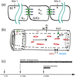

---
author-meta:
- David N. Nicholson
- Vincent Rubinetti
- Dongbo Hu
- Marvin Thielk
- Lawrence E. Hunter
- Casey S. Greene
bibliography:
- content/manual-references.json
date-meta: '2021-01-29'
header-includes: '<!--

  Manubot generated metadata rendered from header-includes-template.html.

  Suggest improvements at https://github.com/manubot/manubot/blob/master/manubot/process/header-includes-template.html

  -->

  <meta name="dc.format" content="text/html" />

  <meta name="dc.title" content="Linguistic Analysis of the bioRxiv Preprint Landscape" />

  <meta name="citation_title" content="Linguistic Analysis of the bioRxiv Preprint Landscape" />

  <meta property="og:title" content="Linguistic Analysis of the bioRxiv Preprint Landscape" />

  <meta property="twitter:title" content="Linguistic Analysis of the bioRxiv Preprint Landscape" />

  <meta name="dc.date" content="2021-01-29" />

  <meta name="citation_publication_date" content="2021-01-29" />

  <meta name="dc.language" content="en-US" />

  <meta name="citation_language" content="en-US" />

  <meta name="dc.relation.ispartof" content="Manubot" />

  <meta name="dc.publisher" content="Manubot" />

  <meta name="citation_journal_title" content="Manubot" />

  <meta name="citation_technical_report_institution" content="Manubot" />

  <meta name="citation_author" content="David N. Nicholson" />

  <meta name="citation_author_institution" content="Department of Systems Pharmacology and Translational Therapeutics, Perelman School of Medicine University of Pennsylvania, Philadelphia PA, USA" />

  <meta name="citation_author_orcid" content="0000-0003-0002-5761" />

  <meta name="twitter:creator" content="@None" />

  <meta name="citation_author" content="Vincent Rubinetti" />

  <meta name="citation_author_institution" content="Department of Systems Pharmacology and Translational Therapeutics, Perelman School of Medicine University of Pennsylvania, Philadelphia PA, USA" />

  <meta name="citation_author_orcid" content="None" />

  <meta name="twitter:creator" content="@vincerubinetti" />

  <meta name="citation_author" content="Dongbo Hu" />

  <meta name="citation_author_institution" content="Department of Systems Pharmacology and Translational Therapeutics, Perelman School of Medicine University of Pennsylvania, Philadelphia PA, USA" />

  <meta name="citation_author_orcid" content="None" />

  <meta name="twitter:creator" content="@None" />

  <meta name="citation_author" content="Marvin Thielk" />

  <meta name="citation_author_institution" content="Elsevier" />

  <meta name="citation_author_orcid" content="0000-0002-0751-3664" />

  <meta name="twitter:creator" content="@TheNeuralCoder" />

  <meta name="citation_author" content="Lawrence E. Hunter" />

  <meta name="citation_author_institution" content="Center for Computational Pharmacology, University of Colorado School of Medicine, Aurora CO, USA" />

  <meta name="citation_author_orcid" content="0000-0003-1455-3370" />

  <meta name="twitter:creator" content="@ProfLHunter" />

  <meta name="citation_author" content="Casey S. Greene" />

  <meta name="citation_author_institution" content="Department of Systems Pharmacology and Translational Therapeutics, Perelman School of Medicine University of Pennsylvania, Philadelphia PA, USA" />

  <meta name="citation_author_institution" content="Department of Biochemistry and Molecular Genetics, University of Colorado School of Medicine, Aurora CO, USA" />

  <meta name="citation_author_orcid" content="0000-0001-8713-9213" />

  <meta name="twitter:creator" content="@greenescientist" />

  <link rel="canonical" href="https://greenelab.github.io/annorxiver_manuscript/" />

  <meta property="og:url" content="https://greenelab.github.io/annorxiver_manuscript/" />

  <meta property="twitter:url" content="https://greenelab.github.io/annorxiver_manuscript/" />

  <meta name="citation_fulltext_html_url" content="https://greenelab.github.io/annorxiver_manuscript/" />

  <meta name="citation_pdf_url" content="https://greenelab.github.io/annorxiver_manuscript/manuscript.pdf" />

  <link rel="alternate" type="application/pdf" href="https://greenelab.github.io/annorxiver_manuscript/manuscript.pdf" />

  <link rel="alternate" type="text/html" href="https://greenelab.github.io/annorxiver_manuscript/v/97a4403fb7cc5e50932c98de71448c66d989796b/" />

  <meta name="manubot_html_url_versioned" content="https://greenelab.github.io/annorxiver_manuscript/v/97a4403fb7cc5e50932c98de71448c66d989796b/" />

  <meta name="manubot_pdf_url_versioned" content="https://greenelab.github.io/annorxiver_manuscript/v/97a4403fb7cc5e50932c98de71448c66d989796b/manuscript.pdf" />

  <meta property="og:type" content="article" />

  <meta property="twitter:card" content="summary_large_image" />

  <link rel="icon" type="image/png" sizes="192x192" href="https://manubot.org/favicon-192x192.png" />

  <link rel="mask-icon" href="https://manubot.org/safari-pinned-tab.svg" color="#ad1457" />

  <meta name="theme-color" content="#ad1457" />

  <!-- end Manubot generated metadata -->'
keywords:
- biorxiv
- preprints
- pubmed-central
- natural-language-processing
- descriptive-linguistics
lang: en-US
manubot-clear-requests-cache: false
manubot-output-bibliography: output/references.json
manubot-output-citekeys: output/citations.tsv
manubot-requests-cache-path: ci/cache/requests-cache
title: Linguistic Analysis of the bioRxiv Preprint Landscape
...

<small><em>
This manuscript
([permalink](https://greenelab.github.io/annorxiver_manuscript/v/97a4403fb7cc5e50932c98de71448c66d989796b/))
was automatically generated
from [greenelab/annorxiver_manuscript@97a4403](https://github.com/greenelab/annorxiver_manuscript/tree/97a4403fb7cc5e50932c98de71448c66d989796b)
on January 29, 2021.
</em></small>

## Authors

+ **David N. Nicholson** 
    {.inline_icon}
    [0000-0003-0002-5761](https://orcid.org/0000-0003-0002-5761)
    · {.inline_icon}
    [danich1](https://github.com/danich1) 
  <small>
     Department of Systems Pharmacology and Translational Therapeutics, Perelman School of Medicine University of Pennsylvania, Philadelphia PA, USA
     · Funded by The Gordon and Betty Moore Foundation (GBMF4552); The National Institutes of Health (T32 HG000046)
  </small>

+ **Vincent Rubinetti** 
    · {.inline_icon}
    [vincerubinetti](https://github.com/vincerubinetti)
    · {.inline_icon}
    [vincerubinetti](https://twitter.com/vincerubinetti) 
  <small>
     Department of Systems Pharmacology and Translational Therapeutics, Perelman School of Medicine University of Pennsylvania, Philadelphia PA, USA
     · Funded by The Gordon and Betty Moore Foundation (GBMF4552); The National Institutes of Health (T32 HG010067)
  </small>

+ **Dongbo Hu** 
    · {.inline_icon}
    [dongbohu](https://github.com/dongbohu) 
  <small>
     Department of Systems Pharmacology and Translational Therapeutics, Perelman School of Medicine University of Pennsylvania, Philadelphia PA, USA
     · Funded by The Gordon and Betty Moore Foundation (GBMF4552); The National Institutes of Health (T32 HG010067)
  </small>

+ **Marvin Thielk** 
    {.inline_icon}
    [0000-0002-0751-3664](https://orcid.org/0000-0002-0751-3664)
    · {.inline_icon}
    [MarvinT](https://github.com/MarvinT)
    · {.inline_icon}
    [TheNeuralCoder](https://twitter.com/TheNeuralCoder) 
  <small>
     Elsevier
  </small>

+ **Lawrence E. Hunter** 
    {.inline_icon}
    [0000-0003-1455-3370](https://orcid.org/0000-0003-1455-3370)
    · {.inline_icon}
    [LEHunter](https://github.com/LEHunter)
    · {.inline_icon}
    [ProfLHunter](https://twitter.com/ProfLHunter) 
  <small>
     Center for Computational Pharmacology, University of Colorado School of Medicine, Aurora CO, USA
     · Funded by The Gordon and Betty Moore Foundation (GBMF4552)
  </small>

+ **Casey S. Greene** 
    {.inline_icon}
    [0000-0001-8713-9213](https://orcid.org/0000-0001-8713-9213)
    · {.inline_icon}
    [cgreene](https://github.com/cgreene)
    · {.inline_icon}
    [greenescientist](https://twitter.com/greenescientist) 
  <small>
     Department of Systems Pharmacology and Translational Therapeutics, Perelman School of Medicine University of Pennsylvania, Philadelphia PA, USA; Department of Biochemistry and Molecular Genetics, University of Colorado School of Medicine, Aurora CO, USA
     · Funded by The Gordon and Betty Moore Foundation (GBMF4552); The National Institutes of Health (T32 HG010067)
  </small>

## Abstract {.page_break_before}

Preprints allow researchers to make their findings available to the scientific community before they have undergone peer review.
This provides an opportunity to understand life sciences peer review and publishing practices.
Studies of bioRxiv to date have been largely focused on article metadata, and have examined how preprints are downloaded, cited, published, and discussed online.
A missing element has been examining the language contained within preprints.
Comparing preprints with peer reviewed manuscripts provides an opportunity to examine how peer review changes these documents.   
We sought to compare and contrast linguistic features within bioRxiv preprints to biomedical text as a whole and also their published counterparts.
The most prevalent elements that changed appeared to be associated with typesetting and mentions of supplementary or additional files.
We created document embeddings derived from a bioRxiv-trained word2vec model and found that they revealed different scientific approaches, linked unannotated preprint-peer reviewed article pairs, and were associated with the journal where a preprint would eventually be published.
We examined factors associated with the time elapsed between the posting of a first preprint and the appearance of a peer reviewed publication and found that preprints with more versions posted and also those with more textual changes, assessed via document embeddings, took longer to publish.
The full text landscape of bioRxiv provides an opportunity to explore scientific language and how peer review alters articles.
We provide a web application with which users can explore how a bioRxiv or medRxiv preprint is positioned within the landscape and identify the journals and articles that are most similar.

## Introduction

The dissemination of research findings is key to science, and initially much of this communication happened orally [@doi:10.1021/ci00050a001].
During the 17th century, the predominate form of communication shifted to personal letters that were shared from one scientist to another [@doi:10.1021/ci00050a001].
Scientific journals didn't become a predominant mode of communication until the 19th and 20th centuries when the first journal abstract was created [@doi:10.1021/ci00050a001; @raw:smith2006trouble; @doi:10.1300/J123v41n01_04].
Although scientific journals became the primary method of communication, they added high maintenance costs and long publication times to scientific discourse [@raw:smith2006trouble; @doi:10.1300/J123v41n01_04].
Scientists' solution to some of these issues was to communicate through preprints, which are scholarly works that have yet to undergo peer review process [@doi:10.1177/0192623318767322; @doi:10.1371/journal.pbio.2003995].

Preprints are commonly hosted on online repositories, where users have open and easy access to these works.
Notable repositories include arXiv [@doi:10.1108/14666180010345564], bioRxiv [@doi:10.1101/833400] and medRxiv [@url:https://www.medrxiv.org/]; however, there are over 60 different repositories available [@url:https://scholarlykitchen.sspnet.org/2019/10/16/the-second-wave-of-preprint-servers-how-can-publishers-keep-afloat/].
The burgeoning uptake of preprints in life sciences has been examined through research focused on metadata from the bioRxiv repository.
For example, scientists found that life science preprints are being posted at an increasingly high rate [@doi:10.1371/journal.pbio.3000269].
Furthermore, these preprints are being rapidly shared on social media, routinely downloaded, and cited [@doi:10.1371/journal.pone.0047523].
Certain preprint categories are read and shared by both scientists and non-scientists alike [@doi:10.1101/2020.03.06.981589].
Overall, about two-thirds to three-quarters of preprints are eventually published [@doi:10.7554/eLife.45133.001; @doi:10.1002/pra2.175] and life science articles that have a corresponding preprint version are cited and discussed more often than articles without them [@doi:10.1162/qss_a_00043; @doi:10.7554/eLife.52646; @doi:10.12688/f1000research.19619.2].
Preprints take an average of 160 days to become published [@doi:10.2139/ssrn.3455146], and those with multiple versions take longer to publish [@doi:10.2139/ssrn.3455146].

In spite of the success and excitement of preprints, there are number of issues that arose from their constant use.
Preprint repositories receive a growing number of submissions, which pose challenges for this mode of communication [@doi:10.1371/journal.pgen.1008565].
For example, repositories have a hard time searching and linking preprints with their published counterparts [@doi:10.1038/530265a; @doi:10.7554/eLife.52646], which results in missing links and consequently erroneous metadata.
Furthermore, these repositories lack tools to show how textual content of preprints are altered due to the peer review process [@doi:10.1371/journal.pgen.1008565].
These repositories are open access for all to view preprints, which results in concern from scientists that they could be scooped by competitors [@doi:10.1371/journal.pgen.1008565; @doi:10.1371/journal.pbio.3000151].
Plus, preprint repositories do not have in-depth peer review which can result in posted preprints containing inconsistent results or conclusions [@doi:10.12688/f1000research.19619.2; @doi:10.1007/s10393-018-1352-3; @doi:10.1038/530265a; @doi:10.1016/j.bpj.2016.06.035].
Despite a growing emphasis on using the study of preprints to examine the publishing process in the life sciences, how these findings related to the text of documents within bioRxiv has not been examined.

Textual analysis is a methodology that uses linguistic, statistical and machine learning techniques to analyze and extract information from text [@doi:10.1111/1475-679X.12123]. 
This set of techniques have made a sizable impact within the life science community by providing valuable insight on biomedical text.
For instance, scientists analyzed linguistic similarities and differences of biomedical corpora [@doi:10.1186/1471-2105-10-183;10.1186/1471-2105-9-S3-S6; @pmc:PMC442180].
Scientists have provided the community with a number of tools that aide future text mining systems [@doi:10.1093/bib/bbs084; @doi:10.1093/nar/gkz389; @doi:10.1186/s12859-017-1775-9] as well as advice on how to train and test future text processing systems [@doi:10.1186/1471-2105-11-492; @doi:10.1186/1471-2105-13-207; @doi:10.1186/s12859-019-2604-0].
We use textual analysis to examine the bioRxiv repository, placing a particular emphasis on understanding the extent to which full text analysis can address hypotheses derived from the analysis of metadata alone.

Preprints are still an emerging method of scientific communication in the life sciences.
To understand how they relate to the traditional publishing ecosystem, we examine the linguistic similarities and differences between preprints and peer reviewed text and observe how linguistic features change during the peer review and publishing process.
We theorize that preprints and biomedical text would be quite similar, especially when controlling for the differential uptake of preprints across fields.
In other contexts, neural networks trained in certain ways can produce a representation of words and documents that has useful properties for many tasks - termed word or document embeddings [@arxiv:1301.3781; @arxiv:1405.4053].
Here, we hypothesize that using these networks to embedded preprints provides a versatile way to disentangle linguistic features and serves as a practical medium for improving preprint repository functionality.
We test this hypothesis by producing a linguistic landscape of bioRxiv preprints, detecting preprints that change substantially during publication, and identify journals that publish manuscripts that are linguistically similar to a target preprint.
We encapsulate our findings through a web-app that projects a user-selected preprint onto this landscape and suggests journals and articles that are linguistically similar.
Taken together, our work reveals how linguistically similar and dissimilar preprints are to peer reviewed text and quantifies linguistic changes that occur during the peer review process. 
Furthermore, our work examines the association between linguistic changes and a preprint's time to publication suggesting that comparisons between embeddings of preprints and peer reviewed documents provides a means to study the process of peer review.

## Materials and Methods

### Corpora Examined

#### BioRxiv Corpus

BioRxiv [@doi:10.1101/833400] is a repository for life sciences preprints.
We downloaded an xml snapshot of this repository on February 3, 2020 from bioRxiv's Amazon S3 bucket [@url:https://www.biorxiv.org/tdm].
This snapshot contained the full text and image content of 98,023 preprints.
Preprints on bioRxiv are versioned, and in our snapshot 26,905 out of 98,023 contained more than one version.
When preprints had multiple versions, we used the latest one unless otherwise noted.
Authors submitting preprints to bioRxiv select one of twenty-nine different categories.
Researchers also select an article type, which can be a new result, confirmatory finding, or contradictory finding.
Some preprints in this snapshot were withdrawn from bioRxiv: when this happens, their content is replaced with the reason for withdrawal.
As there were very few withdrawn preprints, we did not treat these as a special case.

#### PubMed Central Open Access Corpus

PubMed Central (PMC) is a digital archive for the United States National Institute of Health's Library of Medicine (NIH/NLM) that contains full text biomedical and life science articles [@doi:10.1073/pnas.98.2.381].
PMC articles can be closed access ones from research funded by the NIH appearing after an embargo period or those published under Gold Open Access [@doi:10.1007/s12471-017-1064-2] publishing schemes.
Paper availability within PMC is largely dependent on the journal's participation level [@url:https://www.ncbi.nlm.nih.gov/pmc/about/submission-methods/].
Individual journals can fully participate in submitting articles to PMC, selectively participate sending only a few papers to PMC, only submit papers according to NIH's public access policy [@url:https://grants.nih.gov/grants/policy/nihgps/html5/section_8/8.2.2_nih_public_access_policy.htm], or not participate at all.
As of September 2019, PMC had 5,725,819 articles available [@url:https://www.ncbi.nlm.nih.gov/pmc/about/intro/].
Out of these 5 million articles, about 3 million were open access (PMCOA) and available for text processing systems [@doi:10.1093/bioinformatics/btz070; @doi:10.1093/nar/gkz389].
PMC also contains a resource that holds author manuscripts that have already passed the peer review process [@url:https://www.ncbi.nlm.nih.gov/pmc/about/authorms/].
Since these manuscripts have already been peer reviewed, we kept them out of our analysis as the scope of our work is solely focused on examining the beginning and endpoints of a preprint's lifecycle.
We downloaded a snapshot of the PMCOA corpus on January 31, 2020.
This snapshot contained many types of papers: literature reviews, book reviews, editorials, case reports, research articles and more.
We used only research articles, which aligns with the intended role of bioRxiv, and we refer to these articles as the PMCOA Corpus.

#### The New York Times Annotated Corpus

The New York Times Annotated Corpus (NYTAC) is [@sandhaus2008new] is collection of newspaper articles from the New York Times dating from January 1, 1987  to June 19, 2007.
This collection contains over 1.8 million articles where 1.5 million of those articles have undergone manual entity tagged by library scientists [@sandhaus2008new].
We downloaded this collection on August 3rd, 2020 from the Linguistic Data Consortium (see Software and Data Availability section) and used the entire collection as a negative control for our corpora comparison analysis.

### Mapping bioRxiv preprints to their published counterparts

We used CrossRef [@doi:10.1629/uksg.233] to identify bioRxiv preprints that were linked to a corresponding published article.
We accessed CrossRef on July 7th, 2020 and were able to successfully link 23,271 preprints to their published counterparts.
Out of those 23,271 preprint-published pairs only 17,952 pairs had a published version present within the PMCOA corpus. 
For our analyses that involved published links we only focused on the subset of preprints-published pairs that contained a published article within PMCOA.

### Comparing Corpora

We compared the bioRxiv, PMCOA, and NYTAC corpora to assess the similarities and differences between them.
We used the NYTAC corpus as a negative control to assess the similarity between two life sciences repositories when compared with non-life sciences text.
All corpora contain both words and non-word symbols (e.g., $\pm$), which we refer to together as tokens to avoid confusion.
We calculated the following characteristic metrics for each corpus: the number of documents, the number of sentences, the total number of tokens, the number of stopwords, the average length of a document, the average length of a sentence, the number of negations, the number of coordinating conjunctions, the number of pronouns and the number of past tense verbs.
Spacy is a lightweight and easy to use python package designed to preprocess and filter out text [@spacy2].
Due to the potency of this package, we used spaCy's "en_core_web_sm" model [@spacy2] (version 2.2.3) to preprocess all corpora and filtered out 326 spaCy-provided stopwords.

Following our cleaning process, we calculated the frequency of every token across all corpora.
Because many tokens were unique to one set or the other and observed at low frequency, we focused on the union of the top 0.05% (~100) most frequently occurring tokens within each individual corpus.
For each token in this union, we generated a contingency table  and calculated the odds ratio along with the 95% confidence interval [@url:https://www.ncbi.nlm.nih.gov/books/NBK431098/].
Along with token enrichment analysis, we measured corpora similarity by calculating the Kullback–Leibler (KL) divergence across all corpora.
This metric measures the extent to which two distributions, but not the specific entities that comprise those distributions, differ.
A low value of KL divergence implicates that two distributions are similar as opposed to the alternative.
The optimal number of tokens used to calculate the KL divergence is unknown, so we calculated this metric using a spectrum of 100 most frequently occurring tokens between two corpora to 5000 most frequently occurring tokens.

### Constructing a Document Representation for Life Sciences Text

We sought to build a model that would capture the linguistic similarities of biomedical preprint and articles.
Word2vec is a suite of neural networks designed to model linguistic features of words based on their appearance in text.
These models are trained to either predict a word based on its sentence context as a continuous bag of words (CBOW) or predict the context based on a given word in a skipgram model [@arxiv:1301.3781].
Through these prediction tasks the networks learn latent features that can be used for downstream tasks such as identifying similar words.
We used gensim [@rehurek_lrec] (version 3.8.1) to train a CBOW  [@arxiv:1301.3781] model over all the main text within each preprint in the bioRxiv corpus.
Determining the best number of dimensions for word embeddings can be a non-trivial task; however, it has been shown that optimal performance is between 100-1000 dimensions [@arxiv:1812.04224].
Based on this finding, we chose to train the CBOW model using 300 hidden nodes, batch size of 10000 words and for 20 epochs.
We set a fixed random seed and used gensim's default settings for all other hyperparameters.
Once trained, every token present within the CBOW model is associated with a dense vector that represents latent linguistic features captured by the network.
We used these word vectors to generate a document representation for every article within the bioRxiv and PubMed Central corpora.
Each document vector is generated by taking the average of every token present within the CBOW model as well as the individual article [@arxiv:1405.4053].
Any token present within the article but not in the CBOW model is ignored during the calculation process.

### Visualizing and Characterizing Preprint Representations

We sought to visualize the landscape of preprints and determine the extent to which their representation as document vectors corresponded to author-supplied document labels.
We used principal component analysis (PCA) [@doi:10.1111/1467-9868.00196] to project bioRxiv document vectors into a low dimensional space.
We trained this model using scikit-learn's [@scikit-learn] implementation of a randomized solver [@arxiv:0909.4061] with a random seed of 100, output of 50 principal components (PCs), and default settings for all other hyperparameters.
After training the model, every preprint within the bioRxiv corpus is assigned a score for each generated PC.
We sought to uncover concepts captured the generated PCs and used the cosine similarity metric to do as such.
This metric takes two vectors as input and outputs a score between -1 (most dissimilar) and 1 (most similar).
For our use case we used this metric to score the similarity between all generated PCs and every token within our CBOW model.
We report the top 100 positive and negative scoring tokens in the form of word clouds, where the size of each word corresponds to the magnitude of similarity and color represents positive (orange) or negative (blue) association.

### Discovering Unannotated Preprint-Publication Relationships

The bioRxiv maintainers have automated procedures to link preprints to peer reviewed versions and many journals require authors to update preprints with a link to the published version.
However, this automation is largely based on exact matching of certain attributes, and authors can forget to establish a link after publication.
Authors can change the title between a preprint and published version (e.g., [@doi:10.1101/376665] and [@doi:10.1242/bio.038232]), which prevents bioRxiv from automatically establishing a link.
If the authors do not report the publication to bioRxiv, the preprint and the published version are treated as distinct entities despite representing the same underlying research.
We recognized that close proximity in the embedding space could reveal preprint to published version links that were missed by existing automated processes.
We used the subset of paper-preprint pairs annotated in CrossRef as described above to calculate the distribution of known preprint to published distances, which we calculated as the Euclidean distance between the preprint's embedding coordinates and the coordinates of its corresponding published version.
We also calculated a background distribution, which consisted of the distance between each preprint with an annotated publication and a randomly selected article from the same journal.
Next, we calculated distances between preprints without a published version link with PubMed Central articles that weren't matched with a corresponding preprint.
We filtered any potential links with distances that were greater than the minimum value of the background distribution to reduce the curation burden.
Lastly, we binned the remaining pairs based on percentiles from the annotated pairs distribution at the [0,25th percentile), [25th percentile, 50th percentile), [50th percentile, 75th percentile), and [75th percentile, minimum background distance).
We randomly sampled 50 articles from each bin for manual annotation.
We shuffled these four sets to produce a list of 200 potential preprint-published pairs with a randomized order.
We supplied these pairs to two co-authors to manually determine if each link between a preprint and a putative matched version was correct or incorrect.
After the curation process, we encountered eight disagreements between the reviewers.
We supplied the preprint-publication pairs on which reviewers disagreed to a third scientist, who carefully reviewed each case and made a final determination.
We used this curated set to evaluate the extent to which distance in the embedding space revealed true but unannotated links between preprints and their published versions.

### Measuring Time Duration for Preprint Publication Process

We measured the time required for preprints to be published in the peer reviewed literature and compared this time within fields and as a function of the extent to which documents changed between the preprint and publication.
We queried bioRxiv’s application programming interface (API) to obtain the date a preprint was posted onto bioRxiv as well as the date a preprint was accepted for publication.
We calculated the difference between the date at which a preprint was first posted and its publication date to provide a publication interval, and we also recorded the number of preprint versions posted onto bioRxiv.
To measure the amount of textual difference, we calculated the Euclidean distance between the document representation of each preprint and the corresponding published version.
We performed linear regression to model the relationship between preprint version count and a preprint's time to publication as well as the relationship between document representation distances and a preprint's time to publication.
We visualized results as square bin plots.
We observed a limited number of cases in which authors appeared to post preprints after the date of publication, which results in preprints receiving a negative time difference, as previously reported [@url:https://medium.com/@OmnesRes/the-biorxiv-wall-of-shame-aa3d9cfc4cd7].
We did not remove preprints that had a negative time publication in our linear regression analysis as it was not strictly necessary, but we removed them in our survival curve analysis where they were incompatible with the analytical approach.
In practice, the number with negative publication times and the short lead time between publication and preprint has a minimal impact on results.

Document distances can be difficult to understand, so we sought to contextualize the meaning of a distance unit.
We selected preprints within the Bioinformatics topic area, which was well-represented on bioRxiv.
For preprints submitted to the Bioinformatics topic area, we sampled a pair of preprints and calculated their differences 1000 times and reported the mean.

In addition to contextualizing the document distance, we also wanted to contextualize differences in the time to publication.
We examined time to publication for each topic area using the Kaplan-Meier estimator [@doi:10.4103/0974-7788.76794] on preprints within bioRxiv, treating preprints not yet published as survival.
We generated these curves using the KaplanMeierFitter function from the lifelines [@doi:10.5281/zenodo.4136578] (version 0.25.6) python package.
We reported the half-life of each bioRxiv preprint category.

### Building Journal Venue Classifiers

We hypothesized that preprints would be more likely to be published in journals that contained similar content to the work in question.
To test this hypothesis, we designed an experiment examining document and journal representations.
First, we removed all journals that had fewer than 100 papers in the PMC corpus.
Certain manuscripts in the PMC corpus were annotated to their corresponding bioRxiv preprints through CrossRef as previously noted.
We held out this subset and treated it as a gold standard test set.
We used the remainder of the PMC corpus for training and initial evaluation via cross validation using the scikit-learn k-Nearest Neighbors implementation [@arXiv:1201.0490].
We imagined a use case of prioritizing relevant journals for preprint authors, and considered a list of ten journal suggestions to be an appropriate number and we considered a prediction to be a true positive if the correct journal appeared within the ten closest neighbors of the query article.

Certain journals publish articles in a focused topic area, while others publish articles that cover many topics.
Likewise, some journals have a publication rate of at most hundreds of papers per year while others publish at a rate of at least ten-thousand papers per year.
Accounting for these characteristics, we designed two approaches - one centered on manuscripts and another centered on journals.

For the manuscript-based approach, we identified the ten most similar published manuscripts and evaluated where the documents were published.
We embedded each query article into the space defined by the word2vec model as described for preprints.
We selected the ten manuscripts that were nearest by Euclidean distance in the embedding space and returned the journal in which they were published.
The number of journals returned via this method could be less than ten as multiple papers in close proximity to query article may belong to the same journal.
Because this approach was based on paper proximity, we could return the articles that led to each journal being returned.
However, journals that publish more papers are more frequently recommended in this framing.

For the journal-based approach, we identified the ten most similar journals by constructing a journal representation in the same embedding space.
We computed journal centroids as the average embedding of all published papers in the journal.
We then projected a query article into the same space and returned the ten closest journal centroids by Euclidean distance.
This technique guaranteed that at least ten distinct journals were returned and prevented journals that publish many papers from being heavily overrepresented.

In both cases, we set the number of neighbors for each model to be 10 and then evaluated both models via 10-fold cross validation.
We evaluated performance of both classifiers on our gold standard test set of published preprints.

### Web Application for Discovering Similar Preprints and Journals

We developed a web application that identifies similar papers and journals for any bioRxiv and medRxiv preprint and that places the preprint into the overall document landscape.
Our web application downloads a pdf version of a preprint hosted on the  bioRxiv or medRxiv server.
We use pdfminer [@url:https://pdfminersix.readthedocs.io/en/latest/index.html] to extract text from the downloaded pdf.
The extracted text is then fed into our word2vec model to construct a document embedding representation.
We pass this representation onto our journal and manuscript search to identify journals based on the ten closest neighbors of individual papers as well as journal centroids.
We implemented this search using the scikit-learn implementation of k-d trees.
To run it more cost effectively on cloud computing environment, we sharded the k-d trees into four trees.

Accompanying these recommendations, we also provided a neural network derived visualization of our training set and the article's position within it.
We used SAUCIE [@doi:10.1101/2020.03.04.975177], an autoencoder designed to cluster single cell RNA-seq data, to build a two-dimensional embedding space that could be applied to newly generated preprints without retraining, a limitation of other approaches that we explored for visualizing entities expected to lie on a nonlinear manifold.
We trained this model on document embeddings of PMC articles that did not contain a matching preprint version.
We used the following parameters to train the model: a hidden size of 2, a learning rate of 0.001, lambda_b of 0, lambda_c of 0.001, and lambda_d of 0.001 for 2000 iterations.
When a user requests a new document, we can then project the document on the pretrained model to generate a visualization in two-dimensional space.
We illustrate our recommendations as a short list and provide access to our network visualization at [https://greenelab.github.io/preprint-similarity-search/](https://greenelab.github.io/preprint-similarity-search/).

We used the fully trained model to project user-requested bioRxiv preprints onto the generated landscape to enable users to see where their preprint falls along the landscape.

## Results

### Comparing bioRxiv to other corpora

#### bioRxiv Metadata Statistics

The preprint landscape is rapidly changing, and the number of bioRxiv preprints in our data download (71,118) was nearly double that of a recent study that reported on a snapshot with 37,648 preprints [@doi:10.7554/eLife.45133].
Because the rate of change is rapid, we first analyzed category data and compared our results with previous findings.
As in previous reports [@doi:10.7554/eLife.45133], neuroscience remains the most common category of preprint followed by bioinformatics (Supplemental Figure {@fig:biorxiv_categories}).
Microbiology, which was fifth in the most recent report [@doi:10.7554/eLife.45133], has now surpassed evolutionary biology and genomics to move into third.
When authors upload their preprints, they select from three result category types: new results, confirmatory results or contradictory results.
We found that nearly all preprints (97.5%) were categorized as new results, which is consistent with reports on a smaller set [@doi:10.1001/jama.2017.21168].
Taken together, the results suggest that while bioRxiv has experienced dramatic growth, the way in which it is being used appears to have remained consistent in recent years.

#### Global analysis reveals similarities and differences between bioRxiv and PMC

| Metric                | bioRxiv     | PMC           | NYTAC         |
|-----------------------|-------------|---------------|---------------|
| document count             | 71,118      | 1,977,647     | 1,855,658     |
| sentence count             | 22,195,739  | 480,489,811   | 72,171,037    |
| token count                | 420,969,930 | 8,597,101,167 | 1,218,673,384 |
| stopword count            | 158,429,441 | 3,153,077,263 | 559,391,073   |
| avg. document length        | 312.10      | 242.96        | 38.89         |
| avg. sentence length        | 22.71       | 21.46         | 19.89         |
| negatives                  | 1,148,382   | 24,928,801    | 7,272,401     |
| coordinating conjunctions  | 14,295,736  | 307,082,313   | 38,730,053    |
| coordinating conjunctions% | 3.40%       | 3.57%         | 3.18%         |
| pronouns                   | 4,604,432   | 74,994,125    | 46,712,553    |
| pronouns%                  | 1.09%        | 0.87%         | 3.83%         |
| passives                   | 15,012,441  | 342,407,363   | 19,472,053    |
| passive%                   | 3.57%       | 3.98%         | 1.60%         |

Table: Summary statistics for the bioRxiv, PMC, and NYTAC corpora. {#tbl:corpora_stats}

![
A. The Kullback–Leibler divergence measures the extent to which the distributions, not specific tokens, differ from each other.
The token distribution of bioRxiv and PMC corpora is more similar than these biomedical corpora are to the NYTAC one.
B. The major differences in token frequencies for the corpora appear to be driven by the fields that have had the highest uptake of bioRxiv, as terms from neuroscience and genomics are relatively more abundant in bioRxiv.
Points indicate the log_2(OR) for each token and error bars indicate the 95% confidence intervals.
C. Of the terms that differ between bioRxiv and PMC, the most abundant in bioRxiv are "et" and "al" while the most abundant in PMC is "study."
D. The major differences in token frequencies for preprints and their corresponding published version often appear to be associated with typesetting and supplementary or additional materials.
Points indicate the log_2(OR) for each token and error bars indicate the 95% confidence intervals.
E. The tokens with the largest absolute differences in abundance appear to be stylistic.
](https://raw.githubusercontent.com/danich1/annorxiver/e61dff8efe2216852a6b2a9ff0ec921a54356ad7/figure_generation/output/figure_one_panels.svg){#fig:corpora_comparison_panels width="100%"}

We first compared the overall text of bioRxiv with PMC, adding a corpus of professionally written but non-biomedical text (NYTAC) as a control.
Documents on bioRxiv were slightly longer than those on PMC, but both were much longer than those from NYTAC (Table {@tbl:corpora_stats}).
Other than length, both corpora were otherwise quite similar.
The average sentence length, fraction of pronouns, and the use of the passive voice were all more similar between bioRxiv and PMC than they were to NYTAC (Table {@tbl:corpora_stats}).
The Kullback–Leibler divergence measures the extent to which two distributions, but not the specific entities that comprise those distributions, differ.
The distribution of term frequencies in bioRxiv and PMC was low, especially among the top few hundred tokens (Figure {@fig:corpora_comparison_panels}A).
Differences began to emerge over more terms, but remained much lower than when the biomedical corpora are compared with NYTAC.

Examining the frequencies of individual terms revealed differences between the biomedical corpora.
Previous work examining author-selected categories has reported that fields appear to have preprinted unevenly, with certain life sciences research fields having more uptake than others [@doi:10.7554/eLife.45133].
However, it was possible that authors simply selected certain fields preferentially but that the content was similar to the broader corpus of life sciences text.
We directly examined this by comparing term frequencies between bioRxiv and PMC.
We found that among the terms that differed the most many were associated with certain life sciences research fields.
Terms like "neurons" "genome" and "genetic", which are common in genomics and neuroscience, were more common in bioRxiv than PMC while others associated with clinical research, such as "clinical" "patients" and "treatment" were more common in PMC (Figure {@fig:corpora_comparison_panels}B and {@fig:corpora_comparison_panels}C).

We next controlled for differences in the body of documents to identify term-level changes associated with the publication process itself by examining only pairs of preprints and their corresponding publication (Figure {@fig:corpora_comparison_panels}D and {@fig:corpora_comparison_panels}E).
The tokens that differed included "et" "al", "$\pm$", "–" and others that appeared to be typesetting related.
Certain changes appeared to be related to journal styles: "figure" was more common in bioRxiv while "fig" was relatively more common in PMC.
Other changes appeared to be associated with an increasing reference to content external to the manuscript itself: the tokens "supplementary", "additional" and "file" were all more common in PMC than bioRxiv suggesting that journals are not simply replacing one token with another but that there are more mentions of such content after peer review.

Taken together these results suggested that the structure of the text in documents on bioRxiv was similar to that on PMC.
The differences in uptake across fields are supported not only by differences in authors' categorization of their articles but also in the text of the articles themselves.
At the level of individual manuscripts, the terms that change the most appear to be associated with typesetting, journal style, and an increasing reliance on additional materials after peer review.

### Document embeddings derived from bioRxiv reveal fields and subfields

![
A. Principal components (PC) analysis of bioRxiv word2vec embeddings groups documents by author-selected categories.
We visualized documents from key categories on a scatterplot for the first two PCs.
The first PC separated cell biology from informatics-related fields.
The second PC separated bioinformatics from neuroscience.
Certain neuroscience papers appeared to be more associated with the cellular biology direction of PC1, while others appeared to be more associated with the informatics-related direction, which suggested that the concepts captured by PCs were not exclusively related to field.
B. A word cloud visualization of PC1, which separated informatics disciplines (positive direction) from cell biology (negative direction) showed that tokens "empirical" "estimates" and "statistics" characterized the positive direction while "cultured" and "overexpressing" characterized the negative one.
Each word cloud depicts the cosine similarity score between tokens and the second PC.
Tokens in orange were most similar to the PC's positive direction while tokens in blue were most similar to the PC's negative direction.
The size of each token indicates the magnitude of the similarity.
C. A word cloud visualization of PC2, which separated bioinformatics from neuroscience, showed that tokens "genomic" "genome" and "genomes" characterized the positive direction while "evoked" "stimulus" and "stimulation" characterized the negative one.
D. Examining PC1 values for each article by category created a continuum from informatics-related fields on the top through cell biology on the bottom.
Certain article categories (neuroscience, genetics) were spread throughout PC1 values.
E. Examining PC2 values for each article by category revealed fields like genomics, bioinformatics, and genetics on the top and neuroscience and behavior on the bottom.
](https://raw.githubusercontent.com/danich1/annorxiver/e61dff8efe2216852a6b2a9ff0ec921a54356ad7/figure_generation/output/figure_two_panels.svg){#fig:topic_analysis_panels width="100%"}

Document embeddings provide a means to categorize the language of documents in a way that takes into account the similarities between terms [@arxiv:1405.4053;@arxiv:1707.02377;@arxiv:2001.05727].
We first trained word embeddings using a 300-dimensional word2vec continuous bag of words model.
We combined word embeddings to produce an embedding for each bioRxiv or PMC document by calculating the average of all words present in each respective document.
This placed each document in a 300-dimensional space where each individual dimension is arbitrary.
To provide more structure to the dataset, we examined the predominant patterns in these embeddings by performing principal components analysis of bioRxiv.
The principal components (PCs) are ordered by the proportion of the variance explained.
We found that the first two PCs separated articles from different author-selected categories (Figure {@fig:topic_analysis_panels}A).

We sought to understand the token patterns that drove these overall differences between documents.
We identified the tokens most similar to a PC by calculating the cosine similarity score between tokens' embeddings in the word2vec space and each PC.
Visualizing token-PC similarity revealed tokens associated with certain research approaches (Figures {@fig:topic_analysis_panels}B and {@fig:topic_analysis_panels}C).
Examining the value for PC1 across all author-selected categories revealed an ordering of fields from cell biology to informatics-related disciplines (Figure {@fig:topic_analysis_panels}D).

While the PC1 value range for each author-selected category was high, these results suggested that a primary driver in the variability of language use on bioRxiv could be the divide between data science approaches and cell biology ones.
A similar analysis for PC2 suggested that neuroscience and genomics present a similar language continuum (Figure {@fig:topic_analysis_panels}E).
For both of the top two PCs, the submitter-selected category of systems biology preprints was near the middle of the distribution and had a relatively large interquartile range when compared with other categories (Figure {@fig:topic_analysis_panels}D and {@fig:topic_analysis_panels}E).

We examined the preprints that had the highest and lowest values for PC1 within systems biology (Table {#tbl:five_pc1_table}).
The preprints with the highest five PC values [@doi:10.1101/197400;@doi:10.1101/825943;@doi:10.1101/769299;@doi:10.1101/107250] included software packages, machine learning analyses, and other computational biology manuscripts.
The preprints with the lowest five PC values [@doi:10.1101/455048;@doi:10.1101/371922;@doi:10.1101/733162;@doi:10.1101/745943;@doi:10.1101/754572] were focused on signaling.
We provide the top 50 PCs of bioRxiv embeddings within our online repository (see Software and Data Availability).

| Title [citation]     | PC1  | License | Figure Thumbnail |
|--------------------------------|-------------------|------------|----------|
| Conditional Robust Calibration (CRC): a new computational Bayesian methodology for model parameters estimation and identifiability analysis [@doi:10.1101/197400] | 4.700554908074704 | None         |  |
| Machine learning of stochastic gene network phenotypes [@doi:10.1101/825943]                                                                                      | 4.410660604449826 | CC-BY-NC-ND  |  |
| Notions of similarity for computational biology models [@doi:10.1101/044818]                                                                                      | 4.355295926618207 | CC-BY-NC-ND  |  |
| GpABC: a Julia package for approximate Bayesian computation with Gaussian process emulation [@doi:10.1101/769299]                                                 | 4.351517618262304 | CC-BY-NC-ND  |  |
| SBpipe: a collection of pipelines for automating repetitive simulation and analysis tasks [@doi:10.1101/107250]                                                   | 4.321847854182741 |  CC-BY-NC-ND |   |
| | | | |
| Spatiotemporal proteomics uncovers cathepsin-dependent host cell death during bacterial infection [@doi:10.1101/455048]                                           | -4.263964235099807 |  CC-BY-ND   |  |
| Systems analysis by mass cytometry identifies susceptibility of latent HIV-infected T cells to targeting of p38 and mTOR pathways [@doi:10.1101/371922]           | -4.279016673409032 | CC-BY-NC-ND |  |
| NADPH consumption by L-cystine reduction creates a metabolic vulnerability upon glucose deprivation [@doi:10.1101/733162]                                         | -4.592209988884236 | None        |  |
| Inhibition of Bruton’s tyrosine kinase reduces NF-kB and NLRP3 inflammasome activity preventing insulin resistance and microvascular disease [@doi:10.1101/745943] | -4.736613689905791 | None        |   |
| AKT but not MYC promotes reactive oxygen species-mediated cell death in oxidative culture [@doi:10.1101/754572]                                                   | -4.826793742506695 | None        |   |

Table: PC1 divided the author-selected category of systems biology preprints along an axis from computational to molecular approaches. {#tbl:five_pc1_table}

### Document embedding similarities reveal unannotated preprint-publication pairs

Metaresearch into bioRxiv, including our own, relies on annotations of preprints that have been published to their corresponding peer reviewed publication.
Many journals require that authors update preprints with links to the published version of their article.
This is accomplished in two ways: bioRxiv may detect the link and automatically add it or authors may notify bioRxiv that their preprint was published.
However, bioRxiv establishes these links based on consistency in metadata (i.e., title, author names, etc).
Article titles, author lists, and other elements may change as a result of the peer review process. In these cases, if authors do not notify bioRxiv that the preprint has since been published then the scientific record remains incomplete.

Based on our finding that document embeddings captured fields and subfields, we expected that preprint-publication pairs with similar embedding values may represent the same document.
We examined the extent to which annotated preprint-publication pairs were closer in this space that preprints were to a random paper published in the same journal in which the preprint was eventually published using already annotated pairs.
We found that distances between preprints and their corresponding published versions were nearly always lower than preprints paired with a random article published in the same journal (Figure {@fig:preprint_links_panels}A).

![
A. Preprints are closer in document embedding space to their corresponding peer reviewed publication than they are to random papers published in the same journal.
B. Potential preprint-publication pairs that are unannotated but within the 50th percentile of all preprint-publication pairs in the document embedding space are likely represent true preprint-publication pairs.
We depict the fraction of true positives over the total number of pairs in each bin.
Accuracy is derived from curation of a randomized list of 200 potential pairs (50 per quantile) performed in duplicate with a third rater used in the case of disagreement.
C. Most preprints are eventually published.
We show the publication rate of preprints since bioRxiv first started.
The x-axis represents months since bioRxiv started and the y-axis represents the proportion of preprints published.
The light blue line represents the publication rate estimated by Abdill et al. [@doi:10.7554/eLife.45133].
The dark blue line represents the updated publication rate using only CrossRef-derived annotations while the dark green line includes annotations derived from similarity in the embedding space.
The horizontal lines represent the overall proportion of preprints that are were published as of the time of the annotation snapshot.
](https://raw.githubusercontent.com/danich1/annorxiver/f9d8861e3d60afa878c5d0088b7502adae15ebe3/figure_generation/output/figure_three_panels.svg){#fig:preprint_links_panels width="100%"}

Based on this finding, we analyzed preprint-publication pairs that were close in document space but not annotated as such.
We separated these pairs into four quantiles with the first three based on the distribution of preprint-publication distances and the fourth going from the 75th percentile in the preprint-publication pair space to the smallest value observed for the preprint-random set.
We then selected 50 preprint-publication pairs from each of these sets and shuffled them to create a random list of 200 possible pairs.
Two scientists then examined the pairs in these randomized lists determining if an preprint-publication pair represented the peer reviewed publication of the primary content described in the preprint.
Across the entire list we found a high inter-rater reliability of with a Cohen's Kappa [@doi:10.1177/001316446002000104] of 0.92.
In the case of disagreements, a third scientist more carefully examined the pairs and made a final determination.
Of the 200 pairs that we examined, approximately 98% of pairs with an embedding distance in the 0-25th and 25th-50th percentile bins were scored as true matches (Figure {@fig:preprint_links_panels}B).
These two bins contained 1,720 preprint-article pairs, suggesting that many preprints have been published but not previously connected with their published versions.

We overlaid these new annotations onto existing annotations to reassess the overall preprint publication rate reported by Abdill et al. [@doi:10.7554/eLife.45133].
Our filtering criteria were intentionally stringent, so the increased estimate of publication rate amounts to a few percent (Figure {@fig:preprint_links_panels}C).
We noticed that there was a particular enrichment of unannotated but published preprints in the 2017-2018 interval.
We would expect a higher proportion of such preprints before the year 2019 (many of which may not have been published yet); however, we did not expect to observe relatively few missed annotations before 2017.
It is possible that as the number of preprints grows, it has become harder to establish links.
Alternatively, authors now adopting preprinting practices may be less likely to notify the preprint server upon publication if the links are not automatically detected.
In any case, future work, especially that which aims to assess the fraction of preprints that are eventually published, should account for the possibility of missed annotations.
We supplied our set of 1720 high-confidence annotations to the bioRxiv staff.

### Preprints with more versions or more text changes took longer to publish

![
A. Preprints with more substantial text changes took longer to be published.
The x-axis shows the Euclidean distance between document representations of the first version of a preprint and it's peer reviewed form.
The y-axis shows the number of days elapsed between when the first version of a preprint posted on bioRxiv and the time a preprint is published.
The color bar on the right represents the density of each hexbin in this plot: more dense regions are shown in a brighter color.
B. Preprints with more versions were associated with a longer time to publish.
The x-axis shows the number of versions of a preprint that were posted on bioRxiv.
The y-axis shows the number of days that elapsed between when the first version of a preprint was posted on bioRxiv and the date at which the peer reviewed publication appeared.
The density of observations are depicted with the violin plot with an embedded boxplot.
C. Author-selected categories were associated with modest differences in the time to publish.
Categories are shown on the y-axis.
The x-axis shows the median time-to-publish for each category.
Error bars represent 95% confidence intervals for each preprint category's median time to publication.
](https://raw.githubusercontent.com/danich1/annorxiver/e61dff8efe2216852a6b2a9ff0ec921a54356ad7/figure_generation/output/figure_four_panels.svg){#fig:publication_delay_panels width="100%"}

The process of peer review includes a number of steps which take variable amounts of time [@doi:10.1002/nop2.51].
Comparing bioRxiv preprints with their corresponding published version provides an opportunity to better understand peer review and publishing.
We examined how long it took to publish preprints in their peer reviewed form for each author-selected category (Figure {@fig:publication_delay_panels}C).
We considered a preprint's endpoint to be publication and used the Kaplan-Meier estimator to estimate how much time has elapsed.
Of the most abundant preprint categories microbiology was the fastest to publish (140 days, (137, 145 days) [95% CI]) and genomics was the slowest (190 days, (185, 195 days) [95% CI]).
Though we did observe category-specific differences, these differences were generally modest.
One exception was the Scientific Communication and Education category, which took substantially longer to be peer reviewed and published (373 days, (373, 398 days) [95% CI]).

Preprint authors have the opportunity to update their preprint at any point until the peer reviewed publication appears.
We examined whether or not the number of versions of a preprint was associated with a change in the time to publish.
We found that preprints with more versions generally took longer to publish (Figure {@fig:publication_delay_panels}B).
Linear regression comparing the time to publish with the number of versions revealed an increasing relationship, with each version being associated with an additional 51 days before publication.
This time period seems broadly compatible with the amount of time it would take to receive reviews and revise a manuscript, suggesting that many authors may be updating their preprints in response to peer reviews or other external feedback.

We next used the full text content to examine the extent to which the magnitude of change to the text between the preprint and peer reviewed publication was associated with a change in the time to publication.
We used distance in the document embedding space to quantify the amount of change to the text.
We first established a baseline by selecting pairs of random preprints in the author-selected bioinformatics category and found a mean embedding distance between random pairs of 5.068.
Preprints that were further in the embedding space from their corresponding peer reviewed publication took longer to publish, with each unit in the embedding space corresponding to approximately sixteen additional days (Figure {@fig:publication_delay_panels}A).
The number of version and document distance effects, taken together, support a model where preprints that are reviewed more or that require larger revisions take longer to publish.

### Preprints with similar document embeddings share publication venues

We hypothesized that document embedding might capture information associated with the eventual publication venue.
We used the annotated preprint-publication pairs as a fully held out test set.
We embedded all PMC papers except those annotated to have a corresponding preprint into the bioRxiv embedding space.
For journals, we averaged the document representation of all papers in the journal to produce a journal centroid.
We used a k-nearest neighbor classifier trained on the remaining PMC documents to identify the most similar published papers and assessed performance - the extent to which the journal a paper appeared in the returned list of ten neighbors - through cross validation and the held out test set (Supplemental Figure {@fig:knn_auc}).
We found an enrichment of papers published within the same journal among the neighbors of the target paper.

We developed an online app that returns the nearest published papers and journals that are nearest to a preprint.
Users supply digital object identifiers (DOIs) from bioRxiv or medRxiv.
The application downloads the article from the preprint repository, converts the PDF to text, calculates a document embedding score, and returns the ten papers and journals with the most similar representations in the embedding space (Figure {@fig:journal_rec_workflow}).
We also sought to display the position of each preprint in the overall landscape.
We required an embedding that could be rapidly calculated for new documents, so we used the Sparse Autoencoder for Unsupervised Clustering, Imputation, and Embedding (SAUCIE) approach previously described for the analysis of single-cell gene expression data [@doi:10.1038/s41592-019-0576-7].
The user-requested preprint's location in this space is then displayed and users can select regions to identify the terms most associated with those regions.
Users can also explore the terms associated with the top 50 PCs derived from the document embeddings and those PCs vary across the document landscape.

![
The preprint similarity search app workflow allows users to examine where an individual preprint falls in the overall document landscape.
A. Starting with the home screen, users can paste in a bioRxiv or medRxiv DOI, which sends a request to bioRxiv or medRxiv.
Next the app preprocesses the requested preprint and returns a listing of (B) the top ten most similar papers and (C) the ten closest journals.
D. The app also displays the location of the query preprint in PMC.
E. Users can select a square within the landscape to examine statistics associated with the square including the top journals by article count in that square and the odds ratio of tokens.
](images/journal_recommender_workflow.png){#fig:journal_rec_workflow width="100%"}

## Conclusions

We analyzed the full text of bioRxiv, comparing it with the open access portion of PMC, and found that the overall manner of writing is consistent with the biomedical literature.
A benefit of analyzing bioRxiv text is that we can compare preprint and published versions to examine the influence of the publication process.
Token-level analyses suggest that differences between corpora are driven by fields, while comparisons of preprints with their corresponding publication reveals differences in typesetting and supplementary materials.

Previous analyses have focused on article metadata, including which papers are heavily downloaded and discussed [@doi:10.7554/eLife.45133] and by which communities discuss them [@doi:10.1371/journal.pbio.3000860].
We found that some preprints are highly similar to published articles within the PMC open access corpus, and a detailed examination revealed that many preprints were published but not previously annotated.
Using the full text of documents to correct these missing annotations provides a comprehensive understanding of the extent to which preprints are published and this correction resulted in a publication rate that is higher than previously estimated.
Importantly, this only accounts for papers that are published open access, so our analysis should be considered to raise the lower bound but the truly published fraction is likely to be higher.

Our work presents a first step towards understanding the process by which peer review alters life sciences papers through an analysis of the full text of preprints and their corresponding publication.
Our broad-based examination suggests certain changes, but the scale of changes appears modest.
We lay the groundwork for future work that aims to identify sentences and claims that are altered during review.
Our finding that document embeddings reveal manuscripts with similar outcomes is likely to be important to new tools that accelerate publishing, including those that automatically perform integrity checks and other critically important contributions.
We also found that document embeddings captured many elements of how authors use language in preprints.
Fields were separated first on an informatics / molecular axis, and author-selected categories could be distinguished based on embeddings.
Document embeddings were also associated with the eventual journal at which the work was published.
Based on this observation, we supply a web application that returns the papers and journals that are most similar to a bioRxiv or medRxiv preprint.

## Software and Data Availability

An online version of this manuscript is available under a Creative Commons Attribution License at [https://greenelab.github.io/annorxiver_manuscript/](https://greenelab.github.io/annorxiver_manuscript/).
Source for the research portions of this project is dual licensed under the BSD 3-Clause and Creative Commons Public Domain Dedication Licenses at [https://github.com/greenelab/annorxiver](https://github.com/greenelab/annorxiver).
The journal recommendation website can be found at [https://greenelab.github.io/annorxiver-journal-recommender/](https://greenelab.github.io/preprint-similarity-search/), and code for the website is available under a BSD-2-Clause Plus Patent License at [https://github.com/greenelab/preprint-similarity-search](https://github.com/greenelab/preprint-similarity-search).
Full text access for the bioRxiv repository is available at [https://www.biorxiv.org/tdm](https://www.biorxiv.org/tdm).
Access to PubMed Central's Open Access subset is available on NCBI's FTP server at [https://www.ncbi.nlm.nih.gov/pmc/tools/ftp/](https://www.ncbi.nlm.nih.gov/pmc/tools/ftp/).
Access to the New York Times Annotated Corpus (NYTAC) is available upon request with the Linguistic Data Consortium at [https://catalog.ldc.upenn.edu/LDC2008T19](https://catalog.ldc.upenn.edu/LDC2008T19).

## Acknowledgments

The authors would like to thank Ariel Hippen Anderson for evaluating potential missing preprint to published version links.
We also would like to thank Richard Sever and the bioRxiv team for their assistance with access to and support with questions about preprint full text downloaded from bioRxiv.

## Funding

This work was supported by grants from the Gordon Betty Moore Foundation (GBMF4552) and the National Institutes of Health's National Human Genome Research Institute (NHGRI) under awards T32 HG00046 and R01 HG010067.

## Competing Interests

Marvin Thielk receives a salary from Elsevier Inc. where he contributes NLP expertise to health content operations. Elsevier and Marvin provided no restrictions on results or interpretations that could be published in this manuscript. The opinions expressed here do not reflect the official policy or positions held by Elsevier Inc.

## References {.page_break_before}

<!-- Explicitly insert bibliography here -->

## Supplemental Figures

{#fig:biorxiv_categories tag="S1"}

![
Topic associated tokens are highly enriched when comparing bioRxiv to the New York Times.
The plot on the left (A) is a point range plot of the odds ratio with respect to bioRxiv.
Values greater than one indicate a high association with bioRxiv whereas values less than one indicate high association with the New York Times.
The dotted line provides a breaking point between both categories.
The plot on the right (B) is a bar chart of token frequency appearing in bioRxiv and New York Times respectively.
](https://raw.githubusercontent.com/danich1/annorxiver/e61dff8efe2216852a6b2a9ff0ec921a54356ad7/biorxiv/corpora_comparison/output/figures/biorxiv_vs_reference.png){#fig:biorxiv_v_reference tag="S2"}

![
Typesetting symbols and biologically relevant tokens are highly enriched when comparing PubMed Central (PMC) to the New York Times.
The plot on the left (A) is a point range plot of the odds ratio with respect to PMC.
Values greater than one indicate a high association with PMC whereas values less than one indicate high association with the New York Times.
The dotted line provides a breaking point between both categories.
The plot on the right (B) is a bar chart of token frequency appearing in PMC and New York Times respectively.
](https://raw.githubusercontent.com/danich1/annorxiver/a13cc22c1474071dee45602502ceb3d6fb71ab2d/biorxiv/corpora_comparison/output/figures/pmc_vs_reference.png){#fig:pmc_v_reference tag="S3"}

{#fig:knn_auc tag="S4" width="100%"}

<!-- Commenting this out for now unless we get asked for it. The first table is probably comprehensive enough to show that our approach also works within a field and then we don't have to go too deep into a second one.
## Supplemental Tables

| Title [citation]   | PC_2  | License  | Figure Thumbnail |
|--------------------------------|--------------|-------------------|----------|
| Pangenome Analysis of Enterobacteria Reveals Richness of Secondary Metabolite Gene Clusters and their Associated Gene Sets [@doi:10.1101/781328]                                                           | 3.5865702659438883 |  CC-BY-ND    |  |
| QTG-Finder: a machine-learning based algorithm to prioritize causal genes of quantitative trait loci [@doi:10.1101/484204]                                                                                 | 3.470388383023157  | None         |    |
| Identification of candidate genes underlying nodulation-specific phenotypes in Medicago truncotula through integration of genome-wide association studies and co-expression networks [@doi:10.1101/392779] | 3.3814906334073953 |  CC-BY-NC-ND |   |
| Raw sequence to target gene prediction: An integrated inference pipeline for ChIP-seq and RNA-seq datasets [@doi:10.1101/220152]                                                                           | 3.3632576028389742 | None         |   |
| The y-ome defines the thirty-four percent of Escherichia coli genes that lack experimental evidence of function [@doi:10.1101/328591]                                                                      | 3.28742786641417   | CC-BY        |  |
| | | | | |
| The effects of time-varying temperature on delays in genetic networks [@doi:10.1101/019687]                                                                                                    | -2.7047102478958056 | None          |  |
| An analog to digital converter creates nuclear localization pulses in yeast calcium signaling [@doi:10.1101/357939]                                                                            | -2.775745000260895  | None          |  |
| Nicotinic modulation of hierarchal inhibitory control over prefrontal cortex resting state dynamics: modeling of genetic modification and schizophreniarelated pathology [@doi:10.1101/301051] | -3.047342382798414  | None          |  |
| Electrical propagation of vasodilatory signals in capillary networks [@doi:10.1101/840280]                                                                                                     | -3.107715578793087  |  CC-BY-NC-ND  |  |
| Dendritic spine geometry and spine apparatus organization govern the spatiotemporal dynamics of calcium [@doi:10.1101/386367]                                                                  | -3.21533499072831   |  CC-BY-NC-ND  |  |

Table: Top and bottom five systems biology preprints projected onto the PC2 direction. These preprints contain bioinformatis and neuroscience concepts respectively. {#tbl:five_pc2_table}
-->
